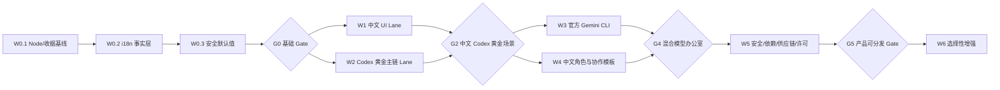

# Munder Difflin DIY 实施规划与 Gate 总览

## 1. 文档定位

本文是 Munder Difflin 中文 DIY 专项的实施入口、状态板、依赖 DAG 和跨 Lane Gate 的唯一维护位置。

- 产品方向、功能价值和长期边界以 [`01-Munder-Difflin-DIY可行性与功能价值分析结论.md`](01-Munder-Difflin-DIY可行性与功能价值分析结论.md) 为准；
- 本文负责工作包顺序、状态、写集合、完成条件、验证层和接棒规则；
- 动态命令、耗时、临时路径、模型返回、真实运行结果和 Gate 收据只进入 `.work/`，不写入长期正文；
- 本文未明确授权的安装、凭据、外部付费调用、公网入口、删除、远端写、提交和推送都不是默认授权。

新会话必须先读 `01` 和本文，再只按首个未完成关键工作包读取对应源码与测试，不得重新全仓调研。

## 2. 业务目的、两条链与不可弱化边界

### 2.1 业务目的

把现有项目收敛为一个本地优先、中文可用、可配置不同模型、可让多个真实 CLI Agent 协作，并能以像素办公室呈现状态和角色关系的 Agent 工作环境。

首条产品黄金场景限定为：

> 中文用户通过中文界面向 Michael 下达任务；Michael 使用 Codex 将任务派发给独立 Worker；Worker 在受控项目或 Worktree 中执行并通过 Hive 回信；用户能看见任务、消息、终端和角色状态，并能暂停、纠偏、优雅停止和恢复。

### 2.2 业务链

```text
中文用户 / 本地界面
  → 选择项目、Provider、模型和权限
  → Michael 理解请求并形成任务合同
  → Worker 在独立 PTY / Worktree 中执行
  → Hive Inbox / Outbox 路由协作消息
  → 任务、终端、像素角色和控制面显示事实
  → 用户批准、纠偏、暂停、停止或接收结果
```

### 2.3 实现链

```text
Main 配置与 locale 事实
  → Shared i18n / Provider 稳定 ID
  → Renderer 展示与 Preload IPC
  → Provider spawn / per-agent HOME / PTY
  → Hook + HIVE_SOCK + Renderer idle-safe delivery
  → Inbox / Outbox / Task / Registry 持久事实
  → Command Center / Office Floor / .work Gate 证明
```

### 2.4 不可弱化边界

1. Hive 字段、Hook 名、IPC channel、Provider/model ID、CLI 参数和终端原始输出不翻译。
2. 像素动画必须投影真实 Agent 状态，不引入与运行事实并行的假状态。
3. 不把所有 Provider 宣传为同等成熟；每个 Provider 单独通过生命周期和恢复 Gate。
4. Auto Mode、遥测、公网入口默认关闭；破坏性 bypass 只能由用户显式开启。
5. Agent 修改真实项目时必须可观察、可停止，并保留 Git/Worktree 保护。
6. 不读取、记录或提交 API Key、访问令牌、认证目录和真实 Prompt/Output 中的敏感信息。
7. 商业发布前必须替换受限像素素材或取得对应授权。

### 2.5 非目标

- 不重写 PTY、Hive、Worktree、Office Floor 或 Command Center 主架构；
- 不在 Codex 黄金场景完成前扩展所有 Provider；
- 不把官方 `gemini` CLI 伪装为 `agy`；
- 不默认开放 Slack、Webhook、Tunnel 或远程 Skills 安装；
- 不在核心主链稳定前扩张新主题、Voice 或复杂游戏玩法；
- 不把 Munder Difflin 源码直接混入其它 DIY 仓库。

## 3. 接棒审计与保护规则

新会话进入仓库后先执行只读审计：

```bash
cd /Users/kailonyang/go/src/munder-difflin
git status --short --branch
git diff --stat
git diff -- docs/diy
node --version
npm --version
ps -ax -o pid=,command= | rg "electron-vite dev|munder-difflin/node_modules/electron" | rg -v "rg " || true
lsof -nP -iTCP:5173 -sTCP:LISTEN || true
```

保护规则：

- 当前 `.idea/` 视为用户/IDE 变更，除非用户明确要求，否则永不读取、修改、stage 或提交；
- `docs/diy/` 是本专项当前写集合，修改前必须先核对已有 diff；
- 不使用 `git reset --hard`、`git checkout --`、清理命令或覆盖式恢复；
- 不因安装失败删除整个仓库、用户配置或 `HarnessAgents`；
- 不启动应用、真实 Agent 或外部调用，除非当前工作包明确要求运行 Gate；
- 发现工作区与本文记录不一致时，先更新动态 `.work` 事实，不在长期文档保存一次性日志。

## 4. 状态模型与首包选择规则

### 4.1 状态

| 状态 | 含义 |
| --- | --- |
| `待开始` | 依赖未满足或尚未领取 |
| `进行中` | 单一 owner 已领取且写集合冻结 |
| `待验证` | 实现结束，适用 Gate 或运行事实尚未闭合 |
| `通过` | 合同、适用 Gate、运行事实和收据全部闭合 |
| `部分通过` | 有明确可用子集，但不能升级为整包完成 |
| `阻塞` | 需要新授权、产品合同、凭据、外部状态或风险决策 |
| `暂缓` | 已明确不是当前关键路径 |
| `废弃` | 被新的权威方案替代，不再继续 |

### 4.2 首个未完成关键包

选择算法：

1. 只考虑依赖全部 `通过`、且没有跨 Lane Gate 阻塞的包；
2. 按本文 DAG 拓扑顺序选择，而不是按文件多少或视觉吸引力选择；
3. 优先选择能建立后续共同基线、形成最短可证伪反馈环的关键包；
4. “代码写完”不等于完成，必须有适用验证、运行事实和 `.work` 收据；
5. 如果首包需要新产品选择、凭据、付费调用、真实公网或许可证法律判断，保持 `阻塞` 并回交用户。

当前首个未完成关键工作包：`W0.1 Node 22 与工作区/收据基线`。

## 5. 总体 Lane 与依赖 DAG



可并行关系：

- `G0` 通过后，W1 中文 UI 与 W2 Codex 运行时可以并行；
- W1 内只有写集合不重叠的页面包可以并行；共享 i18n、配置、通用组件由主会话串行持有；
- W2 中 `codexRemote/index` 与 W1 Renderer 页面迁移可并行；`agentProvider/config/useHive` 等共享合同由单一 owner 修改；
- W3 必须等待中文 Codex 黄金场景通过，不在共享 Provider 合同仍变动时抢写；
- W5 的公网、Skills、依赖和资产许可仅在写集合和验证反馈环真正独立时并行。

## 6. 会话协同规范

为节约 token 消耗并提高推进效率和质量，当前会话始终作为主会话，负责统一分析、任务拆分、创建 N 个真实 Codex 独立会话、调度、进度跟踪、一次复核、集成和跨 Lane Gate。

### 6.1 创建独立会话的必要条件

只有同时满足以下条件才创建：

- 只读证据域或文件写集合真正独立；
- 不共享 DTO、迁移、浏览器/API、Builder、数据库、发布 DAG 或同一个真实运行反馈环；
- 结果可单独验收，交接成本低于可证明的并行收益；
- 主会话能在回传后只做一次范围、证据和冲突复核，而不是重做全部工作。

`N` 由独立 Lane 数量决定，不为占满并发槽而拆分任务。当前专项按用户约定，在创建动作中显式使用 GPT-5.6 Luna：机械扫描和确定性核验使用 `low`，有边界判断的只读审计或局部实现使用 `medium`。模型和推理档不写入通用任务合同，也不发明仓库配置字段。

### 6.2 主会话职责

1. 冻结业务目的、依赖 DAG、当前首包和禁止项；
2. 为每个独立任务声明目标、非目标、输入、读取范围、写集合、禁止修改、完成和停止条件；
3. 维护本文状态和 `.work` 收据索引；
4. 控制共享文件、真实运行、浏览器和远端写的单 owner；
5. 只复核一次回传证据，处理冲突并集成；
6. 只有跨 Lane Gate 的所有输入均成立时才推进下一 Wave。

### 6.3 并行波次调度矩阵

| 调度阶段 | 可创建的独立会话 | 推荐 `N` | 必须由主会话串行持有 | 汇合条件 |
| --- | --- | ---: | --- | --- |
| `W0.1~W0.3` | 只读核验可独立；实现不拆 | `0~1` | `.gitignore`、package/lock、Main config、i18n 事实层 | `G0` |
| `G0` 后的 W1/W2 | W1 页面包按互斥文件拆分；W2 runtime 为另一证据/写域 | `2~3` | shared i18n、Provider/config、真实 Electron/CLI 运行 | `G1` 与 W2 各包 |
| `G2` 中文 Codex Gate | 可建 1 个只读复核会话 | `0~1` | 测试仓库、PTY、Harness、浏览器、Worktree 和运行收据 | `G2` 单 owner 验收 |
| `W3/W4` | Gemini 合同、中文角色模板可并行 | `2` | `agentProvider/hive/useHive` 集成与混合模型运行 | `G3/G4` |
| `W5` | 依赖、公网入口、Skills、资产许可为独立证据域 | `2~3` | Builder、签名、公证、真实公网和发行决策 | `G5` |
| `W6` | 只有已批准且互斥的增强项 | 按实际 Lane | 产品优先级、共享 UI/Provider 合同 | 每项独立 Gate |

调度步骤：

1. 主会话先把候选包按 DAG、依赖、写集合和反馈环分组；
2. 为每个独立包创建真实任务，并立即在 `.work/tasks/<task-id>/contract.md` 登记合同；
3. 同一共享文件只能有一个写 owner；其它任务可只读取证，但不能准备竞争 diff；
4. 主会话使用有界状态快照跟踪进度，不因 commentary 频繁唤醒，也不重复播报无变化状态；
5. 任务在目标时间一半前必须返回首个判别事实；没有则缩小范围或停止该 Lane；
6. 每个任务完成后，主会话只做一次写集合、证据、失败和冲突复核；
7. 所有输入包通过后，由主会话独占真实 UI/CLI/Builder 反馈环执行跨 Lane Gate；
8. Gate 失败只回到拥有根因的工作包，不让所有并行任务同时修改共享合同。

进度板最小字段：

```json
{"taskId":"...","packageId":"W1.1","threadId":"local-only-reference","status":"queued|active|needs-attention|completed|failed","owner":"main|independent-thread","writeSet":["..."],"firstFact":"...","targetMinutes":60,"hardStopMinutes":120,"receipt":".work/gates/..."}
```

长期文档不保存一次性 thread ID；真实 ID 只进入 `.work`。状态改变、首次判别事实、需要主会话关注和最终结果才写事件，不记录每次轮询。

### 6.4 独立任务最小合同

```text
任务 ID / Work Package：
目标：一个可验证结果
非目标：明确不处理的相邻问题

输入与证据入口：
允许读取：
允许写入：
必须排除的用户脏变更：

授权：只读/本地写/真实运行/外部调用/远端写
前置依赖与 Lane：
禁止共享的 DTO、Browser/API、Builder、数据库或运行反馈环：

完成条件：
最小验证：
必须返回的运行事实和收据：

目标时长 / 硬止损：
首次判别事实目标：
到点动作：

停止条件：需要新合同、授权、凭据、扩大写集合、生产/公网风险或许可证判断时停止并回交。
```

## 7. Gate 层级与 `.work` 收据

目标仓当前没有 installer 的 `.agents/config/gates.json`、`juspctl` 或机器计划器。不得假装这些能力已经存在，也不得把移植整套工具作为 DIY 前置条件。专项先复用其语义，用项目现有脚本和轻量 `.work` 收据推进；是否建设机器计划器由后续独立设计决定。

### 7.1 Gate 层级

| Gate | 目的 | 默认命令/入口 |
| --- | --- | --- |
| `P0` 保护 | 确认分支、diff、排除项、进程和端口 | `git status`、目标 diff、`ps`、`lsof` |
| `V1` 静态 | TypeScript 与资源 Key 合同 | `npm run typecheck`、i18n 定向测试 |
| `V2` 定向测试 | 当前包的最小公共行为 | 对应 `node --test test/<target>.test.cjs` |
| `V3` 集成构建 | Electron Main/Preload/Renderer 可构建 | `npm run build` |
| `V4` UI 真实入口 | 中英文页面、窄布局、交互和原生弹层 | `npm run dev` + 真实 Electron/Computer Use |
| `V5` Provider 黄金场景 | 真实 CLI、Hive、PTY、回信、恢复和 Worktree | 受控测试仓库与真实 CLI 收据 |
| `V6` 安全/分发 | 公网、Skills、依赖、签名和许可证 | 独立授权 Gate，不默认执行 |

不运行与当前包无关的全量 Gate。长命令开始前记录预计时长、hard timeout、进度信号和止损点。

### 7.2 收据布局

`W0.1` 必须先把 `.work/` 加入 `.gitignore`。之后使用：

```text
.work/tasks/<task-id>/contract.md
.work/tasks/<task-id>/state.json
.work/tasks/<task-id>/events.jsonl
.work/gates/<package-id>.jsonl
.work/artifacts/<package-id>/
```

最小单行 Gate 收据：

```json
{"taskId":"...","packageId":"W0.1","gateId":"V1","status":"pass|fail|blocked|skipped","repo":"...","cwd":"...","argv":["..."],"inputs":["..."],"runtime":{"node":"...","platform":"..."},"exitCode":0,"evidence":["..."],"redactedTail":"...","reuse":"fresh|reused|invalidated","reason":"..."}
```

收据复用要求：changed paths、目标命令、Node/npm/Electron/CLI 版本、依赖和目标环境均未变化。以下情况立即失效：

- 目标源码、测试、翻译资源或 lockfile 变化；
- Node、Electron、Provider CLI、认证 home 或 Harness Home 变化；
- UI 页面或字体变化导致截图不再对应；
- 动态运行证据超过当前任务声明的 TTL；
- 真实 CLI session、Worktree、Webhook/Tunnel 代次变化。

收据不得保存 Key、Token、Prompt、完整 Agent 输出、用户文件内容或认证路径明细。

## 8. 实施 Gate 板

### Wave 0：共同基线

| ID | 状态 | 目标与写集合 | 非目标 | 完成与 Gate |
| --- | --- | --- | --- | --- |
| `W0.1` | **待开始·首包** | 固定 Node 22 开发基线；增加 `.work/` 忽略与收据目录合同。写：`.nvmrc`/等价版本文件、`.gitignore`、必要的 `package.json/package-lock.json` | 不升级业务依赖，不改 UI/Provider，不清理 `.idea` | Node 22 下安装无非预期 lock 漂移；`V1 typecheck`、`V2 focused`、`V3 build`；记录原生 ABI 与退出码 |
| `W0.2` | 待开始 | 建立 `zh-CN/en-US` i18n 事实层、英文回退、插值/复数、locale 持久化和 CJK 字体栈。写：`src/shared/i18n/**`、`src/main/config.ts`、Renderer locale hook/provider、字体 CSS、必要依赖 | 不迁移具体页面，不改 Preload/Hive/Provider 协议，不引入许可不明字体 | locale 切换可重渲染并持久化；Main 可独立 `t()`；Key/fallback/插值测试通过；字体许可清晰 |
| `W0.3` | 待开始 | 安全默认值：Auto Mode、遥测和公网入口默认关闭。写：`src/main/config.ts`、`OnboardingWizard.tsx`、相关配置测试 | 不重做权限系统，不自动迁移用户既有显式选择 | 新装默认关闭；旧配置兼容；Provider bypass flag 不被误附加；配置测试和 Onboarding UI 事实闭合 |
| `G0` | 待开始 | Wave 0 跨包 Gate | 不扩展业务功能 | `P0+V1+V2+V3` 全部成立；`.work` 收据可用；无用户脏变更污染 |

### Wave 1：中文 UI Lane

以下包依赖 `G0`；写集合不重叠时可创建独立 Luna 会话并行实施。

| ID | 状态 | 目标与写集合 | 非目标 | 完成与 Gate |
| --- | --- | --- | --- | --- |
| `W1.1` | 待开始 | 首次向导、App 壳、HivePicker、通用按钮/Badge、退出/恢复弹层 | 不改 Onboarding 状态机、Provider/model ID 和路径 | 技术/非技术两套中文；切换语言不丢状态；320/375/768px 无裁切；aria/tooltip 完整 |
| `W1.2` | 待开始 | Settings、Add Agent 及其设置子组件 | 不改配置字段、Provider 运行合同或密钥结构 | 七类 Settings 和 Add Agent 主链中文；长错误/模型名可读；保存失败保留稳定错误 code/技术 detail |
| `W1.3` | 待开始 | Command Center、CommandBar、AgentCard、Tasks、Ask Me、Message Composer、控制条 | 不改 Hive schema、Agent status ID、PTY 输出 | 11 个标签和关键错误中文；0/1/多复数正确；暂停/恢复/纠偏/任务依赖 UI 可验 |
| `W1.4` | 待开始 | Memory、Graph、Skills、Triggers、History、Workers、Integrations 的展示文案 | 不启用远程 Skills、公网 Trigger 或外部调用 | 中文资源覆盖；技术字段保持原样；空态、失败态、缓存态、权限提示可验 |
| `W1.5` | 待开始 | IDE/Git/Updates/Release、Main 原生通知和文件/关闭对话框 | 不翻译 Git/CLI 输出、console 日志和 IPC 结构 | Main/Renderer 使用同一 locale；文件选择器、关闭确认、通知和更新提示走真实 Electron 入口 |
| `G1` | 待开始 | 中文 UI 完整 Gate | 不评价 Provider 运行正确性 | Key 集合一致、缺失 Key 为零或有白名单；`V1+V2+V3+V4`；四个核心入口中英文截图无裁切 |

CJK UI Gate 至少覆盖：320/375/768px、125%/200% 缩放、Onboarding 双列、Settings 侧栏、Command Center tab、Agent/任务卡、长中文错误、中文路径与模型 ID 混排。`Press Start 2P` 只用于品牌和短标签，不承载中文正文。

## 9. Wave 2：Codex 黄金主链 Lane

W2 可在 `G0` 后与 W1 并行，但 `G2` 必须等待 `G1` 和 W2 运行 Gate 同时成立。

| ID | 状态 | 目标与写集合 | 非目标 | 完成与 Gate |
| --- | --- | --- | --- | --- |
| `W2.1` | 待开始 | 冻结 Codex executable 来源与 Remote 可选增强。写：`codexRemote.ts`、必要 `index.ts/shellEnv.ts`、remote tests | 不自动安装 standalone，不假设 ChatGPT App binary 具备 daemon/packages | 可区分 standalone、App 内置 binary、本地 TUI；Remote 失败不阻断 PTY；错误提示可行动 |
| `W2.2` | 待开始 | Codex per-agent `CODEX_HOME`、Hook、Inbox/Outbox、idle-safe delivery 与 resume。写：`agentProvider.ts`、`hive.ts`、`hooks.ts`、`useHive.ts`、queue/provider/hive tests | 不改其它 Provider，不启用危险 Auto Mode | Hook、路由、重试、归档、session home 和 `codex resume <sid>` 合同有定向测试 |
| `W2.3` | 待开始 | 在受控测试仓库运行 Michael→Worker→回信→done→恢复黄金场景。默认只写 `.work` 收据 | 不使用重要仓库，不泄露凭据，不把 Remote daemon 当必需 | `V5` 取得真实 PTY、Hook、Inbox/Outbox、任务终态、session/worktree 恢复证据 |
| `W2.4` | 待开始 | 安全控制与 Worktree：pause、delivery pause、steer、graceful halt、kill、自然退出、恢复分别验收 | 不把 pause、halt、kill 合并成一个状态 | 控制状态相互独立；Worktree 不污染主仓；恢复不重复 isolate；断路器证据成立 |
| `G2` | 待开始 | **中文 Codex 黄金场景** | 不扩展 Gemini 或其它 Provider | `G1 + W2.1~W2.4` 通过；中文界面可观察、停止、恢复真实 Codex 协作 |

### 9.1 Codex 最低可靠路径

```text
可发现的 codex binary
  + per-agent CODEX_HOME
  + config.toml hooks
  + HIVE_SOCK / cth-hook
  + Renderer idle-only queue delivery
  + codex resume <session-id>
```

Remote daemon 是可选增强。ChatGPT App 内置 Codex 能运行 TUI，不代表它具备 standalone 的 packages、daemon、socket、远程控制和 session 恢复合同。

### 9.2 Codex 状态与失败矩阵

| 状态 | 权威事实 | 允许转移与成功证明 | 失败与恢复 owner |
| --- | --- | --- | --- |
| `configured` | Provider/config、cwd、权限 | → `provisioning`；配置和路径校验成功 | Main/config；非法配置拒绝 |
| `provisioning` | Agent 目录、registry、per-agent HOME、hooks | → `spawning`；目录和 hook 文件存在 | Hive；失败不得伪装已启动 |
| `spawning` | PTY manager 与实际 PID | → `running`；PTY 输出/SessionStart | Main/PTy；CLI 缺失或 cwd 无效显式失败 |
| `running/busy` | Hook/PTY 活动和 Renderer 状态 | → `idle` 或 `stopping` | Hook + useHive；busy 时消息保留队列 |
| `idle/queued` | idle gate、草稿/菜单、delivery pause | → `delivered`；两次 PTY 写成功后 ack | Renderer queue；最多三次失败后告警，不静默 |
| `delivered` | Inbox cursor、PTY 输入、`.done` | → `running`/`replied` | Worker/Hive；重复消息按 ID/cursor 幂等 |
| `replied/done` | Outbox、`.sent`、`act:done`、任务终态 | → `released` 或 `idle` | Router/Michael；坏 JSON quarantine，未知目标回交 |
| `recovering` | session ID、CODEX_HOME、Worktree 路径 | → `running`；原 session/cwd/worktree 证明 | Main/useHive；找不到 session 时不得静默开新会话 |
| `stopping/failed` | control registry、PTY exit、closing protocol | → `stopped` 或 `recovering` | Control/ClosingTime；区分 halt、kill、自然退出 |

## 10. Wave 3：官方 Gemini CLI

| ID | 状态 | 目标与写集合 | 非目标 | 完成与 Gate |
| --- | --- | --- | --- | --- |
| `W3.1` | 待开始 | 只读冻结官方 `gemini` CLI 的 binary、版本、初始 Prompt、auto、model、resume、hooks、config home 和认证边界 | 不读 Key、不付费调用、不复用 `agy` 未验证参数 | 形成版本化合同矩阵；无法证明的项保持 unknown |
| `W3.2` | 待开始 | 新增独立 `gemini` Provider、展示与生命周期 Bridge | 不替换 `antigravity/agy`，不污染用户全局 Gemini 配置 | Provider ID 独立；per-agent 配置；模型/权限/恢复/Inbox 路径定向测试 |
| `W3.3` | 待开始 | 运行 Gemini 单 Provider 黄金场景 | 不与 Codex 混合前跳过自身恢复/回信 Gate | 真实 Hook/idle、回信、任务完成、恢复和安全控制收据 |
| `G3` | 待开始 | Codex + Gemini 混合办公室 | 不宣传未验 Provider | Michael 与两个 Provider 双向协作、失败隔离、模型显示和成本事实一致 |

`W3.1` 必须取证：实际命令名、初始 Prompt 形式、权限 flag、模型 ID、session ID/恢复、Hook 事件和 stdin/stdout 合同、Stop/continue 语义、配置发现路径、per-agent home、headless/interactive 差异、Inbox delivery owner、认证与费用边界。

## 11. Wave 4：中文角色与协作模板

| ID | 状态 | 目标 | 完成与 Gate |
| --- | --- | --- | --- |
| `W4.1` | 待开始 | 中文产品经理、架构师、开发、测试、审查等角色体系与 Hire Manifest | Manifest 只预填、不自动 Spawn；来源和写集合可审查 |
| `W4.2` | 待开始 | 可配置的 Agent 回复语言与中文任务合同 | 只影响自然语言；Hive 字段、Hook 和 CLI 合同字节不变 |
| `W4.3` | 待开始 | 中文多角色协作场景 | 任务拆分、回信、冲突升级和人工问题均在中文 UI 可理解 |
| `G4` | 待开始 | 中文混合模型角色办公室 | Codex/Gemini 角色可配置、可协作、可停止、可恢复 |

## 12. Wave 5：安全、依赖、供应链与分发

| ID | 状态 | Gate 重点 | 完成边界 |
| --- | --- | --- | --- |
| `W5.1` | 待开始 | Node/Electron/原生模块、lockfile、依赖漏洞和升级兼容 | 安全扫描与升级需单独授权；不能以 `audit fix --force` 试错 |
| `W5.2` | 待开始 | Slack、Webhook、Tunnel：显式启用、监听地址、鉴权、限流、body cap、轮换、replay、关闭清理 | 真实公网验证另立授权 Gate；Token 不进 URL/日志/收据 |
| `W5.3` | 待开始 | Skills 来源、提交/哈希、版本、许可证、安装确认、项目级覆盖、撤销和缓存失效 | 不隐式执行远程脚本；远程不可用不静默换源 |
| `W5.4` | 待开始 | LimeZu/衍生像素素材、签名、公证、安装包和更新 | 商业发布前取得授权或替换资产；法律判断由权利人/专业意见确认 |
| `G5` | 待开始 | 产品可分发 Gate | 中文 Codex 主链、安全默认值、依赖、外部入口、供应链和许可同时闭合 |

## 13. Wave 6：选择性增强

Wave 6 只有在 `G5` 后按真实使用数据选择，不预先承诺全部实现：

- Realtime/Free Flow Voice；
- Knowledge Graph 深化；
- IDE/Git 能力增强；
- 更多办公主题与角色动画；
- Provider 扩展；
- 调度质量、成本和 workflow eval。

每项先说明用户频率、替代方案、维护成本和可单独验收的价值。不能为了展示效果重新引入深度 DIY 复杂度。

## 14. 时间预算与止损

| 闭环 | 目标 / 硬止损 |
| --- | --- |
| 文档、静态扫描、机械汉化小包 | 30 / 60 分钟 |
| 有界 UI、配置、测试或 Provider 局部实现 | 60 / 120 分钟 |
| 真实 Provider 黄金场景或跨 Lane Gate | 120 / 240 分钟 |

### 14.1 工作包时间成本约束

下表是单个闭环的目标/硬止损，不是整个 Wave 的承诺工期。一个包超过硬止损必须拆出新包或改变方法，不能直接延长。

| 工作包 | 目标 / 硬止损 | 目标时间一半检查点 |
| --- | --- | --- |
| `W0.1` | 45 / 90 分钟 | Node/lock/ABI 差异已形成唯一解释 |
| `W0.2` | 60 / 120 分钟 | locale owner、资源接口和最小测试已跑通 |
| `W0.3` | 30 / 60 分钟 | 新装/旧配置默认语义已有定向测试 |
| `W1.1` | 45 / 90 分钟 | Onboarding 中文首屏和语言切换可见 |
| `W1.2` | 90 / 150 分钟 | Settings/Add Agent 至少一条保存链闭合 |
| `W1.3` | 90 / 150 分钟 | Command Center 任务/消息核心标签闭合 |
| `W1.4` | 90 / 180 分钟 | 各次级域已列缺失 Key，至少一域完整迁移 |
| `W1.5` | 90 / 180 分钟 | 一个 Renderer 页面和一个 Main 原生弹层闭合 |
| `G1` | 90 / 180 分钟 | 四个核心入口已有首轮截图与问题清单 |
| `W2.1` | 60 / 120 分钟 | standalone/App/TUI 三种来源可被区分 |
| `W2.2` | 120 / 240 分钟 | Hook、idle delivery、resume 中至少两段定向证据成立 |
| `W2.3` | 120 / 240 分钟 | Michael→Worker 首次真实消息已可观察 |
| `W2.4` | 90 / 180 分钟 | pause/halt/kill/worktree 状态差异可证伪 |
| `G2` | 90 / 180 分钟 | 中文 UI 与真实 Codex 主链已在同一受控场景汇合 |
| `W3.1` | 60 / 120 分钟 | Gemini CLI 关键接口 unknown/known 矩阵形成 |
| `W3.2` | 120 / 240 分钟 | 新 Provider 能启动且未复用 `agy` 隐含合同 |
| `W3.3/G3` | 120 / 240 分钟 | Gemini 单 Provider 首次回信或明确可证伪失败 |
| `W4.1~W4.3` | 每包 60 / 120 分钟 | 角色/语言包至少一个真实任务闭环 |
| `W5.1~W5.4` | 每包 60 / 120 分钟 | 每个安全域形成唯一风险清单和最小 Gate；真实发行可另用 120/240 |
| `W6` | 立项时单独预算 | 目标时间一半必须取得用户价值证据，不以功能数量代替 |

### 14.2 主会话时间与并行收益约束

- 分析和拆包：目标 20 分钟，超过 30 分钟仍不能形成互斥写集合时取消并行；
- 独立任务创建与合同核对：每个不超过 5 分钟；合同不清不创建；
- 进度跟踪：只在状态变化、目标时间一半、目标时间和硬止损点处理，不做高频空轮询；
- 单任务回传复核：目标 10 分钟，复杂运行证据不超过 20 分钟；超过说明任务交接面过大，下一轮必须缩包；
- 跨 Lane 集成：由主会话单 owner，目标 30/60 分钟；出现共享合同冲突立即退回对应包；
- 并行是否有效以墙钟时间、首次判别事实、返工、无新事实重试和 Gate 成功率判断，不以创建会话数量判断。

每个任务在 `.work` 记录：

```json
{"targetMinutes":60,"hardStopMinutes":120,"firstFactTargetMinutes":30,"phaseMinutes":{"analysis":0,"implementation":0,"validation":0,"externalWait":0,"rework":0},"noNewFactRetries":0,"result":"pass|fail|blocked"}
```

达到目标时间一半仍无判别事实时重新规划；达到硬止损后停止当前方法，不用重复安装、sleep、扩大扫描或在线补丁续时。继续推进必须切换为新的可证伪方法，并给出新预算。

立即停止并回交的条件：

- 需要改变产品合同、Hive/Provider 协议或共享状态 owner；
- 需要扩大写集合到用户脏变更或其它仓库；
- 需要凭据、付费模型、真实公网、远端写或不可逆操作；
- 需要删除数据、清理 Worktree/Harness Home 或修改认证目录；
- 发现商业字体/像素素材授权不明确；
- 同一真实 Gate 连续暴露第二个需改代码的兼容缺口，应先补失败矩阵而不是继续线上试错。

## 15. 首包可直接执行合同

### `W0.1 Node 22 与工作区/收据基线`

目标：让所有后续会话使用同一 Node/原生 ABI 和可复用收据语义，避免再次用 Node 26 安装失败或把 `.work` 证据提交进仓库。

非目标：不升级业务依赖、不实施 i18n、不改 UI/Provider、不运行真实 Agent、不清理 `.idea/`。

输入：

- `package.json`
- `package-lock.json`
- `.gitignore`
- README 的安装说明
- `better-sqlite3`、`node-pty`、Electron 当前依赖合同

允许写入：

- `.nvmrc` 或项目选择的等价 Node 版本文件；
- `package.json` 中最小 Node engine/脚本声明；
- 由同一 npm 版本产生的必要 `package-lock.json` 变化；
- `.gitignore` 的 `.work/` 规则；
- 本文 `W0.1` 状态；
- `.work/tasks/w0-1-node-baseline/**` 和 `.work/gates/W0.1.jsonl`。

禁止修改：`.idea/`、源码、用户配置、`HarnessAgents`、全局 Node 链接、远端和任何认证文件。

完成条件：

1. 新 shell 可明确选择 Node 22；
2. 安装/重建原生依赖成功且没有非预期 lockfile 漂移；
3. `npm run typecheck`、`npm run test:focused`、`npm run build` 通过；
4. 收据包含 Node/npm/Electron/平台、命令、输入、退出码和脱敏尾部；
5. Git diff 只包含授权写集合，`.idea/` 未被纳入；
6. 本文状态更新为 `通过` 后，首包算法返回 `W0.2`。

停止条件：需要升级 `better-sqlite3`/Electron、修改全局 Node、删除用户数据、安装未知二进制或现有 lockfile 与目标 npm 无法无损兼容时停止并回交。

## 16. 新会话接棒输出格式

每次结束必须报告：

```text
当前 Work Package：
状态：
完成的合同：
未完成/失败：
适用 Gate 与收据：
真实运行事实：
工作区与排除项：
下一首包：
需要用户的新授权或决策：
```

只有当前包合同、适用 Gate、必要运行事实和授权边界全部闭合后才能标记 `通过`。提交和推送是独立末端 Lane；没有用户当次明确授权，不得 stage、commit 或 push。
