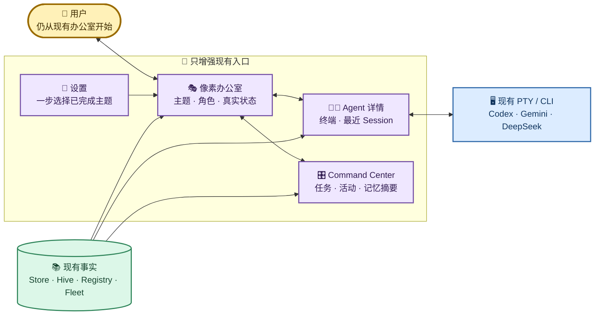
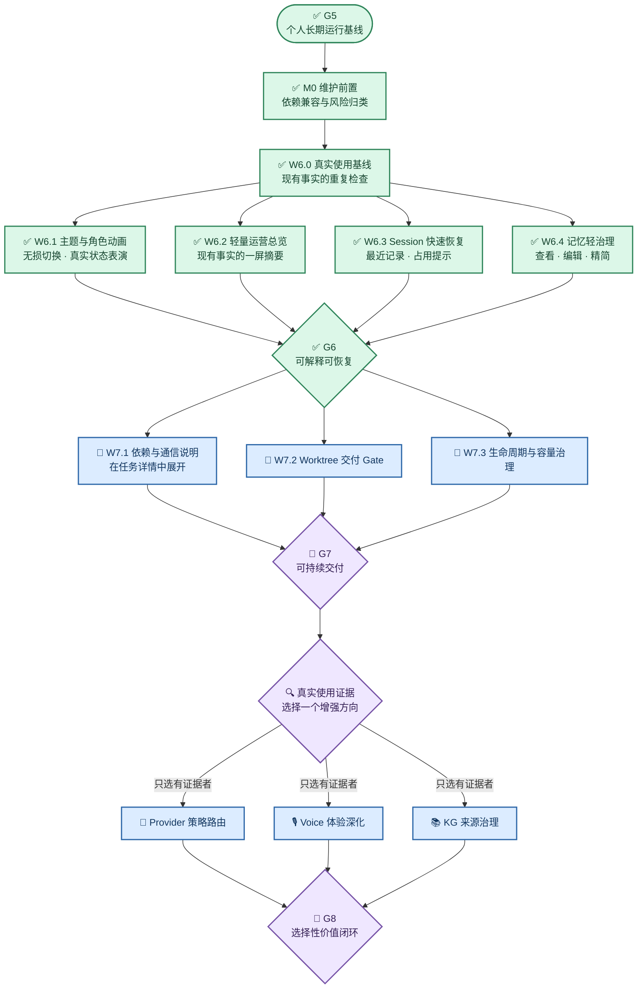
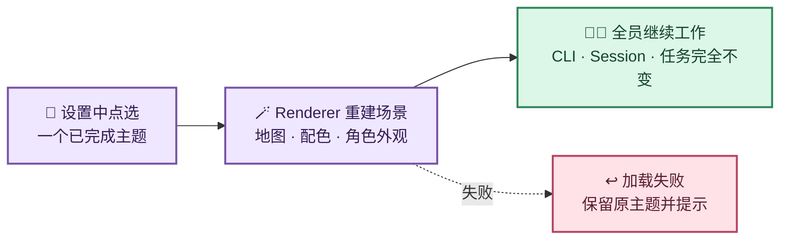
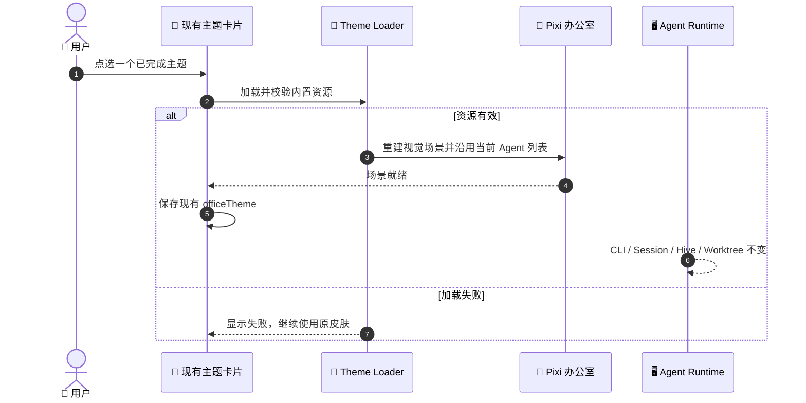
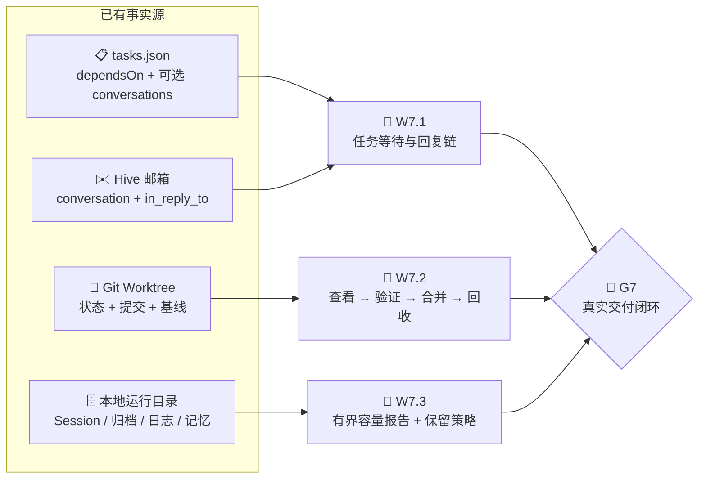

# Munder Difflin Wave 6 及后续设计结论与实施规划

> 本文是 Wave 6 及后续演进的唯一正式规划。它先按当前实现区分“已具备、部分具备、尚未闭环”，再定义增量合同、依赖 DAG 与 Gate；不把已有底层能力重新包装成从零开发。

## 1. 文档定位

| 项目 | 说明 |
| --- | --- |
| 权威范围 | Wave 6 及后续的能力基线、产品取舍、工作包、依赖、Gate 与完成边界 |
| 上游正式设计 | [多 Agent 角色办公室架构与运行机制](../正式设计文档/01-Munder-Difflin多Agent角色办公室架构与运行机制.md)、[个人长期运行安全与备份恢复设计](../正式设计文档/02-Munder-Difflin个人长期运行安全与备份恢复设计.md) |
| 不负责 | 一次性命令、耗时、真实 Session ID、API Key、临时路径、测试输出与某次运行 pass/fail |
| 动态证据 | `.work/`；长期正文只保留当前合同和已确认的能力边界 |
| 当前状态 | Wave 0～7 与 G7 已完成；Wave 8 及后续仍是按真实使用证据选择的候选规划 |

## 2. 已完成基线

Wave 0～6 已把项目从“可行性判断”推进为可长期自用、可解释且可恢复的中文混合 Provider 办公室。历史波次的命令和收据不再作为长期设计维护；其稳定结果收敛如下：

| 基线 | 当前稳定结果 | 权威位置 |
| --- | --- | --- |
| 运行与安全默认 | Node/Electron 原生 ABI、lockfile、安全默认、凭据边界和 `.work` 动态证据边界已固定 | [长期运行设计](../正式设计文档/02-Munder-Difflin个人长期运行安全与备份恢复设计.md) |
| 中文产品界面 | Renderer、Main/Preload 用户可见错误和生成的 Hive 自然语言支持中文；机器合同保持英文稳定值 | [架构设计第 10 节](../正式设计文档/01-Munder-Difflin多Agent角色办公室架构与运行机制.md#10-角色化与中文协作) |
| Codex 黄金主链 | Codex 使用独立 Home、Hook Bridge、真实 Session 和恢复合同接入 PTY/Hive | [架构设计第 8 节](../正式设计文档/01-Munder-Difflin多Agent角色办公室架构与运行机制.md#8-provider-抽象与生命周期-bridge) |
| Gemini / DeepSeek | Gemini 官方 CLI 与 DeepSeek-on-OpenCode 以独立 Provider 能力接入，成熟度不被 UI 展示夸大 | [架构设计第 8.2 节](../正式设计文档/01-Munder-Difflin多Agent角色办公室架构与运行机制.md#82-当前中文混合办公室主链) |
| 中文角色协作 | 中文角色模板、回复语言、任务合同和中文 Hive 手册已生成；ID、字段、枚举、Hook 与 CLI 参数不翻译 | [架构设计第 9～11 节](../正式设计文档/01-Munder-Difflin多Agent角色办公室架构与运行机制.md#9-hive-消息通信) |
| 个人长期运行 | 外部入口默认关闭、Skills 来源固定、脱敏备份、校验、空目录恢复和稳定/开发办公室隔离已形成合同 | [长期运行设计](../正式设计文档/02-Munder-Difflin个人长期运行安全与备份恢复设计.md) |

## 3. “目前有没有”的能力结论

结论不是“下面这些功能都没有”。项目已有大量底层与页面能力；主要缺口是把分散能力收成可理解、可治理、可衡量的日常闭环。

成熟度只使用三种语义：

- **已具备**：存在真实入口和稳定底层合同，可直接使用；后续只做适用增强。
- **部分具备**：核心数据或动作存在，但统一入口、治理、失败语义或端到端 Gate 不完整。
- **尚未闭环**：可能有零散数据或实现缝隙，但还不能承诺为用户能力。

| 能力域 | 当前事实 | 成熟度 | Wave 6+ 真正缺口 |
| --- | --- | --- | --- |
| 多 Agent / PTY / Hive | 每个 Agent 使用独立 CLI、PTY、Provider Home、角色目录和信箱；Router 负责投递 | 已具备 | 不重写内核，只提升运维可解释性 |
| 中文化与中文角色 | UI、角色模板、回复语言和系统生成 Hive 文档已有中文合同 | 已具备 | 新页面持续复用 i18n；不翻译机器字段 |
| Codex / Gemini / DeepSeek | 三条中文混合主链均有 Provider、生命周期和 Session 恢复合同 | 已具备 | 策略路由、降级说明和质量评估尚未统一 |
| Session 管理 | Registry 与有界 Provider 元数据提供最近 Session；Agent 详情显示当前占用、能力限制并复用真实恢复参数 | 已具备 | DeepSeek 枚举仍受 OpenCode 本地索引限制；后续只按真实 CLI 能力演进，不建设 Session 数据库 |
| 任务与依赖 | `tasks.json`、Kanban、优先级、负责人、`dependsOn` 与可选 Conversation 精确关联已存在；任务详情可解释依赖、缺失项、等待回复和人工问答 | 已具备 | 后续只按真实卡点补解释，不建设画布式 DAG 或第二套项目管理器 |
| Agent 通信 | Inbox/Outbox、Conversation、回复链、路由收据、空闲门控和事件日志已存在；任务详情可沿精确 Conversation 展开脱敏消息链 | 已具备 | 投递延迟分解仍是候选；不得靠标题或正文模糊匹配消息 |
| 记忆 | `memory.md`、语义检索、反思、Memory Graph 与本地知识库均已有实现；现有 Memory 入口支持备份优先、原子写入和冲突保护的直接编辑 | 已具备 | 后续只按真实容量问题增强显式治理；不建设自动晋升/遗忘引擎 |
| 观测与成本 | `fleet.json`、Activity、Token、费用账本、OTel、工具状态和断路器已存在；Command Center 已增加现有事实的一屏摘要 | 已具备 | 后续只处理真实使用暴露的解释缺口；不新增观测平台或第二套事实源 |
| Git / Worktree / IDE | 隔离 Worktree、文件树、编辑、Diff、历史和分支比较已存在；现有 Git 页提供检查、显式合并与仅在已集成且干净时的非强制回收 | 已具备 | 不自动丢弃、强制合并或回收分支；后续只补真实失败暴露出的提示 |
| Voice | Groq 转录与 OpenAI Realtime Michael、语音动作和成本保护已存在 | 已具备 | 仅在真实使用频率证明价值后增强可靠性与中文体验 |
| Knowledge Graph | 文档/图片导入、切片、标签、检索、CLI 和图谱页面已有本地实现 | 已具备 | 后续重点是来源、更新、删除、命中解释和记忆边界，不是重建图谱 |
| 自动触发与集成 | Schedule、上下文触发、Webhook、Slack、GitHub CI 等已存在 | 部分具备 | 缺少统一执行历史、失败重试解释和长期运行 SLO |
| 办公室主题与动画 | 三主题共享同一 Renderer、稳定对象语义、状态表演和一步无损切换；两套新主题已完成高保真地图、贴图对齐精细碰撞、3.5 px 净空导航烘焙、15 角色头像/Sprite 与真实运行 QA | 已具备 | 保持右侧操作心智、有限 Shell Token 和零动画业务状态机扩张 |
| 更多 Provider | 已有多种 Provider 预设，能力成熟度不等价 | 部分具备 | 先建立准入矩阵，再决定是否新增或升级黄金主链 |

主要实现证据入口：[`agentProvider.ts`](../../../src/shared/agentProvider.ts)、[`hive.ts`](../../../src/main/hive.ts)、[`TasksKanban.tsx`](../../../src/renderer/src/components/TasksKanban.tsx)、[`CommandCenterPanel.tsx`](../../../src/renderer/src/components/CommandCenterPanel.tsx)、[`git.ts`](../../../src/main/git.ts)、[`IdePanel.tsx`](../../../src/renderer/src/ide/IdePanel.tsx)、[`memory.ts`](../../../src/main/memory.ts)、[`telemetry.ts`](../../../src/main/telemetry.ts)。

## 4. Wave 6+ 产品取舍

### 4.1 核心目的

Wave 6 不以“再加一批功能按钮”为目的，而是把已经能运行的办公室提升为：

> 用户能快速看懂谁在做什么、为什么等待、花了多少、是否需要介入，并能安全切换 Session、治理记忆和交付成果的可持续个人 Agent 工作环境。

### 4.2 优先级原则

1. 先提升已有高频主链的可靠性、可解释性和恢复能力，再扩展低频玩法。
2. 一个新页面必须对应真实数据源、真实动作和明确失败语义，不能只做状态投影。
3. 所有自动化都要保留人工暂停、停止、改派和恢复入口。
4. Provider 能力按真实 CLI 验证分级，不允许静默换模型或伪装恢复成功。
5. 记忆与遥测默认本地；不得把 Prompt、消息正文、文件内容或凭据作为遥测字段。
6. 个人非商业自用边界不变；公开发行和商业化仍是独立设计。
7. 主题与角色动画属于核心产品表达，不再作为末端装饰；但视觉增强只能消费现有状态，不能反向增加 Agent 运行机制和用户操作负担。

### 4.3 明确非目标

- 不重写 PTY、Hive Router、Provider Agent Loop 或像素渲染内核。
- 不把所有 Provider 提升为同等黄金主链。
- 不同时实现 Voice、KG、主题、Provider 扩张等全部候选项。
- 不建立云端控制平面、团队账号、计费系统或公共插件市场。
- 不以无界日志、完整 Prompt/Transcript 收集换取“可观察性”。
- 不用自动删除处理 Session、Worktree、消息和记忆的长期增长。
- 不为了主题引入远程主题市场、动态下载包、脚本插件、第二套地图引擎或每主题独立状态机。

### 4.4 最小复杂度预算

Wave 6 及后续的设计必须同时控制实现复杂度和用户复杂度。默认做法是改进现有入口，而不是增加新的中心、模式和配置页。

| 约束 | 允许 | 应拒绝或重新设计 |
| --- | --- | --- |
| 事实来源 | 读取现有 Store、Hive、Registry、Fleet、Tasks、Cost 和 Provider Home | 为同一事实新建第二套数据库、账本或同步器 |
| 用户步骤 | 原入口内直接显示、一步执行；危险动作才确认 | 新向导、必填配置、重复确认、切换后重新雇佣或恢复 Agent |
| 后台机制 | 现有 IPC 的小型只读投影、现有事件驱动刷新 | 新守护进程、云服务、消息总线或常驻轮询层 |
| 自动化 | 一个可靠默认值，可暂停、可恢复 | 多层策略编辑器、隐藏降级或需要用户理解内部 Provider 参数 |
| 视觉表达 | Renderer 消费已有状态和 Tool 信号 | 为动画新增后端业务状态、模型调用或 Hive 写入 |
| 持久配置 | 复用已有字段；确有必要时只增加一个可选稳定值 | 为每个主题、角色或动画建立独立配置树 |

任一工作包若要求用户完成更多必经步骤，或要求新增守护进程、独立数据库、远程服务、运行时主题下载和迁移器，必须先证明现有结构无法完成；否则停止该方案。

## 5. 目标体验

目标不是再建“运营大厅”或“Session 服务台”等新一级页面，而是在用户已经熟悉的办公室、Agent 详情、Command Center 和设置中补最短入口。底层仍是当前 PTY、Hive、Provider Home 和 Worktree。

## 6. 实施 DAG

`M0` 是进入 Wave 6 前的维护车道，不是产品功能。现有只读依赖审计仍有跨大版本风险项，必须按运行依赖、开发/打包依赖和未启用可选入口分类；不得使用强制自动升级替代兼容验证。

## 7. Wave 6：可解释、可恢复的日常运营（已完成）

Wave 6 以最小增量进入现有入口：日常检查是只读聚合脚本，主题是 Renderer 视觉投影，运营摘要来自现有 Store，Session 只做有界元数据发现，记忆编辑复用 `memory.md`。没有新增守护进程、Session/记忆数据库、远程主题包或第二套事实源。动态结论以 `.work/gates/G6.jsonl` 为准。

### 7.1 工作包

| ID | 目标 | 当前输入 | 写集合 | 非目标 | 建议预算 |
| --- | --- | --- | --- | --- | --- |
| `M0` | 在不破坏 Electron ABI 和生产构建的前提下处理或接受依赖风险 | `package.json`、lockfile、审计清单、长期运行 Gate | 依赖声明、lockfile、适用兼容测试 | 不做 `audit fix --force`；不顺手升级无关 UI | 0.5～1.5 天 |
| `W6.0` | 用现有本地事实建立一组可重复的日常使用检查 | Hive 日志、Fleet、成本账本、任务、消息收据 | 小型只读脚本/测试夹具和 `.work` 收据 | 不建设 Eval 平台、遥测管线或新指标数据库；不采集 Prompt、正文、文件内容和 Key | 0.5～1 天 |
| `W6.1` | 让主题切换无损，并让角色动画更清楚地表达真实工作状态 | `ThemeConfig`、OfficeFloor、Agent Store、Tool/Task/消息事件 | Theme Registry/Picker、场景视觉映射、内置素材、i18n、目标测试 | 不停止 CLI、不归档/重建 Agent、不增加后端状态机、远程主题包或模型调用 | 1.5～3 天 |
| `W6.2` | 在现有办公室/Command Center 内回答“谁在做什么、为何等待、是否需介入” | Fleet、Tasks、Activity、Cost、Inbox backlog | 现有页面的紧凑摘要、i18n、目标测试 | 不新建运营中心、Main 聚合服务或第二套事实源 | 1～2 天 |
| `W6.3` | 用最近 Session 列表和明确占用提示简化恢复与切换 | Registry、Provider Home、spawn/resume 合同 | 按需读取、现有 Agent 入口的小菜单、失败语义、目标测试 | 不复制 transcript、不建立 Session 数据库、不热切换运行中 TUI | 1.5～3 天 |
| `W6.4` | 让用户能查看、编辑和精简角色长期记忆，并看清其与 Session/公共任务的边界 | `memory.md`、现有 Memory 页面、Tasks/Board | 现有页面的最小编辑/精简入口、来源提示、大小提示和测试 | 不建设自动晋升/遗忘引擎、不新增记忆数据库、不让 KG 替代任务账本 | 1～2 天 |

预算是单人聚焦实施的规划范围，不是承诺工期。每包在实施前还要根据真实 diff、适用测试和外部 CLI 状态设定 hard timeout；超过预算先缩小到可证伪路径，不用无界试错消耗时间。

### 7.2 W6.1 主题与角色动画设计

#### 7.2.1 设计结论

主题不是一套新的 Agent 世界，而是同一个办公室运行事实的视觉皮肤。角色动画不是游戏任务系统，而是现有 Agent 状态、Tool、消息和任务事件的可视化。二者均不得拥有业务事实。

这里区分两个概念：

- **皮肤**：共享同一 Renderer、34×22 格网、稳定对象名、状态和交互语义；可携带与整图画面对齐的静态导航投影，只替换视觉资产与可走格事实，不新增运行世界。适合一键切换，是 `W6.1` 的主路线。
- **独立场景**：拥有不同地图布局，例如现有 Brooklyn 99；仍可无损切换，但需要单独维护座位、寻路、咖啡区和功能锚点，优先级低于完整皮肤。

实现上不新增 Skin Engine、皮肤数据库或第二个持久字段。内置皮肤继续注册为现有 `ThemeConfig`/`ThemeId`；主题地图使用同一 Layer/Object 合同和寻路器，用户选择仍只保存在现有 `officeTheme`。

当前主题基础已经足够：`ThemeConfig` 提供地图、Tileset、座位、咖啡区、锚点、差事、显示器、配色和 Cast；`OfficeFloor` 已能在主题变化时重建 Pixi 场景；角色已经支持行走、落座、工作光晕、思考气泡、咖啡、浇花、庆祝、阻塞、压缩和循环告警。因此首要工作是删掉不合理流程并补齐视觉内容，而不是扩展抽象层。

直接实现证据见 [`themeRegistry.ts`](../../../src/renderer/src/scene/office/themeRegistry.ts)、[`OfficeThemePicker.tsx`](../../../src/renderer/src/components/OfficeThemePicker.tsx) 和 [`OfficeFloor.tsx`](../../../src/renderer/src/scene/office/OfficeFloor.tsx)。

#### 7.2.2 用户流程

用户只做一次点选。目标皮肤是随应用打包的本地资源：Renderer 先加载并校验，成功后才更新现有 `officeTheme` 并重建视觉场景；加载失败时保持原皮肤。切换不得 Kill PTY、归档 Agent、清空 Cast、创建新 Session、改变角色目录、移动 Worktree 或要求再次确认；因为动作变成纯视觉操作后，不再需要破坏性确认框。尚未完成的主题只展示“筹备中”且不可选择，不能切换后再静默回退 Office 冒充成功。实验总开关在主题稳定后删除，默认主题本身就是关闭效果。

#### 7.2.3 状态表演：复用现有信号

| 真实事实 | 角色表现 | 实现边界 |
| --- | --- | --- |
| `idle` | 漫步、咖啡、短差事或回桌休息 | 复用现有 idle loop；不产生 Hive 事件 |
| `working` / Tool | 坐回工位、显示器亮起、短工具图标或现有动作摘要 | 使用 `status`、`action`、`carrying`；不增加 Tool 状态 |
| `thinking` | 留在桌前，以轻量省略号/思考提示区别于执行 | 只改 Renderer 表现，不推导新业务状态 |
| `waiting` | 安静留桌、熄灭工作光晕 | 不误显示为阻塞或完成 |
| `blocked` | 走到求助点、显示明确感叹号 | 继续使用现有 `blockReason` 和等待位置 |
| `compacting` / `looping` | 保留装箱/循环告警图标 | 告警优先于主题装饰，所有主题语义一致 |
| `success` | 一次短庆祝后回到 idle | 不对短心跳或普通消息频繁庆祝 |
| Agent 消息 / 任务迁移 | 信封飞行、任务便签移动 | 复用已有动画；账本仍是唯一事实 |

角色辨识优先复用现有头像、名字、Accent、工位和工具图标。只有这些仍不足时，才允许增加少量纯 Renderer 的职业道具覆盖层，例如产品角色的便签、测试角色的检查标记、开发角色的终端符号；不得为此解析自然语言角色描述或新建角色分类服务。

#### 7.2.4 已批准的两套实施型主题

主题不应只是换背景色，也不能为了画风重新设计页面。已批准的视觉方向把同一批办公室对象翻译成两套原创世界观语汇，左侧地图是主要换肤面，右侧 Command Center 的入口、字段、按钮和操作顺序保持不变。

| 办公室语义 | 晶海星港 | 星穹田园公社 | 事实仍来自 |
| --- | --- | --- | --- |
| Agent 工位 | 晶体舰桥控制席、蓝色控制屏 | 木桌终端、职业工坊操作台 | Agent ID、座位、`status` |
| 工作显示器 | 点亮的控制台与数据波形 | 点亮的桌面终端与工坊器具 | `working`、`thinking`、Tool |
| 会议与任务锚点 | 晶体航图桌、航行指令板 | 公社长桌、布告角 | `tasks.json` 与现有点击锚点 |
| Agent 消息 | 数据脉冲或小型航标沿原路径移动 | 信笺微光沿原路径移动 | Inbox/Outbox 路由事件 |
| 咖啡与短休 | 能量饮料台、观景角 | 茶台、小屋与灯笼休息点 | 现有咖啡与 idle loop |
| 阻塞/等待人工 | 珊瑚红求援信标 | 红色告示牌 | `blocked` / `blockReason` |
| Context compact | 数据压缩成立方体 | 纸张收拢进档案箱 | `compacting` |
| 循环/断路器 | 控制台故障环与保险断开 | 工坊警铃与断路标志 | `looping` / Breaker |
| 完成 | 一次短促青绿光束 | 一次短促金色星屑 | `success` |

实施优先级固定如下：

| 方向 | 当前事实 | 复用方式 | 优先级 |
| --- | --- | --- | --- |
| 纸业总部 | 已有完整地图和全部交互 | 作为结构与回归基准 | P0 |
| 晶海星港 | `starship` 已完成高保真整图、命名精细碰撞、3.5 px 净空导航烘焙、15 角色头像与 Sprite、无损切换和运行 QA | 复用同一 Renderer、BFS、对象名、状态、咖啡、锚点和差事语义 | 已完成 |
| 星穹田园公社 | `starfield-farm` 已按同一合同完成高保真整图、复合碰撞体、导航烘焙、15 角色和运行 QA | 不引入农场玩法、物理引擎、NavMesh 或第二运行世界 | 已完成 |

两套方向的正式视觉、素材和页面保护合同见 [内置主题视觉与低风险换肤设计](../正式设计文档/03-Munder-Difflin内置主题视觉与低风险换肤设计.md)。星穹田园公社只借鉴温暖像素农场冒险的气质，不复制具体游戏的角色、地图、Sprite、UI 或品牌，也不增加种植等游戏机制。

#### 7.2.5 一键换肤合同

一键换肤按以下合同实现：

1. 仍在现有设置主题卡片中操作，不增加向导或新的一级页面。
2. 皮肤资源内置、离线、随版本验证，不在运行时下载或执行脚本。
3. 先验证、后切换；失败不修改持久配置，也不以 Office 回退冒充目标皮肤成功。
4. Agent 按原 ID 和稳定座位顺序重新投影；PTY、Session、Provider Home、Hive、任务、消息和 Worktree 不重启、不迁移。
5. 同一地图皮肤应在一次短场景重建内完成；不为了过场效果同时维护两套 Pixi 世界。必要时只使用简单遮罩避免闪烁。
6. 角色状态语义跨皮肤完全一致；魔法书和星舰控制台只是 `working` 的不同画法。

#### 7.2.6 复杂度止损

出现以下任一情况即停止当前设计并退回更小方案：

- 切换主题需要停止 CLI、重建 Agent、迁移 Hive 或改变 Session/Worktree；
- 一个主题需要专属后台逻辑、专属 Agent 状态或不同的任务/消息语义；
- 需要运行时下载、联网校验、主题脚本、插件沙箱或素材包迁移器；
- 用户需要先开实验开关、再选主题、再确认删除角色、再恢复团队；
- 未完成主题可以被选中并以默认主题回退，造成“看似切换成功”；
- 5～6 个 Agent 的动画明显影响终端或界面响应；隐藏窗口和全屏终端下仍持续绘制；
- 动画遮挡阻塞、循环、等待人工等高优先级状态，或无法遵循系统减少动态效果偏好。

#### 7.2.7 视觉基线与后续实施边界

两套已批准视觉稿和详细工作包以 [内置主题视觉与低风险换肤设计](../正式设计文档/03-Munder-Difflin内置主题视觉与低风险换肤设计.md) 为唯一权威。视觉稿只决定地图对象、材质、色彩和主题气质；页面结构、右侧 Command Center 心智、底部 Agent 卡片和设置流程继续以当前实现为准。

`T0～T4` 已完成。两套高保真地图、贴图对齐的精细碰撞体、由 3.5 px 脚底净空自动烘焙的导航投影、各 15 个稳定角色投影、完整身体切片保护和真实 6 Agent 无损往返已闭合；视觉结论以目标稿、碰撞覆盖和真实运行截图同屏复核为准，不以对象类别或测试数量代替。实现保持同格网/同对象语义/同帧位，不扩张用户流程或 Agent、PTY、Session、Hive、任务、Worktree 机制。

### 7.3 G6 完成条件

> 当前结论：G6 已通过。以下条件作为后续回归合同继续保留。

G6 只有同时满足以下事实才可通过：

1. 一个 Codex、一个 Gemini、一个 DeepSeek 角色在同一 Hive 中的任务、消息、状态、成本与等待原因能在统一入口对齐。
2. Session 切换前能识别当前占用；切换使用对应 Provider 的真实恢复参数；失败时旧 Session 与角色记忆仍可恢复，且不会伪装成功。
3. 用户能在现有 Memory 入口查看、编辑和精简角色 `memory.md`，并清楚知道该操作不修改 Provider Session 或公共任务账本。
4. 遥测与 Eval 不保存 API Key、Prompt、消息正文、文件内容或真实敏感路径。
5. 中文 UI、类型检查、生产构建、适用单元/集成测试和至少一次真实三 Provider 运行事实闭合；动态证据进入 `.work/`。
6. 至少完成默认皮肤和一个原创魔幻/科幻皮肤；在 5～6 个运行中 Agent 存在时可一键双向切换，Agent ID、PTY、Provider Session、任务、记忆、消息队列和 Worktree 均保持不变；失败保留原皮肤，隐藏/全屏时继续暂停场景绘制。

## 8. Wave 7：任务、通信与交付治理

Wave 7 不引入第二套编排、消息、Git 或存储系统。它把已经存在但分散的任务账本、Hive Conversation、Git Worktree 安全判定和本地容量事实，收进现有任务详情、Git/Agent 详情与 Command Center。用户仍按原方式派工、查看 Agent 和打开 Git；新增信息只回答三个问题：**为什么在等、成果能否安全交付、长期数据增长到哪里**。

### 8.1 W7.0 设计冻结与依赖 DAG

`conversations` 是任务卡上的可选关联字段，只保存已有 Hive Conversation ID；它不改变消息格式、Router 或收件箱所有权。旧卡没有该字段时继续正常显示依赖与任务状态，不做标题或正文模糊匹配。回复链继续以消息原有的 `conversation` 与 `in_reply_to` 为唯一事实。

| 工作包 | 目标 / 输入 | 写集合与禁止修改 | 适用验证与预算 | 完成 / 停止条件 | 删除或替代的复杂度 |
| --- | --- | --- | --- | --- | --- |
| `W7.1` | 在现有任务详情用一层信息说明依赖、负责人、Conversation 与回复关系；输入为任务账本和脱敏后的 Hive 消息读层 | 任务解析/详情、Hive 只读查询合同与定向测试；禁止修改 Router、PTY、消息落盘格式和新增项目管理页 | 纯函数测试、Main/Web 类型检查、生产构建；约 45～70 分钟 | 精确关联可见、缺失依赖/旧任务可解释降级；若只能靠正文模糊匹配则停止并保留旧行为 | 替代用户在任务页与 Threads 页之间人工猜测关联，不增加第二套 DAG |
| `W7.2` | 在现有 Git/Agent 详情串起 Worktree 改动、验证提示、目标分支合并和显式回收；输入为现有 Git 状态与 `worktreeIsGcSafe` | Git 安全交付核心、既有 Git 页、IPC/Preload 接线与定向测试；禁止自动丢弃、强制合并、`reset` 和独立交付中心 | 临时仓库成功/脏树/冲突/未集成回收测试，类型检查、构建；约 70～100 分钟 | 只有干净、可定位的分支可合并；冲突自动退出合并态并保留原 Worktree；仅已集成且干净时可回收 | 替代终端手工拼装高风险 Git 命令，不引入流水线引擎 |
| `W7.3` | 在现有 Command Center 展示 Session、消息归档、日志、记忆和 Worktree 的数量/字节与保留说明；输入为 `harnessHome` 和 Provider 元数据目录 | 有界容量扫描、既有 Activity/Workers 入口、IPC/Preload 接线与定向测试；禁止读取正文、后台守护、自动删除和清理中心 | 临时目录边界/截断/缺失目录测试，5～6 Agent 适用运行、类型检查、构建；约 45～70 分钟 | 报告能标注扫描上限/不完整性，默认保留且指向备份恢复合同；扫描超界或拖慢 UI 时停止扩展统计 | 替代 `du`/Finder 人工巡检，不增加数据库、定时器或保留规则 DSL |
| `G7` | 用一个含依赖、跨 Agent 中文消息、隔离 Worktree 的真实小任务闭合派工、审查、合并与回收 | `.work/runtime/w7-golden` 动态事实、`.work/gates/G7.jsonl` 收据和本节稳定状态；禁止使用产品源码未提交改动作“已集成”证明 | 目标测试、Node/Web 类型检查、生产构建、真实入口运行与 Git 前后事实；约 45～75 分钟 | 所有成果可定位、失败可恢复、Worktree 仅在集成后回收；任一证据缺失则 G7 不通过 | 用一条可复验黄金链替代主观“看起来完成”判断 |

并行只用于写集合互斥的 `W7.1～W7.3` 局部实现；`src/main/index.ts`、`src/preload/index.ts`、共享 i18n 资源、Gate 收据和最终文档状态由主会话串行集成，避免跨 Lane 合同漂移。

### 8.2 增量合同

| ID | 增量合同 | 完成边界 |
| --- | --- | --- |
| `W7.1` | 在现有任务详情中展开 `dependsOn`、Conversation 和回复链 | 能用一层展开说明“正在等谁、哪条任务或回复”；不新增画布式 DAG、项目管理页或 Hive 协议 |
| `W7.2` | 在现有 Git/Agent 详情中串起查看改动、验证提示、合并和安全回收 | 未集成改动绝不自动丢弃；失败可回到原 Worktree；不新增独立交付中心 |
| `W7.3` | 为 Session、消息归档、日志、记忆和 Worktree 建立容量可见性与显式保留策略 | 先报告再治理；默认不删除；备份与恢复合同持续成立 |

G7 要求一个包含依赖、跨 Agent 消息和隔离 Worktree 的真实任务从派工走到审查、合并与回收；任一失败点都能定位并保留可恢复成果。

### 8.3 完成结论

Wave 7 与 G7 已完成。稳定结果如下：

| 合同 | 已闭合事实 |
| --- | --- |
| `W7.1` | 任务详情按 `dependsOn` 和显式 `conversations` 展开依赖、负责人、缺失项、回复链与当前等待原因；旧任务无关联字段时不猜测消息 |
| `W7.2` | Git 页复用现有入口执行检查、显式合并和安全回收；脏树、主目标错误、分支不可定位或仍未集成时拒绝，冲突时自动退出合并态并保留 Worktree 与分支 |
| `W7.3` | Command Center 活动页按文件元数据有界统计 Session、消息、日志、成本、记忆和 Worktree；不读取正文、不后台轮询、不提供删除动作，默认保留且治理前先备份 |
| `G7` | 真实 Jim 实现与凯莉机械审查通过同一中文 Hive Conversation 完成依赖任务；实现提交经检查、合并后才非强制回收两个隔离 Worktree，分支保留，主目录干净；三类权限/沙箱失败均保留并在恢复路径中被证伪 |

动态命令、真实消息 ID、临时仓库、截图和逐项测试结果只保存在 `.work/runtime/w7-golden`、`.work/runtime/w7-ui` 与 `.work/gates/G7.jsonl`，不进入长期合同。G7 未读取或记录 API Key，也未保存 Provider Transcript、Prompt 或响应正文。

## 9. Wave 8 及后续：按证据选择性增强

Wave 8 不预先承诺全部候选项。每次只选择一个能由真实使用证据证明价值的方向：

| 候选方向 | 立项触发 | 增量设计结论 | 不立项信号 |
| --- | --- | --- | --- |
| Provider 策略路由 | 同类任务长期存在明显质量、成本或时延差异 | 显式策略、可预览目标、失败后人工可见的降级；不静默换模型 | 三条黄金主链已满足需求，差异不足以抵维护成本 |
| Voice 深化 | Voice 成为稳定高频入口且失败/中文识别问题可量化 | 强化中文命令确认、噪声恢复、成本提示和操作回执 | 使用频率低，键盘入口更快更可靠 |
| Knowledge Graph 治理 | 私有文档数量和更新频率使来源管理成为真实痛点 | 增加来源、版本、删除、命中解释和与角色记忆的边界 | 现有本地检索足够，主要问题是文档质量而非工具 |
| 新 Provider | 有真实任务只有该 Provider 能明显改善，且 CLI 生命周期可验证 | 先完成能力/凭据/Session/Hook/失败矩阵，再决定黄金主链等级 | 只有营销型号差异，缺少可靠 CLI/Hook/恢复合同 |

主题与角色动画已前移到 `W6.1`，不再与低频候选竞争。G8 不是“候选全部完成”，而是被选方向的用户价值、实现、失败路径、长期维护成本和真实运行证据全部闭合；未选方向保持候选状态。

## 10. 跨 Wave Gate 规则

1. 每个工作包先声明目标、非目标、输入、写集合、禁止修改、验证、时间预算、完成与停止条件。
2. 只有写集合互斥、输入稳定且能单独验收的任务才并行；跨 Main/Renderer/Provider 合同的集成由一个所有者收口。
3. 代码存在不等于产品完成：必须同时具备真实入口、真实动作、失败语义、适用验证和运行事实。
4. 中文化只改自然语言资源；Provider ID、JSON 字段、枚举、Hook、CLI 参数和目录名保持机器稳定值。
5. API Key 只在 Main/子进程运行时边界使用，不得进入源码、配置、Prompt、日志、截图、文档、`.work` 或 Git。
6. 不使用 `reset --hard`、force push、覆盖用户修改、无关删除或无界自动清理。
7. 每个 Gate 的动态命令、输入摘要、结果和收据放入 `.work/`；正式设计只在稳定合同改变时更新。
8. 提交与推送是独立末端步骤，必须基于明确授权和范围化门禁，不借提交任务扩大实现。
9. 新能力优先进入现有办公室、Agent 详情、Command Center 或设置入口；不得仅为命名完整而增加新的一级页面。
10. 每个工作包必须说明它删除或替代了什么复杂度；若只增加入口、配置和状态而不减少任何负担，不得通过设计 Gate。

## 11. 规划维护规则

- 工作包开始时只把状态从“待立项”更新为“进行中”，在稳定设计决策或 Gate 结论变化时更新本文；轮询和重试不写入正文。
- 若实现证明某项能力比本文记录更成熟，先校准能力矩阵，再删除重复工作包；不得为了维持路线图而重复造能力。
- 若真实使用证明候选价值不足，允许明确取消；“不做”是合法设计结论。
- Wave 6 以后的编号表达依赖顺序，不表示必须连续实施。主题与角色动画虽然前移，但必须以无损切换、真实状态可读和零运行机制扩张为完成标准，不能用素材数量冒充产品价值。
