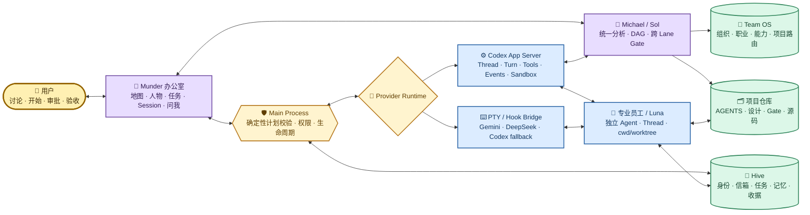
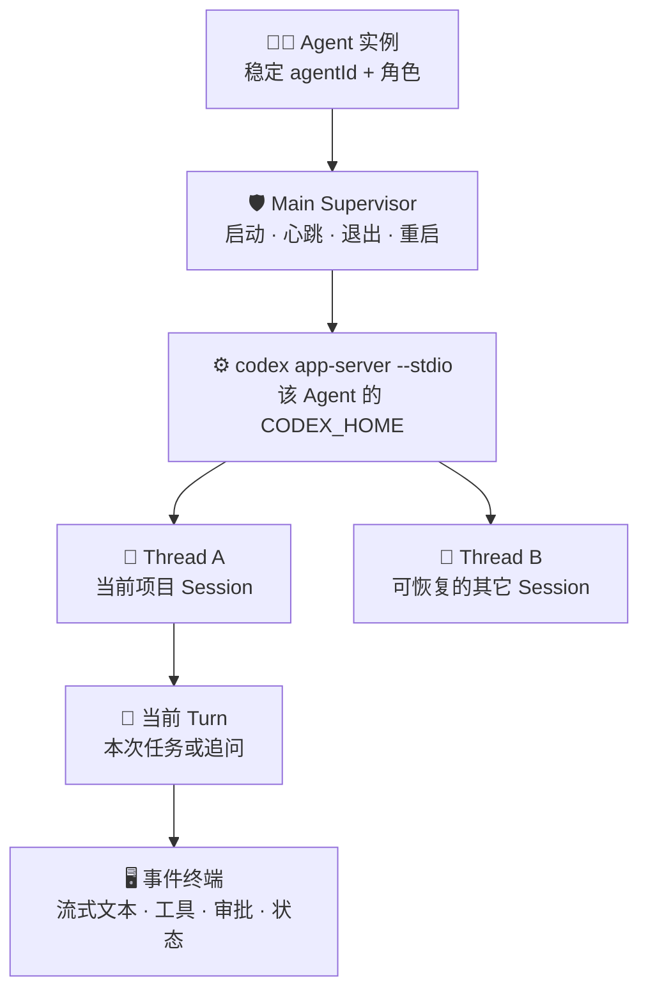
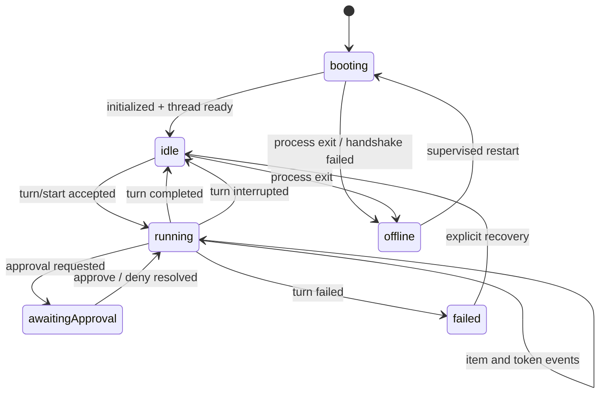
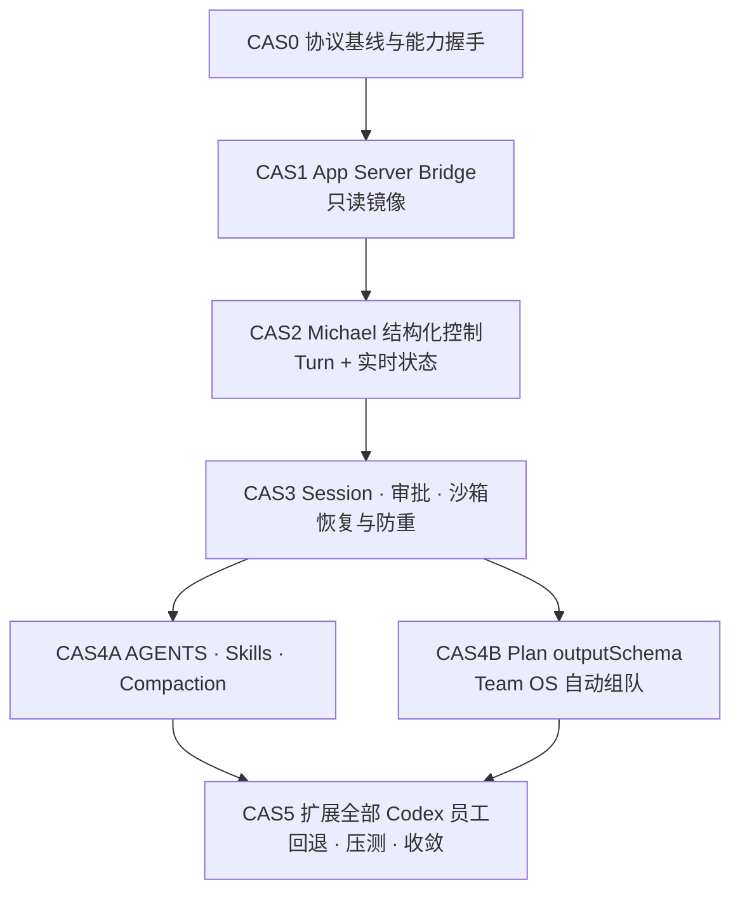

# Munder Difflin Codex App Server 原生运行桥升级实施规划

> 本文把 Munder、Hive、Team OS 与 Codex 的整套链路分析收敛为实施合同和 Gate 板。核心目标不是重写 Munder，也不是再造一个 Agent 框架，而是让 Munder 继续承担“本地专业团队操作系统”的产品职责，同时把 Codex 线程、回合、工具、审批、沙箱、状态和上下文管理交还给 Codex 原生 App Server。CAS0～CAS5 已于 2026-08-24 完成；本文保留设计理由、完成合同和动态证据路由，不再把已落地主链描述为未来设想。

## 1. 文档定位与总判断

### 1.1 一句话结论

Munder 当前的总体分层方向是正确的，最需要升级的不是地图、角色或 Team OS，而是 Codex Provider 的控制面：

- **保留** Munder 的办公室 UI、Michael 总控心智、Team OS 组织合同、Hive 文件协作与项目仓库权威；
- **替换** Codex 日常消息依赖 PTY 模拟键盘输入、Hook 推断状态、宽泛绕过审批和 Session 文件扫描的脆弱主链；
- **采用** Codex App Server 的 `thread`、`turn`、事件、审批、沙箱、Goal、Compaction、Skills 和结构化输出能力作为 Codex 原生运行桥；
- **兼容** Gemini、DeepSeek 等 Provider 继续使用现有 PTY/Hook Bridge，不为追求统一而降级 Codex，也不把 Codex 专属假设写进公共 Provider 合同；
- **渐进迁移**：先只读镜像，再让 Michael 试点结构化控制，最后扩展到其它 Codex 员工；任何阶段失败都能退回现有 PTY 主链。

目标关系可以概括为：

> Munder 管办公室和人，Team OS 管组织和方法，Hive 管持久协作事实，Codex App Server 管模型运行循环，项目仓库管真实工作。

### 1.2 本轮要解决的问题

| 问题 | 当前表现 | 目标结果 |
| --- | --- | --- |
| 消息投递脆弱 | 队列消息最终通过 PTY 输入，需判断启动、空闲、光标和终端静默 | Codex 消息通过 `turn/start` / `turn/steer` 结构化提交，有明确接受、执行、完成和失败状态 |
| 状态事实分裂 | Hook、PTY 静默、Registry、Fleet 和 Renderer 各自推断一部分状态 | App Server 事件成为 Codex 实时状态权威；Registry 只管身份/恢复，Fleet 只做物化快照 |
| Session 语义间接 | 通过 CLI 本地元数据和终端恢复间接管理 | Agent、Thread、Turn、Session、Goal 有稳定映射，支持原生 resume、fork、interrupt、compact |
| 权限过宽 | 因项目 cwd 与 Hive 目录分离，Codex 自动模式使用宽泛 bypass 参数 | 使用精确可写根目录和结构化审批，把必要决定投影到 Munder“问我” |
| Bootstrap 重复 | 角色、记忆、Roster 和工作协议可能反复进入终端输入 | 稳定内容进入分层 `AGENTS.md`，Skills 按需加载，动态任务只在 Turn 中发送，Roster 只发语义增量 |
| 计划输出易漂移 | Michael 的 Plan Manifest 依赖自然语言遵守结构 | 同一 Thread 的规划 Turn 使用 `outputSchema`，Main Process 继续做确定性 schema、DAG、授权和写集合校验 |
| Provider 被最低公分母限制 | 所有 Provider 若都只抽象成 PTY，就无法利用 Codex 原生能力 | 公共能力接口保持中立，Codex 走 native capability path，其它 Provider 保留兼容桥 |

### 1.3 明确非目标

- 不用数据库、消息总线或云端编排替换 Hive；
- 不让 Team OS 变成第二个模型运行时或第二个 Agent Loop；
- 不把全部可见员工替换为 Codex 原生 subagent；
- 不复制项目 `AGENTS.md`、正式设计、Skills、Gate、生产事实到 Team OS；
- 不让地图动画承担任务状态机或运行调度；
- 不一次性删除 PTY、Hook Bridge、Session Catalog 或非 Codex Provider；
- 不在本阶段引入远端 App Server、WebSocket 服务、多人网络办公室或新的云基础设施；
- 不以迁移为由扩大 Git、生产、远端、数据删除或秘密读取权限；
- 不把 Codex 内部协议细节泄漏为用户必须理解的操作步骤。
- 不把日志保留策略、完整备份恢复或 Hive 内部 Git 版本化绑成 App Server 迁移的前置；这些继续按个人长期运行安全设计独立演进。

### 1.4 优先级结论

| 优先级 | 内容 | 原因 |
| --- | --- | --- |
| P0 | App Server Bridge；Michael 原生 Turn 控制；精确 writable roots 与结构化审批 | 直接解决 PTY 投递、状态推断和宽泛权限三个主链风险 |
| P1 | 原生 Thread/Session/Goal/Compaction；Main 实时状态权威；最小 AGENTS；Skills 渐进披露；Plan `outputSchema` | 提升恢复、上下文效率、自动组队可靠性和用户可解释性 |
| P2 | 被动长期评测；可选只读原生 subagent 实验；日志/备份/内部 Git 的独立治理 | 有长期价值，但不应阻塞黄金主链，也不能先增加系统复杂度 |

### 1.5 实施状态与 Gate 板

| Gate | 状态 | 已闭合事实 | 动态收据 |
| --- | --- | --- | --- |
| G0 协议适用性 | 完成 | Codex CLI 0.148.0 的 stdio initialize、Thread/Turn、事件、审批、Goal、Skills、Compaction、schema 与失败边界完成真实探测 | `.work/runtime/codex-app-server/g0-capability/` |
| G1 只读镜像等价 | 完成 | JSONL 客户端、请求超时、stderr 隔离、未知事件、子进程监管、事件归一和无孤儿进程闭合 | `.work/runtime/codex-app-server/g1-shadow-events/` |
| G2 Michael 原生控制 | 完成 | 新建/resume、`turn/start/steer/interrupt`、事件终端、原生状态权威和无 PTY 键盘投递真实闭合 | `.work/runtime/codex-app-server/g2-michael-native/` |
| G3 Session/恢复/最小权限 | 完成 | list/read/resume、Goal、精确 writable roots、approve/deny、越界阻断、崩溃防重、唤醒核对闭合 | `.work/runtime/codex-app-server/g3-session-sandbox/` |
| G4 上下文与自动组队 | 完成 | 最小角色 AGENTS、项目 AGENTS 发现、Skills 渐进加载、usage/compact、Michael `outputSchema` 计划和真实 Luna 交付闭合 | `.work/runtime/codex-app-server/g4-context-plan/` |
| G5 全团队与兼容 | 完成 | 1 Sol + 5 Luna、12 个并发真实 Turn、IO 去重、运行索引免入 Hive Git、源码冷启动、单 Agent PTY 回退/恢复、Gemini/DeepSeek 回归、构建与 UI 闭合 | `.work/runtime/codex-app-server/g5-team-golden/` |

当前产品默认 `codexNativeRuntime=all`：所有 Codex 员工走 App Server 原生快路；配置仍可收窄到 Michael 或关闭，单个员工可在 UI 显式退回 PTY compatibility。Gemini 与 DeepSeek 未被迁移或伪造成 App Server，继续使用各自现有 PTY/Hook/Plugin 运行桥。

## 2. 证据基线与官方设计依据

### 2.1 Munder 当前代码事实

截至 2026-08-24，当前本机与源码事实如下：

| 事实 | 位置/说明 | 对规划的影响 |
| --- | --- | --- |
| 本机 Codex 为 `codex-cli 0.148.0` | `codex --version` | 可以进行真实协议探测，但版本升级必须重新握手，不能假定字段永久不变 |
| `codex app-server` 已存在 | 当前 CLI 将命令标记为 experimental；默认支持 `stdio://`，也列出 Unix/WebSocket transport | 首版只采用本地 stdio；保留现有 PTY 回退，不把实验接口直接替换为唯一主链 |
| Codex PTY 自动模式保留 bypass 参数 | `src/shared/agentProvider.ts` 中 Codex compatibility preset 仍可在用户显式 Auto Mode 下使用 `--dangerously-bypass-approvals-and-sandbox`；原生路径不读取该参数 | 原生日常主链已收敛为精确 writable roots、`on-request` 与结构化审批；不能把 compatibility 参数误判为 native 默认 |
| Codex 模型已区分总控与执行 | Michael 推荐 `gpt-5.6-sol`，worker 推荐 `gpt-5.6-luna` | 保留现有模型分工，不因运行桥迁移改变角色体系 |
| 队列按 Runtime 能力消费 | Codex native 由 Main 直接 `runtimeSubmit`；`src/renderer/src/hooks/useHive.ts` 的 boot/quiescence/queue 启发式只服务 PTY Provider | Codex 常规工作单不模拟键盘，PTY 只作 Gemini/DeepSeek 与显式 compatibility 入口 |
| Fleet 是运行投影 | `src/main/index.ts` 从 native snapshot 或兼容状态周期写 Fleet | Codex App Server event 是实时权威，Registry 管身份/恢复，Fleet 不反向驱动原生状态 |
| Remote 能力探测依赖安装布局 | `src/shared/codexRemote.ts` 主要检查 `CODEX_HOME/packages` 和 standalone 路径 | 必须改成“实际命令 + 初始化握手 + 能力集”探测，不能由安装目录猜能力 |

这些代码事实只用于界定迁移入口。实施时应先冻结当前 diff 和动态基线，再以当时源码为准定位准确写集合，不能用本文路径替代只读审计。

### 2.2 Codex 官方公开机制

本规划只把官方公开能力视为外部合同，不依赖对 Codex 私有实现的猜测：

1. OpenAI 将 Codex harness 描述为负责上下文、工具、会话状态、流式执行、沙箱/审批、失败恢复和跨 Turn 工作的运行层；宿主产品负责界面、业务上下文、规则、工具和审批体验。[Codex as a platform](https://learn.chatgpt.com/blog/codex-as-a-platform)
2. App Server 是构建富客户端的协议入口，公开 `thread/start`、`thread/resume`、`thread/fork`、`thread/read`、`turn/start`、`turn/steer`、`turn/interrupt`、流式事件、审批、Goal、Compaction、Token usage 和结构化输出等能力。[Codex App Server](https://learn.chatgpt.com/docs/app-server)
3. Codex 的 `AGENTS.md` 采用全局到项目、项目根到当前目录的分层发现；更接近 cwd 的文件优先，并有上下文大小限制。[AGENTS.md discovery](https://learn.chatgpt.com/docs/agent-configuration/agents-md)
4. Skills 使用渐进披露：先暴露紧凑的名称、描述和路径，只在选择后加载完整 `SKILL.md`；也可以被显式调用。[Build skills](https://learn.chatgpt.com/docs/build-skills)
5. Codex subagent 适合独立、可并行、读密集的探索、测试和汇总，但会增加 Token，且并行写入存在冲突风险。[Subagents](https://learn.chatgpt.com/docs/agent-configuration/subagents)
6. 官方提示词建议强调目标、上下文、输出和边界，优先描述结果而非堆叠执行步骤。[Prompting](https://learn.chatgpt.com/docs/prompting)
7. Hooks 适合生命周期前后的确定性脚本，例如审计、秘密扫描、摘要和验证；它们是规则执行器，不应替代模型运行协议。[Hooks](https://learn.chatgpt.com/docs/hooks)
8. GPT-5.6 官方指南建议保持提示词精简、稳定内容靠前、动态内容靠后，并通过可验证结果持续优化；官方给出的 Agent 评测改善是方向性证据，不应直接当作 Munder 的既成收益。[GPT-5.6 prompting guide](https://developers.openai.com/api/docs/guides/latest-model)

### 2.3 官方事实与本项目推论的边界

| 类型 | 可以确定 | 仍需在 CAS0 实测 |
| --- | --- | --- |
| 官方协议 | 有 Thread、Turn、事件、审批、Goal、Compaction、Skills、结构化输出等公开能力 | 本机 `0.148.0` 的具体 schema、事件顺序、错误码、恢复边界 |
| 本地 transport | 当前 CLI help 提供 stdio、Unix、WebSocket | stdio 子进程退出、应用睡眠/唤醒、多个 Agent 并发时的稳定性 |
| Munder 集成 | App Server 能替代 Codex 的日常 PTY 控制面 | 是否一 Agent 一进程、共享进程多 Thread；首版建议前者，仍需压力实测 |
| 权限 | 协议支持沙箱与审批 | 两个可写根（项目/worktree 与 Agent Hive）能否覆盖现有黄金主链全部动作 |
| 上下文 | AGENTS 与 Skills 可减少重复提示词 | 实际 Token 节省、质量和冷启动差异必须通过 Munder 自己的长期样本验证 |

## 3. 设计原则

### 3.1 每类事实只有一个权威所有者

| 层级 | 唯一职责 | 不应承担 |
| --- | --- | --- |
| Munder Renderer | 办公室、终端/事件视图、任务、审批、Session 和 Gate 的用户交互 | 猜测模型是否空闲、解析终端文本决定业务状态 |
| Munder Main Process | Provider 生命周期、协议桥、计划确定性校验、权限投影、运行状态物化 | 代替 Michael 做产品判断，复制项目长期规则 |
| Team OS | 组织原则、职业模板、能力路由、项目适配器、协作拓扑与 Gate 方法 | 保存运行 Session、Transcript、实时任务状态或项目正文 |
| Hive | Agent 身份、Inbox/Outbox、任务、记忆、最小投递账本和恢复事实 | 充当第二个模型上下文或完整 Transcript 仓库 |
| Codex App Server | Codex Thread、Turn、工具循环、流式事件、审批、沙箱、Goal、Compaction | 决定 Munder 的团队结构、项目权威或用户界面 |
| 项目仓库 | `AGENTS.md`、源码、正式设计、机器计划、Gate 和生产事实 | 迁就 Munder 而复制为另一份合同 |

### 3.2 原生快路与兼容桥并存

公共 Provider 层只定义业务所需能力，不强迫所有实现具备同样的底层协议：

```text
AgentRuntime
├── capabilities(): RuntimeCapabilities
├── startOrResumeSession(...)
├── submitTurn(...)
├── steerTurn(...)
├── interruptTurn(...)
├── observeEvents(...)
├── respondToApproval(...)
└── dispose(...)
```

- `CodexNativeRuntime` 通过 App Server 实现完整能力；
- `PtyHookRuntime` 继续服务 Gemini、DeepSeek 及 Codex 回退模式；
- UI 根据 capabilities 呈现可用操作，不用 Provider 名称散落判断；
- `thread/fork`、Goal、Compaction、结构化审批属于可选能力，不伪造跨 Provider 一致性；
- Provider 公共状态只保留 `booting / idle / running / awaiting-approval / blocked / completed / failed / offline` 等用户需要的语义状态。

### 3.3 实施采用的切换顺序

实际迁移按以下顺序完成，今后重做协议大版本迁移仍遵守同一 Gate：

1. 先握手，并用专用探针 Thread 把事件只读镜像到调试状态，不改变真实 Michael 的任何用户行为；
2. 对比 App Server 事件、Hook、PTY 和 Fleet，校准状态映射；
3. 仅让 Michael 的新任务走结构化 Turn，旧任务和其它 Agent 保持原链；
4. 完成 Session、审批、沙箱、上下文和恢复后，再扩到 Codex worker；
5. 旧 PTY 主链至少保留一个稳定版本周期，确认回退和数据兼容后才降为明确的兼容模式。

## 4. 目标架构



### 4.1 一名员工的推荐进程拓扑

首版采用“**一个可见 Codex Agent 实例对应一个本地 App Server stdio 子进程**”：



选择理由：

- 延续当前每个员工独立进程、独立 `CODEX_HOME`、独立角色与恢复边界；
- 5～6 个日常 Agent 的规模下，隔离和故障定位价值高于共享进程节省的少量资源；
- 一名员工可在自己的 App Server 中维护多个 Thread，但同一时间默认只运行一个前台 Turn；
- 一个进程异常只影响一个员工，Main 可单独恢复；
- 首版不引入共享 daemon、远端 socket、鉴权和跨客户端竞争。

若 CAS5 压测证明进程资源不可接受，才比较“办公室共享一个 App Server、多 Thread 隔离”的方案；不能在没有数据前预先引入共享路由复杂度。

### 4.2 “终端”在原生运行桥下的含义

- Codex 原生模式下，当前终端面板默认变为**结构化事件视图**：显示模型流式输出、工具调用、命令、文件变更摘要、审批请求、Token 和完成状态；
- 用户常规工作仍在队列输入框或 Michael 对话入口发送，不必操作终端；
- “直接终端”保留为高级兼容模式，可启动 PTY/TUI，但不能与 App Server 同时控制同一个活动 Thread；
- 切换到兼容模式前必须确认当前 Turn 已结束或中断，避免两个客户端同时写同一 Session；
- Gemini、DeepSeek 等非原生 Provider 的终端仍保持真实 PTY。

## 5. 核心机制设计

### 5.1 App Server Bridge

Main Process 新增一个 Codex 原生 Bridge，候选职责如下：

1. 启动 `codex app-server --stdio`，管理 stdin/stdout/stderr 和退出；
2. 完成 initialize/版本/能力握手，生成运行期 `RuntimeCapabilities`；
3. 发送带 request id 的协议请求，维护超时、取消和待响应表；
4. 校验每一行 JSON，隔离 stderr，禁止把协议噪声当成模型内容；
5. 把原始事件归一为 Munder runtime events；
6. 对未知事件保留兼容告警但不中断已知主链；
7. 对 schema 不兼容、进程退出和超时显式失败，不静默改走重复提交；
8. 对日志做字段白名单和秘密脱敏，默认不保存完整 Prompt、Response 或 Transcript；
9. 允许每个 Agent 单独 dispose/restart，应用退出时有界结束子进程；
10. 向现有 Provider 层暴露能力，不让 Renderer 直接依赖 JSON-RPC 字段。

能力探测必须以真实握手为准。`CODEX_HOME/packages`、PATH、npm 安装位置或文件布局只能帮助定位命令，不能再单独决定“是否支持 App Server”。

### 5.2 实时状态权威

Codex 原生模式使用以下状态链：



事实归属固定为：

| 数据 | 权威 | 物化/消费方 |
| --- | --- | --- |
| Thread/Turn 当前状态 | App Server events | Main runtime store → Renderer、Fleet |
| Agent 身份、角色、Hive Home | Registry | Main、恢复逻辑 |
| 当前任务与依赖 | Hive tasks | Michael、任务 UI、Gate |
| 消息是否已提交到哪个 Turn | Hive 最小投递绑定 | Main 恢复与防重 |
| 8 秒办公室摘要 | Fleet | 只读消费者，不反向覆盖 App Server 状态 |
| 角色动作动画 | Renderer 从语义状态投影 | 不成为任务权威 |

Codex 原生 Agent 不再使用“终端静默 N 秒”判定 idle，也不再把 Registry 启动时写入的 `idle` 当作实时事实。PTY fallback 仍可使用原启发式，但必须带 `statusSource=pty-heuristic`，避免和 native event 混淆。

### 5.3 Hive 消息与 Turn 的可靠投递

Hive 继续保存团队消息；App Server 只负责执行消息对应的 Turn。最小投递状态为：

```text
queued → submitting → accepted(threadId, turnId) → running
       → completed | failed | interrupted | unknown-after-crash
```

每条待投递消息必须有稳定 `messageId`。Main 在发送前记录 `submitting`，收到 App Server 的 Thread/Turn 标识后原子记录绑定，再把消息标为 accepted。恢复时：

- 已有 `turnId`：通过 `thread/read` 或事件恢复状态，绝不重新提交；
- 只有 `submitting`、没有 `turnId`：进入 `unknown-after-crash`，先做 Thread 对账，不能猜测“没发送”而自动重复；
- 确认不存在对应 Turn 才允许用户或 Michael 选择重投；
- `turn/steer` 只用于同一活动 Turn 的补充方向，新的独立任务仍用 `turn/start`；
- `turn/interrupt` 只停止当前 Turn，不删除 Hive 任务、Thread 或证据。

实施不追求无法证明的分布式“绝对 exactly-once”，而要达到：正常路径一次提交、崩溃路径不静默重复、所有不确定状态可见且可对账。

### 5.4 Agent、Session、Thread、Turn 与 Goal 映射

| Munder 概念 | Codex 原生概念 | 合同 |
| --- | --- | --- |
| 角色模板 | `AGENTS.md` 角色内核 + Team OS 能力选择 | 可复用职业，不等于一个运行进程 |
| Agent 实例 | 一个受 Main 监管的 App Server 进程 + 稳定 agentId | 地图上的一名员工；有独立 Hive Home 和运行隔离 |
| Session | Thread | 串行无关事项切新 Thread，同一事项继续 resume 原 Thread |
| 当前工作 | Turn | 一项明确任务、追问、规划或验证回合 |
| 方向修正 | `turn/steer` | 只给正在运行的 Turn 增量补充，不重发 Bootstrap |
| 停止当前工作 | `turn/interrupt` | 保留 Thread、任务和已产生证据 |
| 分析分叉 | `thread/fork` | 默认不开启；仅在需要对同一上下文做独立方案比较时使用 |
| 长期目标 | `thread/goal/*` | Michael 可维护总目标；员工 Thread 维护本 Lane 目标 |
| 上下文压缩 | `thread/compact/start` | 由 Token 阈值、阶段边界或用户操作触发，不向终端反复输入 `/compact` |

UI 的最近 Session 列表最终优先使用 `thread/list/read` 获取原生状态；现有有界 CLI 元数据扫描保留为 PTY 兼容和迁移期后备，不复制 Transcript。

### 5.5 审批与沙箱

目标是删除 Codex 原生日常路径对宽泛 bypass 的依赖，而不是增加用户审批负担。

推荐默认策略：

- `cwd` 仍是上下文锚点；
- writable roots 最少包含本次项目仓库或 worktree、该 Agent 自己的 Hive 目录；
- Team OS 和非目标仓库默认只读；
- 网络、项目外写入、系统目录、Git push、生产和破坏性操作按项目规则进入明确审批；
- App Server 的 command/file/permission approval 事件统一投影到 Munder“问我”；
- Michael 合并重复或同源审批，向用户说明动作、目标、风险和继续后的影响；
- deny 后 Turn 获得结构化结果，不能把拒绝误判为系统故障；
- 所有批准只作用于明确请求范围，不从“按结论开始推进”推导出 Git/生产授权。

多 writable roots 能否完整覆盖“项目工作 + Hive 协作”必须在 CAS3 用真实任务验证。若当前 App Server 版本不支持所需精度，保留 PTY fallback 并明确标记能力缺口，不恢复为静默 bypass。

### 5.6 Bootstrap 与上下文编译

目标上下文分五层，但只有需要的层进入当前 Thread：

| 层 | 内容 | 装载方式 | 更新频率 |
| --- | --- | --- | --- |
| 1. Codex 基础能力 | 模型、工具、沙箱、协议 | App Server 原生 | 运行时 |
| 2. 员工稳定角色 | 身份、职责、边界、协作原则、Hive 路径 | 每 Agent `CODEX_HOME/AGENTS.md` 的最小编译内核 | 角色版本变化时 |
| 3. 项目权威 | 项目根和 cwd 链上的 `AGENTS.md` | Codex 原生分层发现 | Thread 启动/恢复时 |
| 4. 按需专业方法 | Team OS 能力映射到实际 Skill 名称和路径 | 原生 Skills 渐进披露或显式 Skill input | 每项任务按需 |
| 5. 本次动态工作 | outcome、non-goals、输入、写集合、禁止修改、验证、预算、完成/停止条件 | `turn/start` 输入 | 每 Turn 一次 |

压缩原则：

- Michael、开发、测试等角色只保留不同的“职责差异”，共同安全规则引用统一合同，不在每个 `identity.md` 重复全文；
- `memory.md` 只保存经筛选的长期偏好、稳定事实和可复用教训，不保存 Session Transcript 或本次流水；
- Roster 首次只发紧凑团队摘要，后续只发新增、归档、角色变化等语义 delta；
- `COMMANDS.md`、项目规范和正式设计只给路径和选择理由，由 Agent 按任务读取；
- 同一 Turn 内不重复发送角色 Bootstrap；Thread resume 不重新粘贴全部身份；
- Main 展示 App Server 返回的 `instructionSources`，用户可以看到本 Thread 实际加载了哪些 AGENTS，而不是靠猜测；
- 上下文大小、Token usage、compact 前后变化成为可观察指标。

### 5.7 Skills 与 Team OS 的结合

Team OS 维护的是“需要什么能力”，Skills 维护的是“怎样执行一种专业方法”，项目维护的是“这个项目的真实规则”。三者不能合并成一份大 Prompt。

推荐链路：

```text
Team OS role/capability
    → 解析到可用 Skill 名称/描述/路径
    → Michael 在 Plan Manifest 中声明所需能力
    → Main 校验 Skill 可用性
    → 对应员工 Turn 显式选择必要 Skill
    → Codex 只在命中时加载完整 SKILL.md
```

约束：

- Team OS 不复制 Skill 正文，只维护稳定 skill id、用途和选择条件；
- 项目专属 Skill 继续留在项目 `.agents/skills`；个人通用 Skill 可留在 Codex 用户技能目录；
- Munder 可展示“本 Turn 使用了哪些 Skill”，但不把 31 个或更多 Skill 全文注入角色 Prompt；
- Michael 不以职位名机械决定 Skill，而以任务证据、交付物和 Gate 选择最小集合；
- 同一任务只选一个流程所有者 Skill，领域 Skill 作为叠加层，验证/运维 Skill 只执行已定计划；
- Skill 加载失败时显示缺失能力，不偷偷用长 Prompt 模拟另一份 Skill。

### 5.8 Michael 结构化计划与自动组队

用户体验继续保持：

> 与 Michael 讨论想法 → 结论满意 → 说“按结论开始推进” → Michael 自动读取权威 → 自动形成计划、DAG、角色与 Session 分配 → 自动组织协作并按 Gate 汇报。

迁移后不新增第二个规划模型。Main 对同一 Michael Thread 发起一个带 `outputSchema` 的 planning Turn：

1. 动态输入只包含本次讨论结论、选定项目和启动意图；
2. Michael 自己读取项目 `AGENTS.md`、实施规范、正式设计和机器计划；
3. 通过结构化输出返回 Plan Manifest；
4. Main 只校验 schema、DAG、项目、workspace、写集合、角色/能力、并发、授权和预算；
5. 校验失败以结构化错误回到同一 Thread 修正；
6. 校验成功后写入现有 Hive tasks/inbox 并分配真实员工；
7. Michael 继续是唯一综合与跨 Lane Gate 负责人。

最低 Plan Manifest 字段继续沿用[个人团队操作系统与多项目工作流分层设计](../正式设计文档/04-Munder-Difflin个人团队操作系统与多项目工作流分层设计.md)的合同：project/workspaces、outcome/non-goals/acceptance、authority refs、lanes、dependencies、topology rationale、authorization 和 stop conditions。App Server 负责约束输出形状，PlanCoordinator 继续负责确定性业务校验；两者不能互相替代。

### 5.9 Hook Bridge 的新边界

Codex 原生迁移后，Hook 不再承担 Codex 的主要状态和消息控制，但仍有价值：

- 运行确定性的秘密扫描、审计、策略检查和适用验证；
- 在 Turn 完成后生成“长期记忆候选”，由规则或 Michael 筛选后写 memory；
- 为 Gemini、DeepSeek 和 PTY fallback 提供现有生命周期桥；
- 在迁移期与 App Server 事件做双读对比；
- 执行与模型判断无关、必须稳定发生的本地动作。

同一事件必须有 `source=native-app-server | hook | pty-heuristic`。Codex native 成为权威后，Hook 同类事件只记兼容遥测，不能重复触发状态迁移、消息投递或任务完成。

### 5.10 原生 subagent 的边界

Munder 的正式专业员工继续是可见、可恢复、可分配 Session、拥有 Hive 信箱和任务卡的独立 Agent 实例，不改成隐藏 subagent。

Codex 原生 subagent 在本规划中默认关闭，不属于 CAS0～CAS5 的必做项。未来只有同时满足以下条件才可作为“临时实习生”试验：

- 工作是独立、读密集、写集合为空或完全互斥；
- 结果只需返回给正式 Lane owner，不需要长期角色、记忆、Session 或用户直接沟通；
- Token 和并发预算明确；
- 不替代用户选择的“独立 Luna 会话协同”主流程；
- 失败不会影响 Gate 权威。

## 6. 用户操作流程

### 6.1 日常使用不增加步骤

| 用户动作 | Munder 内部处理 | 用户看到 |
| --- | --- | --- |
| 在 Michael 队列输入想法 | 向 Michael 当前 Thread `turn/start` | 对话、工具与状态流 |
| Michael 运行时补充方向 | 对活动 Turn `turn/steer` | “已补充方向”，不出现重复 Bootstrap |
| 按结论开始推进 | 同 Thread 发起结构化 planning Turn | 规划中 → DAG/角色摘要 |
| Michael 分派员工 | PlanCoordinator 写 Hive，目标 Agent 启动/恢复 Thread | 地图入座、任务卡、执行状态 |
| 员工需要权限 | App Server approval event → “问我” | 一个合并且可理解的批准问题 |
| 切换 Session | `thread/list/read/resume` | 最近 Session、项目、状态和继续入口 |
| 停止当前任务 | `turn/interrupt` | 当前 Turn 停止，Session/任务证据保留 |
| 上下文接近阈值 | token event + `thread/compact/start` | 可见压缩状态和结果，不刷入重复命令 |

### 6.2 用户不需要理解的内部细节

- JSON-RPC request id、Thread id、Turn id；
- AGENTS discovery 顺序和 Skill 文件路径；
- stdio 子进程、Hook 事件和 Fleet 快照；
- writable roots 的协议字段；
- Plan Manifest 完整 schema。

这些只在高级检查器、调试页或 `.work` 脱敏收据中按需查看。默认界面继续用“讨论中、规划中、执行中、验证中、等待你、完成”六个阶段。

## 7. 已执行分波、DAG 与原始时间预算

### 7.1 总体 DAG



`CAS4A` 与 `CAS4B` 只有在 CAS3 冻结公共协议和写集合后才可并行；其它阶段默认串行。并行时最多两个真实独立 Lane，必须写集合互斥并可单独验收。

### 7.2 工作包（完成记录）

| 包 | 目标与建议写集合 | 非目标/禁止修改 | 验证 | 预算 |
| --- | --- | --- | --- | --- |
| CAS0 | 冻结 PTY/Hook/Fleet 基线；生成当前 App Server schema/bindings；完成 initialize、thread、turn、event、approval 探针；写 `.work` 收据 | 不改变运行行为；不读取 API Key 内容；不接 WebSocket | 本机握手、版本/能力矩阵、未知事件、退出/超时、秘密扫描 | 0.5～1 天 |
| CAS1 | Main 新增协议客户端、子进程 supervisor、事件归一化和 Provider capability；仅用专用受控测试 Thread 镜像事件，真实 Michael 仍走原 PTY | 不复制真实 Michael 工作、不产生双模型回合；不改 Renderer 主操作 | fake server 单测、真实 stdio、代表性事件与 Hook/Fleet 语义对照、进程泄漏 | 1.5～2.5 天 |
| CAS2 | Michael 新任务改用 `turn/start/steer/interrupt`；Main runtime state 成为权威；终端显示结构化事件；保留显式 PTY fallback | 不扩到 worker；不删 Hook/Session Catalog | 同 Thread 多轮、steer、interrupt、状态延迟、无 PTY 键盘投递、回退 | 2～3 天 |
| CAS3 | 原生 thread list/read/resume/fork 边界、Goal、投递绑定、防重复、崩溃恢复、审批 UI、精确 sandbox roots | 不自动批准 Git/生产；不远端监听；不启用共享 daemon | 睡眠/唤醒、App/子进程 crash、unknown-after-crash、approve/deny、越界写阻断 | 2～3 天 |
| CAS4A | 每 Agent 最小 AGENTS 编译、instructionSources、显式 Skills、token usage、原生 compact；压缩 Bootstrap/Roster | 不迁移项目 Skill 正文；不把 memory 当 Transcript | 上下文快照、技能选择、AGENTS 优先级、compact 恢复、Token 对比 | 1.5～2.5 天 |
| CAS4B | Michael planning Turn 使用 outputSchema；PlanCoordinator 接收原生结构结果并自动组队 | 不新增规划模型或任务数据库；不让 schema 自动授权 | 模糊讨论→开始→读取权威→合法 DAG→真实 Luna 实例；非法计划修正 | 1.5～2.5 天 |
| CAS5 | 扩展全部 Codex worker；Provider 兼容矩阵、5～6 Agent 压测、PTY 回退、旧主链降级、长期文档收敛 | 不改 Gemini/DeepSeek 内部机制；不删除可恢复 Session | G5 全部运行事实、冷重启、并发、资源、回退、类型检查/构建/适用回归 | 2～3 天 |

总有效开发预算约 11～17 天，不含后续数周的被动质量观察。若协议兼容或审批精度不足，应停在相应 Gate，不用临时字符串解析补成“看似完成”。

### 7.3 任务拓扑与会话协同规则

每个实施包由 GPT-5.6 Sol 主会话统一分析、DAG、集成和跨 Lane Gate。只有真正独立、写集合互斥且能单独验收时，才创建 GPT-5.6 Luna 独立会话：

- 机械协议/回归核验使用 Luna low；
- 局部协议桥、UI 或上下文实现使用 Luna medium；
- 每个独立任务必须写目标、非目标、输入、写集合、禁止修改、验证、时间预算、完成和停止条件；
- 不使用隐藏 subagent 代替正式会话协同；
- 共享工作区先按路径锁定写集合，若出现重叠，立即收回主会话串行集成；
- 每 Lane 只产出实现与 `.work/delegated/.../receipt.md`，不自行提交、推送或更新跨 Lane 完成结论。

## 8. Gate 合同

### 8.1 G0：协议适用性

全部满足才进入 CAS1：

1. 本机 App Server 可通过 stdio 初始化并返回可识别版本/能力；
2. 实际 schema 与官方文档的核心 Thread/Turn/Event 能力一致，差异有显式兼容表；
3. TypeScript binding/schema 可固定到当前版本或生成稳定的本地测试夹具；
4. stdout 只承载协议，stderr 可隔离，进程退出和无效 JSON 能明确失败；
5. 不读取、输出、记录或提交 API Key；动态收据不保存 Prompt/Transcript。

若 G0 不通过，保留现有 PTY 主链，只更新能力探测和设计状态，不进入“半原生”实现。

### 8.2 G1：只读镜像等价

1. Bridge 可监督启动、请求、事件、取消和退出，无孤儿进程；
2. 至少覆盖 thread started/active/idle、turn running/completed/failed/interrupted、approval requested 和 token usage；
3. 同一真实测试任务的 App Server 状态与 Hook/PTY 动态证据完成对照；
4. 未识别事件不导致崩溃或错误完成；
5. Munder 正常 PTY 使用完全不受影响。

### 8.3 G2：Michael 原生控制主链

1. Michael 新 Session 和已有 Thread resume 均可真实运行；
2. 常规队列消息不再通过 PTY 输入，`turn/start` 只提交一次；
3. 运行中追问使用 `turn/steer`，停止使用 `turn/interrupt`；
4. UI 状态只来自 native event，Fleet/角色动画与之匹配；
5. 结构化事件终端可看见回复、工具、状态和错误；
6. 一键退回 PTY compatibility 后仍能处理新工作，不破坏原 Session 文件。

### 8.4 G3：Session、恢复与最小权限

1. Agent/Thread/Turn/Goal 映射可重启恢复；
2. 最近 Session 可 list/read/resume，切换不会覆盖旧 Thread；
3. 崩溃窗口没有静默重复 Turn；不确定投递会显示并可对账；
4. project/worktree + own Hive writable roots 支撑真实读写、工具、测试和任务通信；
5. 越界文件写、网络、Git/生产等审批能进入“问我”，approve/deny 都有正确后续；
6. Codex native 默认参数中不再使用宽泛 bypass；
7. 应用冷重启、系统睡眠/唤醒和 App Server 子进程崩溃均有动态收据。

### 8.5 G4：上下文与自动组队

1. 每 Agent 最小角色 AGENTS 与项目嵌套 AGENTS 正确组合，UI 可展示 `instructionSources`；
2. 角色 Bootstrap 在同一 Thread 不重复粘贴，Roster 只发语义变化；
3. 任务只加载必要 Skills，未选 Skill 不加载全文；
4. Token usage 和 compact 可观察，compact 后身份、任务、边界和未完成事项保持；
5. “按结论开始推进”在同一 Michael Thread 返回 schema 合法的 Plan Manifest；
6. PlanCoordinator 对越权、环、写冲突、无效 workspace 和过度组队仍做确定性拒绝；
7. 简单任务保持单 owner，只有真实独立 Lane 才创建 Luna 员工实例。

### 8.6 G5：全 Codex 团队与兼容闭合

1. Michael 和至少 4～5 个 Codex worker 连续运行，Thread、Turn、队列、审批、Gate 和地图状态一致；
2. 两个同角色并行 Lane 使用两个独立 Agent 实例，不共享活动 Thread；
3. Gemini/DeepSeek 的 PTY/Hook 既有主链无回归；
4. Codex 原生失败时可按 Agent 降级，不拖垮整个办公室；
5. CPU、内存、文件 IO、事件延迟和 Token 使用在日常 5～6 Agent 规模下可接受；
6. 全部适用类型检查、目标测试、Electron 构建和真实源码启动通过；
7. 正式设计、Team OS 合同、Gate 板和 `.work` 动态收据全部闭合后，才可宣布原生运行桥完成。

## 9. 测试与动态证据设计

### 9.1 最小公共测试接口

建议围绕稳定语义测试，不让测试依赖 JSON-RPC 私有字段散落：

```text
probeCodexRuntime(command, env) -> RuntimeCapabilities
startOrResumeAgentSession(agent, sessionRef) -> RuntimeSession
submitAgentTurn(session, message, options) -> TurnBinding
reduceRuntimeEvent(state, event) -> RuntimeState
reconcileDelivery(message, threadSnapshot) -> DeliveryDecision
compileAgentContext(role, project, skills) -> ContextManifest
mapApprovalToUserRequest(event) -> ApprovalView
```

具体文件名、类名和存储布局在 CAS0/CAS1 冻结，不作为本文长期公共合同。

### 9.2 测试层级

| 层级 | 内容 | 是否需要真实模型 |
| --- | --- | --- |
| 单元 | JSONL parser、request table、event reducer、能力映射、投递状态、审批映射、schema 校验 | 否 |
| 协议夹具 | fake app server 的乱序、未知事件、超时、无效 JSON、进程退出 | 否 |
| 本机集成 | 真实 stdio initialize、thread/turn、interrupt、resume、compact | 是，限制为最小任务 |
| UI 集成 | 状态、事件终端、审批、“问我”、Session 切换、fallback | 最小真实 + 可重复夹具 |
| 黄金主链 | Michael 讨论→按结论开始→计划→Luna 分派→Gate 汇报 | 是 |
| 恢复与压力 | App/子进程崩溃、睡眠、冷重启、5～6 Agent、文件 IO/CPU/内存 | 是 |
| Provider 回归 | Gemini/DeepSeek PTY/Hook 路径 | 仅各自适用最小测试 |

### 9.3 `.work` 收据

动态证据建议写入：

```text
.work/runtime/codex-app-server/
├── g0-capability/
├── g1-shadow-events/
├── g2-michael-native/
├── g3-session-approval-recovery/
├── g4-context-plan/
└── g5-team-golden/
```

每个 Gate 收据只保留：版本、命令摘要、输入类别、事件类型计数、状态时间线、测试结果、资源指标、失败与止损结论、脱敏截图/哈希。禁止写入 Key、完整 Prompt、完整 Transcript、命令环境变量、一次性认证信息或模型隐私内容。

### 9.4 长期质量指标

迁移收益必须由后续真实使用验证，至少观察：

- 工作单重复投递次数；
- 状态误判和用户手动干预次数；
- Session 恢复成功率；
- 审批问题数量与误阻断；
- 单任务总 Token、Bootstrap Token、compact 次数；
- 首 Token 延迟、完整 Turn 延迟和多 Agent 并发延迟；
- Gate 一次通过率、返工率和缺失证据率；
- App Server/Agent 进程异常与降级次数。

这些指标只做被动、低成本遥测和周期复盘，不为了“科学化”建立复杂绩效系统，也不把个别任务成功自动固化为长期规则。

## 10. 兼容、失败止损与回退

### 10.1 能力降级顺序

```text
Codex Native App Server
    ↓ 当前 Agent 握手/运行失败
Codex PTY + Hook compatibility
    ↓ Codex CLI 本身不可用
Agent offline + 明确错误 + 保留 Hive/Session
```

降级必须按 Agent 发生，不能因一个员工失败关闭全部办公室。用户可看到当前 runtime mode 和失败原因，但默认不需要理解协议细节。

### 10.2 停止条件

出现以下任一情况，停止当前最小包并回到直接上游：

- 本机 App Server schema 与官方能力严重不一致，无法稳定初始化或恢复；
- 需要解析自然语言终端输出才能补足关键 Thread/Turn 状态；
- 无法避免崩溃窗口静默重复工作；
- writable roots 无法覆盖黄金主链，且只能恢复宽泛 bypass；
- native 与 Hook 同时驱动业务导致重复消息、重复完成或状态振荡；
- Michael output schema 不稳定：先缩小 schema/Turn 输入，不新增第二个模型；
- 5～6 个一 Agent 一进程的资源成本不可接受：先取证，再评估共享进程，不边运行边堆缓存；
- 非 Codex Provider 因公共抽象被迫伪造能力或发生回归；
- 需要新的远端、生产、Git 或破坏性授权：进入等待用户，不从本规划继承。

### 10.3 不采用的补偿方案

- 用更复杂正则继续解析 Codex TUI；
- 用更短静默阈值假装获得实时状态；
- 把 App Server 全量事件和 Transcript 写进 Hive；
- 为防重复建立新的通用数据库或消息中间件；
- 同时启动 PTY 和 App Server 控制同一个活动 Session；
- 把所有 Team OS、项目设计和 Skills 预加载进每个 Agent；
- 因 App Server 有 subagent 就取消 Munder 的独立员工与会话协同。

## 11. 文档与长期合同收敛

G5 通过后更新以下权威，不在实施中提前宣告完成：

| 位置 | 应收敛内容 |
| --- | --- |
| 正式设计 `01` | Codex native/PTY 双运行桥、Thread/Turn 映射、实时事实权威、Hive 投递关系、Bootstrap 新链 |
| 正式设计 `02` | App Server 子进程、Session、权限、备份恢复和降级安全边界 |
| 正式设计 `04` | Team OS capability→Skill、Michael outputSchema 计划、独立员工与 Thread 分配；原 PTY/Session 描述校准为 Provider Runtime 业务合同，不复制协议细节 |
| Team OS | 只更新必要的运行适配器接口、能力 id 和计划输出合同，不写 App Server 教程 |
| Gate 板 | 记录 CAS0～CAS5 当前状态、适用验证和真实运行结论 |
| `.work` | 保留动态版本、事件、截图、资源和运行收据；不进入长期正文 |

若 G0～G4 只部分完成，正式设计必须准确写“试点/双轨/兼容模式”，不能把代码存在或单元测试通过描述成黄金主链已完成。

## 12. 完成定义

只有以下事实同时成立，才能把本规划标记为完成：

1. Codex App Server 的本机适用性、协议兼容和版本边界有真实收据；
2. Michael 与全部目标 Codex worker 的日常消息、状态、Session、审批和中断走原生主链；
3. PTY 不再是 Codex 日常工作单的键盘投递器，但兼容回退真实可用；
4. Registry、Fleet、Hook 和 Renderer 不再争夺 Codex 实时状态权威；
5. Codex native 默认不使用宽泛 bypass，精确 writable roots 与“问我”审批闭合；
6. 角色 Bootstrap、Roster、Skills、memory 和 project AGENTS 不重复占用上下文；
7. Michael 在同一 Thread 完成讨论、结构化计划、自动组队和 Gate 汇报；
8. Gemini/DeepSeek 现有路径无回归；
9. 5～6 Agent 真实运行、冷重启、崩溃恢复、资源与文件 IO 验证通过；
10. 适用实现、验证、真实运行、`.work` 收据和长期文档全部闭合。

## 13. 完成后的维护入口

CAS0～CAS5 已闭合，不再继续扩展本规划。后续维护只遵守以下短合同：

1. Codex CLI/App Server 升级时先重跑 G0 协议夹具和最小真实握手，再允许稳定办公室使用新版本；schema、审批响应或事件顺序变化必须显式兼容，不能用终端文本解析补洞。
2. 原生主链回归优先运行 `test/codex-app-server.test.cjs`、`test/codex-native-runtime.test.cjs`、`test/tos-plan-coordinator.test.cjs`，再运行适用 Provider、Wave、Team OS、类型检查和 Electron 构建。
3. 5～6 人规模的 CPU、内存、IO、Turn 延迟、重复投递和人工干预只做低成本长期观察；发现稳定问题再开新的实施规划，不把遥测系统复杂化。
4. PTY compatibility 至少保留到真实长期使用证明可安全收窄；Gemini、DeepSeek 继续独立演进，不因 Codex 原生化被迫统一。
5. 原生 subagent、共享 App Server daemon、远端 transport、Wave 5～6 外的新基础设施仍不属于本规划完成范围。
