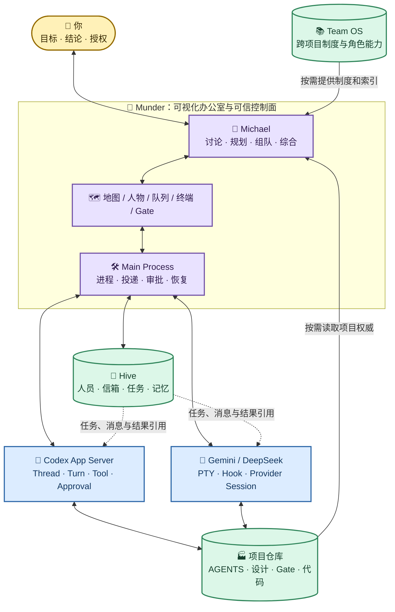
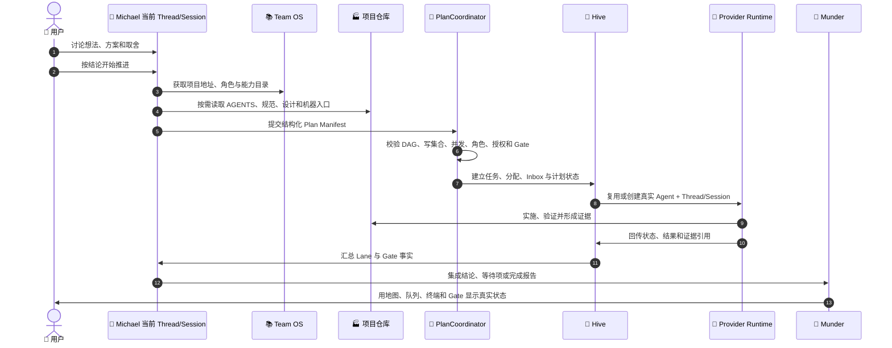

# Munder Difflin 系统说明书

> 本文是 Munder Difflin、Codex App Server、其他 Provider、Team OS、Hive 与项目仓库的统一阅读入口。它用一个稳定心智模型解释整套系统怎样协作；各专题的精确机器合同仍由本文引用的正式设计与源码拥有。

## 1. 怎样使用这份说明书

第一次阅读只需要完成三件事：

1. 打开 [交互式系统讲解器](assets/system-manual/index.html)，播放“一次任务”链路；
2. 记住“公司制度、办公室账本、员工大脑、项目工厂”四个区别；
3. 日常只从 Michael 继续讨论，结论满意后说“按结论开始推进”。

遇到问题时再按主题深入：

| 想了解的问题 | 权威入口 |
| --- | --- |
| Agent、Provider、Hive、消息、Session 和恢复怎样工作 | [多 Agent 角色办公室架构与运行机制](01-Munder-Difflin多Agent角色办公室架构与运行机制.md) |
| 稳定版/开发版、备份与恢复怎样安排 | [个人长期运行安全与备份恢复设计](02-Munder-Difflin个人长期运行安全与备份恢复设计.md) |
| 地图、角色、碰撞和主题怎样换肤 | [内置主题视觉与低风险换肤设计](03-Munder-Difflin内置主题视觉与低风险换肤设计.md) |
| Team OS、角色能力、多项目和工作流怎样分层 | [个人团队操作系统与多项目工作流分层设计](04-Munder-Difflin个人团队操作系统与多项目工作流分层设计.md) |
| Codex App Server 原生运行桥为何这样实现 | [Codex App Server 原生运行桥升级实施规划](../实施规划/05-Munder-Difflin-Codex-App-Server原生运行桥升级实施规划.md) |

本文不保存真实 Session ID、Key、一次性命令输出、当前进程号或某次测试结果。动态事实进入 `.work/`，秘密只在运行时使用。

## 2. 一句话理解整套系统

> Munder 是看得见、可控制的办公室；Team OS 是公司的长期制度；Hive 是这间办公室的人员、信箱和任务账本；Codex App Server 或其他 Provider 是员工真正思考和使用工具的大脑；项目仓库是员工实际工作的工厂。

这五类对象不是五套重复的 Prompt：

| 对象 | 形象理解 | 拥有的权威事实 | 明确不拥有 |
| --- | --- | --- | --- |
| Munder | 办公楼、前台和控制室 | UI、人物投影、Provider 进程、IPC、投递、审批、暂停与恢复机制 | 模型内部推理、项目业务事实 |
| Team OS | 公司章程、岗位手册和项目通讯录 | 跨项目角色、能力、协作方法、项目索引和结果合同 | 当前任务、Session、运行日志 |
| Hive | 当前办公室的花名册、邮局、任务簿和档案柜 | Agent 实例、信箱、任务、记忆、运行快照和恢复索引 | Provider 完整对话、项目正式设计 |
| Provider Runtime | 每位员工的电脑和大脑 | Thread/Session、模型上下文、工具调用、审批与 Provider 原生状态 | 其他 Agent 的身份和项目全局任务账本 |
| 项目仓库 | 工厂和产品资料库 | 项目 `AGENTS.md`、正式设计、机器计划、Gate、代码和运行事实 | 通用团队制度、办公室 Session |

## 3. 总体架构：一栋楼、两种大脑、三个档案柜



系统依赖方向是单向的：Team OS 和项目仓库提供稳定合同，Munder 将适用片段编译成计划、任务和 Provider 输入，Provider 执行真实工作，运行事件和协作结果再投影回 Hive 与 UI。Hive 的动态状态不能反向改写 Team OS 或项目权威。

## 4. 一次工作怎样从一句话跑到完成

日常主流程不是让用户填写复杂任务表，而是保持原有自然工作方式：



关键边界：

- Michael 是唯一规划判断者；PlanCoordinator 只做确定性校验和派工，不启动第二个模型重新理解对话。
- 简单工作默认由一个端到端负责人完成；只有独立验收、互补证据或互斥写集合能够覆盖协调成本时才增加 Lane。
- “按结论开始推进”只开启项目适配器允许的本地分析、实现、文档与适用验证；Git、远端、生产、破坏性操作和数据删除不会隐式开启。
- 项目正文由 Agent 按路径读取，不复制到 Team OS、Hive 或 Plan 文件。

## 5. 一个 Agent 到底由什么组成

一个人物不是一段角色 Prompt，而是一张由六部分组成的真实工位：

| 组成 | 主要载体 | 回答的问题 |
| --- | --- | --- |
| 人物身份 | Registry、`identity.md`、Roster | 这是谁，显示什么名字和形象 |
| 组织岗位 | Team OS `roles/capabilities.yaml`、`roleBinding.id` | 长期承担什么责任，已知盲点是什么 |
| 当前工作单 | Hive Task/Inbox、当前 Turn | 这一次具体做什么，写哪里，怎样验收 |
| Provider Runtime | Codex App Server 或 Provider CLI + PTY | 如何思考、调用工具、审批和报告状态 |
| Thread/Session | Provider 自己的会话存储 | 当前对话上下文和恢复点是什么 |
| 长期记忆 | `memory.md` | 哪些提炼事实跨 Session 仍值得保留 |

关系可以这样记：

> 人物是员工，岗位是职业，工作单是本次岗位，Thread/Session 是正在进行的谈话，`memory.md` 是员工自己的长期笔记。

同一个人物可以切换 Thread/Session 而不丢失工牌、信箱和长期记忆；同一岗位需要真正并行时，必须创建第二个 Agent 实例和独立活动 Thread/Session，不能让一个人的一个大脑同时执行两条互相独立的活动 Turn。

## 6. Codex 原生桥与其他 Provider 的区别

| 能力 | Codex 默认主链 | Gemini / DeepSeek / Codex 兼容模式 |
| --- | --- | --- |
| 运行入口 | 每 Agent 独立 `codex app-server --stdio` | 每 Agent 独立 CLI 进程和 PTY |
| 会话 | 原生 Thread，可 list/read/resume/new/fork | Provider 自己的 Session 参数和索引 |
| 消息投递 | `turn/start`；活动 Turn 可 `turn/steer` | 等待空闲、无草稿、未暂停后串行键入 |
| 实时状态 | App Server 结构化事件 | Hook/Plugin 事件与 PTY 启发式 |
| 审批 | 结构化 approval request/response | Provider TUI 或 Hook Gate |
| 恢复 | Thread read/resume + 运行索引 | 停止 CLI 后用有效 Session ID 重启 |

所以“统一 Provider”只统一办公室能够理解的最小状态、任务和控制语义，不假装底层能力完全一致。Codex App Server 是 Codex Harness 的原生协议入口；Munder 拥有团队 UI 和协作控制面，不复制 Codex Agent Loop。

## 7. Hive 文件显微镜

当前开发办公室的 Hive 根目录是 `/Users/kailonyang/Munder-Difflin/office-dev/hive`。稳定办公室使用相同结构，但位于 `/Users/kailonyang/Munder-Difflin/office/hive`。

| 文件或目录 | 形象理解 | 它保存什么 | 它不保存什么 |
| --- | --- | --- | --- |
| `registry.json` | 花名册和恢复索引 | Agent ID、Provider、角色、最近 Session、归档状态 | 实时工具过程、完整对话 |
| `fleet.json` | 当前值班快照 | 运行状态、用量、最近工具、断路器和 Inbox 积压 | 稳定角色合同、长期项目事实 |
| `tasks.json` | 结构化任务簿 | 负责人、状态、依赖、会话引用 | 自由形式规划全文 |
| `board.md` | Michael 的公告板 | 面向人类的当前协作摘要 | 第二套任务数据库 |
| `agents/<id>/identity.md` | 工牌 | 姓名、岗位、能力、cwd、语言 | 本次任务全文 |
| `agents/<id>/memory.md` | 私人长期笔记 | 跨 Session 仍有价值的提炼事实 | Transcript、心跳、重复状态 |
| `agents/<id>/inbox/` | 收件箱 | 送达该 Agent 的结构化消息 | 其他 Agent 的私有推理 |
| `agents/<id>/outbox/` | 发件箱 | 该 Agent 发出的结构化消息 | 对其他目录的直接写入权限 |
| `agents/<id>/runtime.json` | 原生运行书签 | Thread/Turn 状态与有界防重索引 | Prompt、Transcript、Key |
| `agents/<id>/.codex/` | Codex 私人电脑目录 | 独立认证链接、配置、Session、角色内核和 Skills | 其他 Agent 的身份和会话 |
| `cache/codex/` | 办公室公共软件仓库 | 可再生的公共插件目录和不可变版本缓存 | 认证、Session、角色、日志 |
| `PROTOCOL.md` | 邮局规则 | 消息格式和协作说明 | 每轮都要注入的完整 Prompt |
| `COMMANDS.md` | 操作参考卡 | 与 Provider 相符的 Hive/CLI 命令说明 | 自动执行授权 |
| `log.jsonl` | 办公室流水 | Spawn、Session、消息和任务等事件 | 完整 CLI Transcript |

消息不是“大家共同编辑一份文档”。Agent 只写自己的 Outbox，Main Router 是跨目录投递的唯一写者；Router 盖章后原子写入目标 Inbox，并把原件归档为 `.sent`。Codex 原生员工随后通过结构化 Turn 接收，PTY 员工则经过安全投递门。

## 8. Team OS 文件显微镜

当前 Team OS 位于 `/Users/kailonyang/Munder-Difflin/team-os`，是独立 Git 仓库，运行时默认只读。

| 路径 | 作用 | Munder 怎样使用 |
| --- | --- | --- |
| `AGENTS.md` | 跨项目协作短内核和安全边界 | 维护任务和命中场景按需读取 |
| `organization/` | 决策权、组织原则和科学协作操作模型 | Michael 需要组织判断时读取 |
| `roles/capabilities.yaml` | 七类稳定岗位与可叠加专业能力的唯一机器目录 | 添加人物、恢复人物、规划校验和自动复用共同使用稳定 ID |
| `workflows/` | 对话式规划、自适应组队、交接和状态合同 | 编译计划与工作单时按需引用 |
| `projects/registry.json` | 已登记项目列表 | 定位项目适配器，不复制项目文档 |
| `projects/adapters/*.yaml` | 项目权威、机器入口和能力边界的地址卡 | 有界解析项目路径、Workspace、Gate 和允许能力 |
| `templates/` | 结果卡和稳定数据模板 | 提供字段合同，不创建任务数据库 |
| `models/` | 模型/Provider 准入和长期观察合同 | 不代表已经自动选模或进入黄金主链 |
| `evals/` | 长期质量、效率和协作成本评测 | 用真实长期使用校准规则，不保存一次性运行流水 |

Team OS 不维护项目专属 Skills 的副本。项目 Skill 继续由项目仓库及其 `AGENTS.md` 路由；只有跨项目反复证明有价值并经用户决定晋升的能力，才进入通用层。

## 9. 上下文、Prompt 与 Token 为什么不会无限增长

运行上下文采用“稳定短前缀 + 按需正文 + 一次性工作单”：

1. 每 Agent 常驻角色内核只含身份、岗位差量、语言、安全和 Hive 路径；
2. Codex 在隔离 `CODEX_HOME/AGENTS.md` 保持稳定短前缀，并从 cwd 原生发现项目分层 `AGENTS.md`；
3. 项目规范、正式设计和 Skills 只在任务命中时读取；
4. 本次目标、读写集合、授权、验收和停止条件只在工作单/Turn 发送一次；
5. `LIVE ROSTER` 只有成员、角色、真实状态或 Inbox 等语义变化时才更新；
6. `memory.md` 只保存提炼事实，不复制 Session Transcript。

这也是 `memory.md` 与 Provider Session 不冲突的原因：Session 负责当前谈话的连续性，Memory 负责跨谈话仍值得保存的少量结论。

## 10. 四类故障怎样恢复

| 故障 | 保留什么 | 系统怎样做 | 为什么不自动多做一步 |
| --- | --- | --- | --- |
| Codex App Server 崩溃 | Agent ID、Hive、Thread 索引、记忆 | 只重启该员工并 read/resume 原 Thread | 活动 Turn 结果可能未知，不能静默重投造成重复写 |
| PTY CLI 崩溃 | Agent ID、Provider Home、最近 Session、信箱 | Restart & Continue，必要时明确新建 Session | 不伪装恢复成功，不猜无效 Session |
| Inbox 暂时不可投递 | 消息原件、收据和积压状态 | 留在队列，等原生状态或 PTY 安全门恢复 | “尝试写入”不等于“已送达” |
| Team OS/项目适配器不可用 | 基础终端、Agent、Hive 与已有 Session | 自动规划显式降级；基础办公室继续运行 | Team OS 是组织合同，不是 Provider Runtime 的单点依赖 |

暂停工具、暂停投递、停止 Turn 和归档人物是四个不同动作。归档人物保留 Session、记忆和恢复信息；删除与破坏性 Git 操作不是普通关闭动作。

## 11. 你日常真正需要操作的只有三层

| 你想做什么 | 最短动作 |
| --- | --- |
| 继续探索想法 | 在 Michael 当前 Thread/Session 继续对话 |
| 让团队开始工作 | 说或点击“按结论开始推进” |
| 观察和干预 | 看地图/任务/Gate；需要时审批、引导、暂停或停止 |

不需要先手工拆分前端、后端、测试和架构角色，也不需要逐个登记所有服务仓库。Michael 通过 Team OS 项目适配器定位总控项目，再按项目自己的 Workspace Registry 解析实际服务仓库；只有确实需要并行且能独立验收时才创建额外人物或 Session。

## 12. 当前本机布局

```text
/Users/kailonyang/go/src/munder-difflin/       # Munder 产品源码和正式设计
/Users/kailonyang/Munder-Difflin/team-os/      # 跨项目 Team OS，独立 Git
/Users/kailonyang/Munder-Difflin/office/       # 日常稳定 harnessHome
/Users/kailonyang/Munder-Difflin/office-dev/   # 开发验证 harnessHome
/Users/kailonyang/Munder-Difflin/backups/      # 已验证的脱敏备份
```

稳定应用与源码开发版技术上可以顺序使用同一个 `harnessHome`，但不能同时写入。Provider、App Server、Hive、Session 或迁移开发应先在 `office-dev/` 闭合；日常已安装应用使用 `office/`。

## 13. 代码实现地图

| 机制 | 主要实现 |
| --- | --- |
| Codex stdio 协议、Thread/Turn、事件和审批 | [`src/main/codexAppServer.ts`](../../../src/main/codexAppServer.ts) |
| 每 Agent Codex 原生运行、恢复、防重和投递 | [`src/main/codexNativeRuntime.ts`](../../../src/main/codexNativeRuntime.ts) |
| Hive 目录、角色编译、消息与 Provider Bridge | [`src/main/hive.ts`](../../../src/main/hive.ts) |
| Team OS 有界加载与项目 Workspace 解析 | [`src/main/teamOs.ts`](../../../src/main/teamOs.ts) |
| Plan Manifest、角色能力和 schema | [`src/main/teamOsPlan.ts`](../../../src/main/teamOsPlan.ts) |
| “按结论开始推进”与确定性组织 | [`src/main/teamOsPlanning.ts`](../../../src/main/teamOsPlanning.ts) |
| Provider 中立状态、事件与审批类型 | [`src/shared/agentRuntime.ts`](../../../src/shared/agentRuntime.ts) |
| PTY 生命周期和串行输入 | [`src/main/pty.ts`](../../../src/main/pty.ts) |
| Hook/Plugin 生命周期接入 | [`src/main/hooks.ts`](../../../src/main/hooks.ts) |
| Renderer 安全 API | [`src/preload/index.ts`](../../../src/preload/index.ts) |

## 14. 怎样持续维护而不让说明书失真

本文是“概念入口权威”，不是所有机器细节的第二份副本。维护时遵守以下路由：

| 变化类型 | 先修改的唯一权威 | 必须同步检查 |
| --- | --- | --- |
| Provider、Thread/Session、消息、Hive schema | 正式设计 `01` 与适用源码/测试 | 本文第 3～10、13 节和交互页对应卡片 |
| 备份、目录、稳定/开发运行形态 | 正式设计 `02` | 本文第 7、12 节和交互页路径 |
| 主题、地图、角色视觉、碰撞 | 正式设计 `03` | 说明书只更新专题入口，不复制视觉合同 |
| Team OS、角色能力、项目适配器、协作工作流 | Team OS 仓库与正式设计 `04` | 本文第 4、5、8、9、11 节和交互页 |
| 实施阶段、测试、动态事实 | `.work/` 或活动实施规划 | 不写入本文和交互页 |

交互页是本文的解释投影，不能自行发明新机制。每次修改交互数据时，必须为每个节点保留“权威来源”和“它不负责什么”；图形、文案与源码冲突时，以可验证实现为诊断起点，确认新合同后一次更新源码、专题正式设计、本文与交互页。

## 15. 完成阅读后的判断标准

如果能够回答下面五个问题，就已经掌握日常使用所需的整套机制：

1. 为什么 Team OS 不应该放进 Hive？
2. 为什么 `memory.md` 不能替代 Provider Session？
3. 为什么 Codex 可以直接提交 Turn，而 Gemini/DeepSeek 仍需要 PTY 安全门？
4. 为什么“按结论开始推进”不等于自动获得 Git、远端和生产权限？
5. 为什么人物、岗位、Agent 实例和 Thread/Session 是四种不同对象？

答案都可以在交互讲解器中通过“架构总览、一次任务、文件显微镜、故障恢复”四个页面重新演示。
