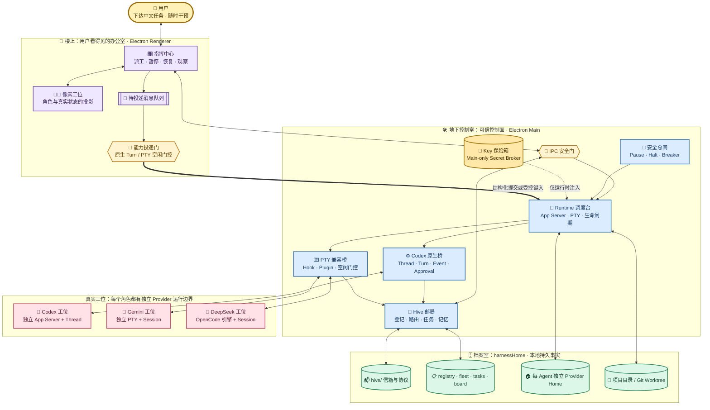
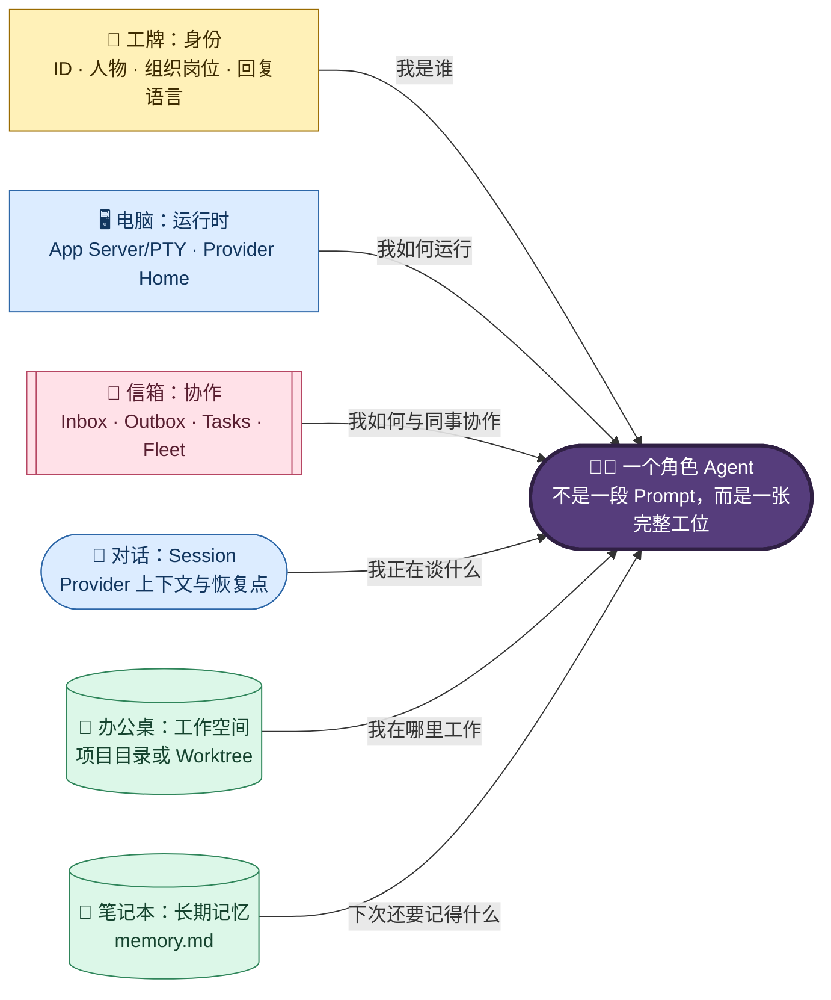
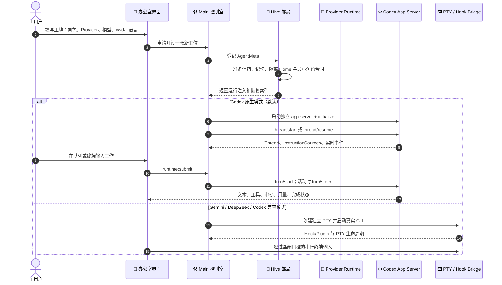
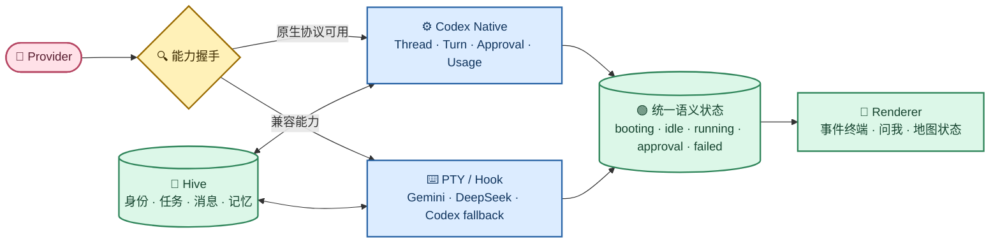
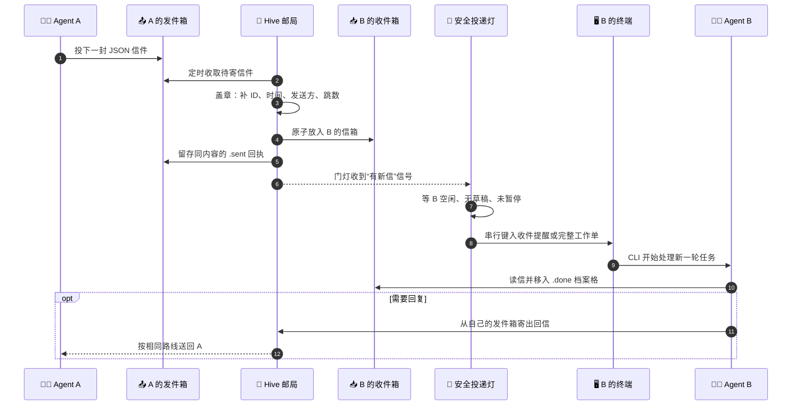
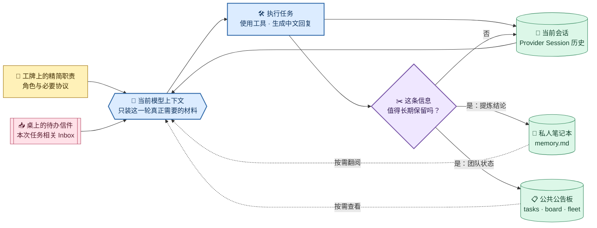
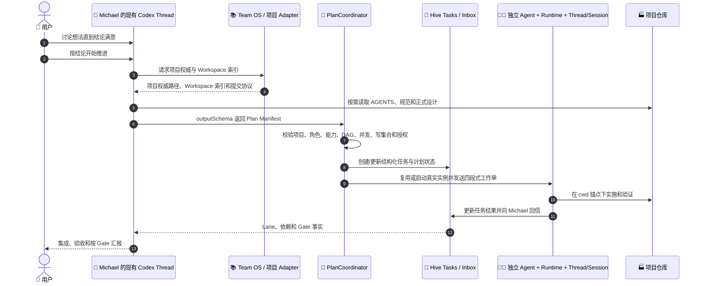

# Munder Difflin 多 Agent 角色办公室架构与运行机制

> 本文是 Munder Difflin DIY 版本的架构总览，描述系统当前如何通过真实 Provider Runtime、Hive 协作目录和办公室控制面组成一个本地优先、可观察、可干预、可恢复的多 Agent 角色办公室。Codex 默认走 App Server 原生 Thread/Turn 主链；Gemini、DeepSeek 及 Codex 显式兼容模式继续走 PTY/Hook Bridge。

## 1. 文档定位

| 项目 | 说明 |
| --- | --- |
| 权威范围 | 多 Agent 运行模型、角色化、消息通信、Provider 适配、Session/记忆、控制与恢复机制 |
| 不负责 | 实施阶段、一次性验证结果、临时运行目录、真实 Session ID、密钥和排查流水 |
| 产品与架构结论 | 本文第 2～16 节；Codex 原生运行桥的实施记录与 Gate 见 [Codex App Server 原生运行桥升级实施规划](../实施规划/05-Munder-Difflin-Codex-App-Server原生运行桥升级实施规划.md) |
| 长期运行合同 | [个人长期运行安全与备份恢复设计](02-Munder-Difflin个人长期运行安全与备份恢复设计.md) |
| 主题视觉合同 | [内置主题视觉与低风险换肤设计](03-Munder-Difflin内置主题视觉与低风险换肤设计.md) |
| 个人团队与多项目合同 | [个人团队操作系统与多项目工作流分层设计](04-Munder-Difflin个人团队操作系统与多项目工作流分层设计.md) |
| 核心实现 | [`src/main/codexAppServer.ts`](../../../src/main/codexAppServer.ts)、[`src/main/codexNativeRuntime.ts`](../../../src/main/codexNativeRuntime.ts)、[`src/shared/agentRuntime.ts`](../../../src/shared/agentRuntime.ts)、[`src/main/hive.ts`](../../../src/main/hive.ts)、[`src/renderer/src/hooks/useHive.ts`](../../../src/renderer/src/hooks/useHive.ts) |

本文只维护稳定设计合同。动态证据属于 `.work/`，不得把 API Key、临时进程号、运行 Session ID 或某次 pass/fail 复制进本文。

## 2. 产品定位与一句话架构

Munder Difflin DIY 的产品定位是：

> 一个本地优先、可配置不同模型、可让多个真实 Provider Agent 协作，并以像素办公室呈现状态和角色关系的中文 Agent 工作环境。

产品采用独立 Fork 维护，当前边界是个人非商业自用。保留项目原有许可证与素材归属，不把商业授权、公开发行、签名、公证、应用商店和自动更新服务纳入当前合同；若用途转为公开或商业分发，必须另立许可、隐私、供应链与发布设计。

核心产品决策是保留真实 Provider Runtime、Hive、像素办公室、Worktree 和 Command Center，不在 Electron 内复制模型工具循环，也不为了统一外观牺牲真实状态、可停止、可恢复和数据边界。

Munder Difflin 不在 Electron 内重新实现 Agent Loop。每个可见 Codex 员工对应一个受 Main 监管的 `codex app-server --stdio` 进程，日常消息直接成为原生 Turn，Thread 保存会话，事件驱动实时状态、审批和用量；Gemini、DeepSeek 及 Codex 回退模式仍分别运行在独立 PTY，并通过官方 Hook/Plugin Bridge 投影生命周期。两条运行桥共享 Agent 身份、Hive 信箱、任务、长期记忆和项目 cwd，但不伪造底层能力一致性。

## 3. 设计原则

| 原则 | 设计含义 |
| --- | --- |
| Provider 原生 | 推理、工具调用和会话历史由 Codex App Server、Gemini CLI、OpenCode 等真实 Provider Runtime 拥有，不在应用内复制一套 Agent Loop |
| 本地优先 | 协作事实主要保存在用户选择的 `harnessHome`；不依赖中心调度服务才能运行 |
| 单写者信箱 | Agent 只写自己的 `outbox/`，只处理自己的 `inbox/`；路由器是跨目录投递的唯一写者 |
| 持久事实与实时信号分离 | 任务、消息、记忆和注册表落盘；Codex 原生事件或 PTY/Hook 信号承担低延迟运行状态 |
| 能力驱动适配 | Provider 通过能力和 Bridge 接入，不假设不同 CLI 拥有相同参数、Hook 或恢复语义 |
| 能力化投递 | Codex 通过 `turn/start/steer` 明确提交；PTY Provider 仍经过空闲、无草稿和未暂停门控 |
| 人可随时介入 | 暂停工具、暂停投递、引导、停止、恢复和断路器共享同一控制面 |
| 展示与机器合同分离 | 中文化作用于 UI、角色和自然语言说明；Provider ID、消息字段、枚举、命令与 Hook 名保持稳定 |

## 4. 总体架构



这张图可以按真实办公室来读：Renderer 是员工可见的楼层，Electron Main 是控制室，Hive 是邮局和档案系统，Provider Runtime 是工位电脑。Codex 原生桥像结构化内线电话，直接知道 Thread、Turn、工具和审批；PTY 兼容桥像仍需观察终端状态的传统工位。两者都不改变地图、角色和项目仓库的用户心智。

视觉图例：`🧑` 人类操作员 · `🧑‍💻/🤖` Agent · `⚙️/⌨️` 原生/PTY Runtime · `📮/📬` Hive 通信 · `🗄️/📋` 持久事实 · `🔌` 生命周期 Bridge · `🔐` 凭据边界 · `🚦/🛑` 安全控制。

### 4.1 分层职责

| 层 | 拥有的事实 | 不应拥有的事实 |
| --- | --- | --- |
| Renderer | 当前页面状态、角色投影、用户草稿、待投递队列、空闲门控 | API Key、Provider 全局认证文件、消息路由权威 |
| Electron Main | Provider 进程、原生协议、PTY、Hive 路由、控制状态、审批投影与凭据注入 | 模型内部推理历史、Renderer 临时布局 |
| Provider Runtime | Thread/Session、模型推理、工具执行和自身协议状态 | 其他 Agent 的目录写权限、Hive 全局路由 |
| `harnessHome` | 角色、任务、消息、记忆、注册表和 Provider 隔离 Home | 临时 UI 组件状态、明文凭据文档 |
| 项目/Worktree | Agent 实际修改与验证的工作成果 | Hive 身份、通信收据和 Provider 认证状态 |

### 4.2 六类系统与事实所有者

虚拟办公室不是只靠 `hive/` 运行，也不能把 Team OS、Hive、Provider Session 和项目仓库理解成同一种“提示词资料”。它们各自只拥有一类权威事实，并按单向依赖组合：

| 系统 | 形象理解 | 权威事实 | 主要消费者 |
| --- | --- | --- | --- |
| Munder 源码与 Main Process | 楼宇和物业系统 | 进程、App Server/PTY、路由、审批、Hook、IPC、门控和 Provider 适配规则 | Renderer、Hive、Provider Runtime |
| Team OS | 公司章程、组织手册和项目通讯录 | 跨项目组织制度、角色能力、通用流程、项目登记和结果模板 | Michael、PlanCoordinator |
| `harnessHome/hive` | 当天正在营业的办公室 | 当前员工、任务、消息、长期记忆、事件和恢复索引 | Main Process、各 Agent |
| 每 Agent Provider Home / Session | 员工自己的大脑与会话本 | Provider 对话历史、Session 索引、CLI 配置 | 对应 Provider CLI |
| 项目仓库 | 实际工厂和产品资料库 | 项目 AGENTS、正式设计、代码、机器计划、Gate 和生产合同 | 执行本项目的 Agent |
| Renderer 与像素地图 | 玻璃墙和仪表盘 | 当前页面、投递队列、角色视觉和运行状态投影 | 用户 |

依赖方向是：Team OS 和项目仓库提供稳定合同，Main Process 把合同编译为 Hive 任务与 Provider 输入，Provider Thread/Session 执行真实工作；Codex 原生事件或兼容 Hook 再把运行事实投影到 Renderer。地图移动、工位动画和人物碰撞只解释运行状态，不参与模型推理、文件权限或任务调度。

## 5. Agent 的组成

一个角色 Agent 不是一段提示词，而是五类状态的组合：



其中：

- Agent ID 是目录、注册表和路由的稳定主键；显示名称与中文角色名可以修改。
- `roleBinding.id` 绑定 Team OS 的稳定组织岗位，人物名称、形象和备注不参与机器路由；`identity.md` 投影当前角色合同，`replyLanguage` 定义自然语言输出偏好。
- Codex 原生员工使用受监管 App Server、Thread 和结构化事件；PTY 员工保留 TUI、快捷键、彩色输出、原生审批和窗口尺寸语义。
- Provider Thread/Session 保存会话历史；`memory.md` 保存跨 Session 的提炼事实。
- `cwd` 指向实际工作目录，可以是项目根目录，也可以是隔离 Worktree。

## 6. Harness 与持久目录

### 6.1 生成规则

用户选择 `harnessHome` 后，Main Process 会确保该目录存在，并在其中幂等生成 Hive 根目录、公共协议、角色目录和 Provider 隔离配置。切换 `harnessHome` 相当于切换一套办公室持久状态，而不是只切换一个 UI 主题。

```text
<harnessHome>/
├── hive/
│   ├── PROTOCOL.md              # 人可读的消息与协作协议
│   ├── COMMANDS.md              # 人可读的 CLI/Hive 操作说明
│   ├── registry.json            # Agent 身份、Provider、Session 与归档状态
│   ├── fleet.json               # 实时状态、用量、工具、断路器和积压快照
│   ├── tasks.json               # 结构化任务账本
│   ├── board.md                 # Michael 维护的自由形式协作看板
│   ├── log.jsonl                # 追加式事件日志
│   ├── hooks.sock               # CLI Hook 到 Main Process 的本地 socket
│   ├── spawn-requests/          # Michael 请求临时增员的文件队列
│   ├── cache/codex/             # 全办公室共享的公共 Codex 目录/插件缓存；不含角色或 Session
│   ├── bin/                     # Hook、Proxy 与捆绑 Node 启动桥
│   ├── .git/                    # 只服务 Hive 恢复的内部版本库
│   └── agents/
│       └── <agent-id>/
│           ├── identity.md      # 角色身份与职责
│           ├── memory.md        # 跨 Session 长期记忆
│           ├── cursor.json      # 已处理消息游标，防止重复唤醒
│           ├── inbox/
│           │   └── .done/       # 已处理消息
│           ├── outbox/
│           │   └── .sent/       # 已路由发送收据
│           ├── runtime.json     # 原生 Thread/Turn/投递状态索引；不保存 Prompt/Transcript
│           ├── .codex/          # Codex 隔离 Home；认证链接、状态库、Session、角色 AGENTS 与 Skills
│           ├── .gemini-cli/     # Gemini 隔离 Home，按 Provider 存在
│           └── .opencode/       # OpenCode/DeepSeek 隔离 Home，按 Provider 存在
├── worktrees/                   # 按任务创建的隔离 Git 工作区
├── roster.json                  # UI 团队、人物和队列恢复镜像
└── roster-backups/              # roster 的恢复备份，不是运行权威
```

### 6.2 持久与易失状态

| 状态 | 主要载体 | 生命周期 |
| --- | --- | --- |
| 角色身份、Provider、最近 Session | `registry.json` | 应用重启后保留 |
| 任务、看板、消息、长期记忆 | `tasks.json`、`board.md`、信箱、`memory.md` | 应用与 Session 重启后保留 |
| CLI Session 内容 | 每 Agent Provider Home | 由对应 CLI 管理，可按 Session ID 恢复 |
| 运行状态与用量摘要 | `fleet.json`、事件日志 | 持久快照，可由新运行更新 |
| PTY 进程、Hook socket | 内存与操作系统 | 应用退出后消失，重启时重建 |
| Renderer 输入草稿与投递队列 | Renderer Store；队列有本地持久镜像 | 页面运行态；适用状态可恢复 |

### 6.3 Hive 文件关系与读取顺序

Hive 顶层文件可以按“工牌、花名册、值班表、任务簿、公告板、邮箱、笔记和流水”理解：

| 文件/目录 | 回答的问题 | 写入者与更新方式 | 读取注意事项 |
| --- | --- | --- | --- |
| `agents/<id>/identity.md` | 我是谁、职责是什么、工作目录在哪里 | Main 在 spawn/恢复时由 Registry 幂等刷新 | 是稳定工牌，不包含本次任务全文 |
| `registry.json` | 办公室有哪些人、如何恢复其 Provider/Session | Main 通过统一注册入口原子更新 | 是身份与恢复索引，不是完整实时状态总线 |
| `fleet.json` | 最近一次快照中谁在岗、用量、断路器和 Inbox 是否积压 | Main 周期性从注册、遥测、断路器和信箱汇总 | `ts`、token、费用和最近工具是易变快照，不应注入常驻 Prompt |
| `tasks.json` | 任务是谁负责、依赖什么、做到哪一步 | Main/Hive 任务 API 结构化更新 | 是自动协调的任务事实，不以 `board.md` 文本猜测状态 |
| `board.md` | 当前工作用自然语言怎样概括 | Michael 维护 | 面向人和总控的叙事摘要，不是第二套任务数据库 |
| `inbox/`、`outbox/` | 谁向谁发送了哪项工作或结论 | Agent 只写自己 Outbox；Main Router 投递到目标 Inbox | `.done`、`.sent` 是处理档案；大制品只传路径 |
| `memory.md` | 哪些事实跨 Session 仍值得记住 | 对应 Agent 只追加新耐久事实或决策 | 不保存 transcript、心跳、无变化检查和重复状态 |
| `cursor.json` | 哪封信已进入 Agent 处理边界 | Agent/Renderer 随处理推进 | 防止同一消息在恢复或轮询中反复唤醒 |
| `PROTOCOL.md` | 邮件格式和协作制度是什么 | Main 生成并只迁移已知系统模板 | 按需读取；机器字段和目录名不能翻译 |
| `COMMANDS.md` | 当前 CLI/Hive 操作如何执行 | Main 生成参考手册 | 必须与 Agent 的实际 Provider 一致，不能把 Claude 命令当成 Codex 合同 |
| `hooks.sock`、`bin/` | CLI 的 Session/工具/停止事件怎样回到办公室 | Main 创建 socket，桥接脚本转发 Hook/Proxy 事件 | 是低延迟神经通道，不是长期记忆 |
| `log.jsonl` | 办公室发生过哪些运行事件 | Main 追加 spawn、session、message、task 等事件 | 不等于完整 CLI transcript，长期运行需要保留策略 |
| Hive `.git/` | Hive 关键文件如何恢复与审计 | Main 对登记、消息、任务和记忆建立内部提交 | 与项目 Git 完全隔离，不能据此推断项目已提交 |
| `roster.json` | UI 应恢复哪些人物、视觉属性、选择和待投递队列 | Renderer 经 Main 持久化 | 与 Registry 对账但不替代 App Server/PTY 的真实运行与会话事实 |

Michael 的推荐读取顺序不是扫描整个 Hive，而是先看 `tasks.json`、`fleet.json` 和自己的 Inbox；只有需要了解某位员工的稳定职责或历史结论时，才读取其 Registry/Identity 或向其发问。普通 Agent 默认只读自己的 Identity、Memory、Inbox 和本任务明确引用的共享事实。`cache/codex/` 只去重公开的远程插件目录与不可变插件版本，始终被 Hive Git 忽略；认证、SQLite、Session、日志、角色 `AGENTS.md` 和 Skill 仍按 Agent 隔离。

## 7. Agent 启动、工作与恢复



Codex 原生模式可以在同一员工进程中 list/read/resume/new/fork Thread，但活动 Turn 存在时禁止切换；PTY Provider 的 Session 切换仍是“停止当前 CLI，再以另一个有效 Session ID 重启并绑定”。Agent ID 不变时，角色身份、信箱和 `memory.md` 连续；对话上下文跟随所选 Thread/Session。

## 8. Provider 抽象与生命周期 Bridge

### 8.1 为什么需要 Bridge

不同 Provider 的差异不只是模型名：它们的 Thread/Session 协议、初始 Prompt、审批、Hook、配置目录、恢复和空闲信号都不同。公共层只声明 Munder 需要的可选能力；Codex 原生实现 Thread/Turn/事件/审批，PTY Bridge 只承诺其真实可证明的能力。

可以把 Provider Bridge 理解成“转接插头”：不要求每台 Agent 设备使用同一种接口，而是把它真实提供的信号转换成办公室能够理解的统一状态。



### 8.2 当前中文混合办公室主链

| 产品 Provider | 默认运行桥 | 稳定角色合同 | 实时状态权威 | 会话恢复 | 隔离 Home |
| --- | --- | --- | --- | --- | --- |
| `codex` | App Server stdio 原生桥 | 每 Agent `.codex/AGENTS.md` + 项目分层 AGENTS | App Server events | `thread/list/read/resume` | `<agentDir>/.codex` |
| `gemini` | Google Gemini CLI + PTY | `--prompt-interactive` | Gemini 官方 Hook 翻译 + PTY | `--resume` | `<agentDir>/.gemini-cli` |
| `deepseek` | OpenCode TUI + PTY | `--prompt` | OpenCode Plugin Bridge + PTY | `--session` | `<agentDir>/.opencode` |

Codex 可按 Agent 显式切到 PTY compatibility；该动作先停止原生活动，保留 Thread/Session 文件，再用 `codex resume` 启动兼容工位。`deepseek` 是用户可见的独立 Provider ID，但复用 OpenCode 的工具循环、TUI、Plugin 和 Session；Electron 不直接实现 DeepSeek Agent Loop。其他 Provider 不得因为出现在选择器中就伪装原生能力。

### 8.3 凭据边界

- Renderer 只处理 Provider/模型选择和“是否已配置”等脱敏状态，不读取真实 Key。
- Main Process 的 Secret Broker 在 spawn 时把所需凭据放入子进程环境。
- 每 Agent Provider Home 只保存 CLI 必要配置；生成的系统设置不得包含 Key 文本。
- 凭据不得进入 Prompt、Hive 文档、消息、截图、日志、`.work` 收据或 Git。

## 9. Hive 消息通信

### 9.1 消息不是共享文档协作

Agent 之间确实使用文件形成持久信箱，但完整通信链还包括：

1. Agent 在自己的 `outbox/` 写一条 JSON 消息。
2. Main Process Router 读取并规范化消息，补齐 ID、时间、发送方和跳数。
3. Router 原子写入接收方 `inbox/`，并将发送方原件归档到 `.sent/`。
4. Codex 原生员工由 Main 依据 Thread/Turn 状态直接 `turn/start`，活动 Turn 的增量方向使用 `turn/steer`；同一 `messageId` 有界记账，崩溃不确定时禁止静默重投。
5. PTY 员工继续由 Hook 或终端静默确认安全空闲点，再由 Renderer 串行写入提醒或工作单。
6. Agent 读取并处理消息，移入 `.done/`，必要时通过自己的 `outbox/` 回信。

因此它更像一套“有档案、有邮戳、按工位能力选择原生内线或传统红绿灯”的内部邮政系统，而不是所有 Agent 同时编辑一份公共文档。Hive 保存协作事实，App Server 不被当成第二个信箱；`runtime.json` 只保存 Thread/Turn ID、状态和最多 100 条投递索引，不保存 Prompt 或 Transcript。



### 9.2 消息机器合同

| 字段 | 含义 |
| --- | --- |
| `id` | 消息唯一标识；缺失时由 Router 生成 |
| `conversation` | 跨多条消息的协作会话标识 |
| `in_reply_to` | 被回复消息的 ID |
| `from` / `to` | 发送方与接收方；发送方最终以拥有该 `outbox/` 的 Agent 为准 |
| `act` | `request`、`inform`、`propose`、`query`、`agree`、`refuse`、`done` |
| `subject` / `body` | 人可读主题和正文，可使用中文 |
| `requires_reply` | 是否要求接收方明确回复 |
| `needs_human` | 是否需要人类关注；由 Michael 代理进入人机控制面 |
| `hops` | 路由跳数；超过上限时停止转发，防止 Agent 互相循环 |
| `created_at` | 标准时间戳 |

机器字段、枚举值和目录名不能翻译。中文化只作用于 `subject`、`body`、角色说明和生成文档中的自然语言。

### 9.3 单写者与交付保证

- Agent 绝不直接写入另一个 Agent 的目录。
- Router 使用临时文件与原子重命名完成落盘，避免接收半个 JSON。
- 已规范化消息同时成为接收方消息和发送方 `.sent` 收据，二者机器字段一致。
- 无效 JSON 被隔离为 `bad-*`，不会让路由循环持续报错。
- 归档 Agent、无安全空闲信号的 Provider 和无 PTY 目标不会被静默当作成功；系统改走终端工作单或回退给 Michael。
- 广播只面向当前活跃、可安全接收 Inbox 的 Agent。

## 10. 角色化与中文协作

角色化由稳定人物、Team OS 组织岗位合同、可叠加能力和运行时语言合同共同组成，而不是把角色名硬编码到模型中。人物回答“这是谁”，岗位回答“长期承担什么责任”，工作单回答“这一次获准做什么”。

| 组成 | 存储/来源 | 作用 |
| --- | --- | --- |
| Agent ID | Registry 与角色目录 | 稳定路由主键，不依赖中文名称 |
| 人物与备注 | Renderer Agent、`roleNotes` | 姓名、形象、沟通风格和用户可编辑备注，不作为自动派工键 |
| 组织岗位 | Team OS `roles/capabilities.yaml`、`roleBinding` | 稳定 ID、职责能力、权限语义、写策略和已知盲点；是创建、恢复和自动复用的共同合同 |
| 默认专业能力 | `defaultCapabilityProfileIds` | 人物的长期能力偏好，不等于本次任务能力或授权 |
| 回复语言 | `replyLanguage` | 要求自然语言使用 `zh-CN` 或 `en-US` |
| 角色 Prompt | `HiveManager` 生成 | 注入职责、消息协议、记忆和安全边界 |
| 人物模板 | Add Agent UI / Hire Manifest | 只预填人物备注、岗位和默认能力，必须由用户确认，不自动 Spawn |

中文人物名称若无法形成安全英文 slug，系统生成稳定的安全 Agent ID；显示名仍可完整保留中文。旧版内置中英文模板按精确已知文案向前映射到 Team OS 岗位；自定义人物不会被猜测归类。协议生成器只迁移已知的系统模板，自定义 `PROTOCOL.md`、自定义身份说明和既有长期记忆正文不被覆盖。

Munder Difflin 当前没有自动加载到所有 Agent 的统一 `AGENTS.md`“蜂巢意识”。其共同意识由精简 Prompt、`PROTOCOL.md`、`registry.json`、`fleet.json`、`tasks.json` 和 `board.md` 按需组合，避免每轮都把整个办公室状态塞入上下文。

### 10.1 Bootstrap 是上下文编译结果，不是完整员工手册

Agent 启动时收到的 bootstrap 只负责让一个真实 CLI 能立即、安全地进入办公室。详细制度、项目正文和动态状态留在权威文件或消息中按需读取。当前上下文分为五层：

| 层 | 内容 | 进入上下文的时机 | 变化频率 |
| --- | --- | --- | --- |
| 员工角色内核 | 身份、Hive/记忆/信箱路径、回复语言、总控或员工差量 | Codex 写入每 Agent `.codex/AGENTS.md`；PTY Provider 在新 Session 注入最短 bootstrap | 角色版本变化时 |
| `identity.md` | 姓名、角色、能力、cwd、Michael 总控身份 | Agent 按需读取；Main 在 spawn 时刷新 | 角色配置变化时 |
| 首次定向说明 | 提醒全新 Michael 查看 Memory、Inbox、Board、Tasks 和命令参考 | 只在没有可恢复 Session 的 Michael 首次启动 | 每个新 Session 一次 |
| Hive 工作单 | 本次 `OBJECTIVE`、`OUTPUT`、`TOOLS`、`BOUNDARIES` 及路径/消息 ID | 用户派工或 PlanCoordinator 分配时 | 每项任务不同 |
| LIVE ROSTER 差量 | 成员、角色、关键状态、断路器和 Inbox 变化 | SessionStart 后首次提供，此后只在语义签名变化时 | 有意义的团队变化时 |

员工角色内核不包含日期、计数器、费用、最近工具、完整 Board、项目背景或其他易变值，以保持 Provider Prompt Cache 稳定。LIVE ROSTER 的语义签名排除时间戳、token、费用和活动秒数；没有语义变化时不重复唤醒 Michael，也不追加 `memory.md`。

Codex 黄金主链不再把长 bootstrap 作为位置参数反复发送：Main 在隔离 `CODEX_HOME/AGENTS.md` 维护约 1～2 KiB 的稳定角色差量，Codex 再按 cwd 原生发现项目根和嵌套 `AGENTS.md`；动态任务只进入一次 Turn，Skills 只在选择后加载全文。PTY Provider 可继续通过系统/交互 Prompt 或 Bridge 使用同一语义，但必须遵守自身真实参数和恢复合同。

### 10.2 Michael、普通角色和准备助手的差量

所有角色共享相同的短协议，只有职业差量不同：

- Michael 额外拥有拆解、派工、签收、冲突处理、集成、最终质量和 `board.md`；派工前先看 Fleet/Registry 并优先复用现有人，只有真正独立 Lane 才增员。
- 普通角色只保留“边界不清、跨域或需要签收时联系 Michael”，具体专业职责来自 Identity、Team OS 能力和本次工作单。
- 准备助手只做只读上下文补全并把自包含工作单发回 Michael，不直接实施原任务。

Michael 不应在 bootstrap 中携带整套项目规范或团队名单。普通角色也不应复制 Michael 的调度制度。基础 Codex 主链以不启用可选语义记忆/知识图谱时不超过 3,600 字符为保护门槛；可选能力只有被真实配置并可用时才增加对应说明。

`identity.md` 与角色内核的关系是“可编辑工牌”与“开机接线说明”：Main 根据当前注册信息刷新工牌，`.codex/AGENTS.md` 或 PTY bootstrap 只给出路径和最短行动规则。`memory.md` 只在首次建员时创建并在后续恢复中保留，不能因为角色重启而覆盖已有长期记忆。

### 10.3 所有组织岗位的 Prompt 编译规则

所有人物都使用同一个编译顺序，不保存七份重复的长 Prompt：Provider 基础合同与项目 `AGENTS.md` → Hive 公共短内核 → 当前 `roleBinding` 职业差量 → 人物默认能力 ID → 本次工作单的 `OBJECTIVE / CONTEXT / CONSTRAINTS / DONE WHEN`。前四层是稳定前缀，只有角色配置变化才刷新；本次能力、读写集合、授权、验收和停止条件只随工作单发送一次。Role/Capability 只决定分工和复核边界，永远不能扩大任务授权。

| 稳定岗位 ID | 常驻 Prompt 只强调 | 明确不承担 |
| --- | --- | --- |
| `chief-of-staff` | 定界、DAG、WIP、派工、冲突、集成和最终汇报 | 普通实现、代替领域负责人 |
| `product-architect` | 用户结果、边界、少量方案、合同和验收语义 | 未授权实现、把不确定事实过早制度化 |
| `delivery-engineer` | 单一纵向结果、最小实现、适用验证、集成和文档收敛 | 自行扩大范围、跨越写集合 |
| `evidence-researcher` | 来源发现、长上下文/多模态分析、证据比较和可追溯结论 | 把来源当授权、无工具时假装事实新鲜 |
| `quality-verifier` | 可证伪案例、回归边界、独立运行证据和 Gate 复核 | 重定义产品意图、边测边修被测实现 |
| `release-operator` | 预检、发布、回退、运行入口与可观测事实 | 未经显式授权的外部写入、以运行事实覆盖产品合同 |
| `independent-challenger` | 反例、替代假设、隐含风险和假设审计 | 泛泛反对、重复已有意见 |

“产品经理”“架构师”“开发工程师”“测试工程师”“审查员”等 UI 模板是人物入口，不再是另一套角色权威。例如产品经理与架构师都绑定 `product-architect`，但分别默认叠加 `product-discovery` 与 `backend-domain`；测试工程师与审查员都绑定 `quality-verifier`，但分别默认叠加 `test-engineering` 与 `security-engineering`。用户也可直接选择七个组织岗位和任意默认能力；自定义角色保持可用，但不会被 Michael 当成某个标准岗位自动复用。

## 11. Session、长期记忆与上下文预算

### 11.1 三种记忆层次

| 层次 | 载体 | 适合保存 | 不适合保存 |
| --- | --- | --- | --- |
| 当前对话 | Provider Session | 最近对话、工具调用、模型内部上下文 | 跨 Session 必须长期保留的结论 |
| 角色长期记忆 | `memory.md` | 稳定事实、决策、经验、未完上下文 | 完整对话抄本、原始大日志、凭据 |
| 蜂巢公共事实 | `tasks.json`、`board.md`、Registry/Fleet | 所有者、任务状态、全局角色与运行摘要 | 单 Agent 的私有推理历史 |

可以把模型上下文理解成 Agent 当前摊开的桌面：工牌和当前信件随手可见，私人笔记与公共公告板按需翻阅；工作结束后只把真正耐久的结论抄回笔记本，而不是把桌上所有草稿永久保存。



### 11.2 节省 Token 的规则

- 角色 Prompt 只包含稳定职责、必要协议和文件路径，不粘贴任务背景全文。
- 派工引用文件、消息 ID 和任务卡，而不是跨 Agent 复制大段内容。
- `memory.md` 保存提炼结论，不复制 Session transcript。
- Agent 只读取自己的 Inbox 和任务相关公共事实，不扫描所有角色目录。
- Michael 使用紧凑 roster/fleet 摘要掌握全局，需要深入时再读取单个 Agent 的记忆或发出查询。
- 长对话可创建新 Session，通过 `memory.md` 保持角色连续性，避免无限膨胀旧上下文。

因此 `memory.md` 与 CLI Session 不冲突：前者是显式、可编辑、跨 Session 的耐久摘要；后者是 Provider 拥有的对话上下文。冲突只会在两者重复保存未经提炼的历史时出现。

## 12. Team OS 与 Hive 的运行结合

Team OS 的完整产品与权威分层见 [个人团队操作系统与多项目工作流分层设计](04-Munder-Difflin个人团队操作系统与多项目工作流分层设计.md)。本文只维护它怎样进入 Munder 运行链：Team OS 是独立、版本化、默认只读的组织合同；Hive 是某个 `harnessHome` 内正在运行的办公室账本。Team OS 不保存 Session、实时消息或某次任务状态，Hive 也不能反向改写 Team OS 和项目权威。

### 12.1 运行时读取边界

| Team OS 内容 | 当前机械使用方式 | 不会发生的行为 |
| --- | --- | --- |
| `projects/registry.json` 与 `projects/adapters/*.yaml` | 找到已登记项目、项目根目录及权威/机器/证据入口 | 不复制项目正文到 Team OS |
| `roles/capabilities.yaml` | 为添加人物提供岗位/能力目录，校验 Plan，生成角色快照并按稳定 ID 自动复用 | 不把七个角色手册全量注入所有 Agent，不授予任务权限 |
| `templates/outcome-card.yaml` | 提供结果卡字段合同 | 不创建第二套任务数据库 |
| 项目 `workspaces.json` | 从平台总控项目按需解析服务仓库 | 不要求把每个服务仓库逐一注册到 Team OS |
| `organization/`、`workflows/` | 由 Michael 或维护任务按需阅读的稳定方法 | 当前不自动拼接进每次 bootstrap |
| `models/`、`evals/`、`tools/` | 模型准入、长期评测和工具边界的治理资料 | 当前不自动选择模型或替代项目 Gate |

Team OS Loader 对注册表、Adapter 和引用做有界只读解析，只返回路径、存在性、类型、约束和错误状态，不返回文档正文、Prompt、Transcript、任务内容或秘密。真正需要项目知识时，由 Michael/执行角色直接读取项目自己的 `AGENTS.md`、实施规范、正式设计和机器配置。

Team OS 当前不统一分发项目 Skills。项目专属 Skill 继续由项目仓库拥有，并由 Codex/AGENTS 的匹配规则按任务加载；跨项目反复证明有价值的能力，才适合另行晋升为用户级或 Team OS 管理的可版本化能力，不能先复制一份造成双权威。

### 12.2 “按结论开始推进”的真实链路



规划请求、Michael 结构化输出、规范化计划和运行状态持久化在办公室 `.work/team-os/plans/`；Hive `tasks.json` 继续是执行任务账本。原生路径把同一 Michael Thread 的规划 Turn 绑定 `outputSchema`，Main 收到完整 assistant message 后原子提交；PTY compatibility 仍可使用有界文件提交。PlanCoordinator 是确定性校验和编排器，不调用第二个模型，也不取代 Michael 的分析判断或 Provider Agent Loop。

串行且属于同一计划的任务可以复用同一 `roleBinding.id` 的角色实例和 Thread/Session；同岗位多人空闲时优先选择默认能力画像与本次任务能力重合更多的人，没有完全匹配仍复用同岗位人物，不为标签差异无谓增员。无关计划复用同一职业工位时使用新 Thread/Session；真正并行的同角色 Lane 必须拥有不同 Agent 实例和活动 Thread/Session。人物中文备注、名称和形象不参与匹配。应用恢复时优先用当前 Team OS 目录刷新角色合同；目录暂时不可用则保留 Roster/Registry 中的最近有效快照。Codex native 的 `cwd` 是上下文锚点，`writableRoots` 才是工具写入边界；PTY Provider 的可访问范围仍由工作单 scope、项目合同、本机权限与用户授权共同决定。

### 12.3 Provider 运行兼容边界

以下边界必须如实理解：

1. Codex native 的 Thread/Turn 实时状态以 App Server event 为权威；Registry 保存身份和恢复投影，Fleet 是周期快照，Hook 同类事件只作兼容信号，不能反向覆盖原生状态。
2. Gemini、DeepSeek 与 Codex PTY compatibility 仍由 Hook/Plugin/PTY 启发式提供状态，界面必须用 runtime mode 区分，不能伪装成原生 Thread 能力。
3. `PROTOCOL.md` 只自动迁移已知系统模板；用户编辑版本始终保留。运行硬约束来自生成的最小角色内核、项目 AGENTS 和本次 Turn，不要求每轮读取整份协议。
4. `roster.json` 与 Registry 分别服务 UI 恢复和真实身份/运行恢复；启动时对账，原生 Thread 由 `runtime.json` 与 App Server read/resume 恢复，PTY Session 由各 CLI 自有索引恢复。
5. Codex 公共目录与插件版本缓存只在 Hive 保存一份；每 Agent 的认证链接、SQLite、Session、日志、角色 AGENTS 和 Skills 继续隔离。长期日志、归档和 Session 仍按容量报告与备份合同治理。

## 13. 空闲门控、控制与状态

系统没有用单一枚举表达所有状态，而是把“运行状态”“投递状态”和“操作员控制”作为可叠加事实：

| 维度 | 典型状态 | 事实来源 |
| --- | --- | --- |
| Provider 生命周期 | `booting`、`idle`、`running`、`awaiting-approval`、`blocked`、`failed`、`offline` | Codex native event；或带兼容标记的 Hook/PTY 启发式 |
| 协作状态 | Inbox 积压、任务处理中、等待回复 | Hive 文件和任务账本 |
| 工具/审批控制 | 正常、等待批准、拒绝、暂停、指定工具 Gate | App Server approval；或 PTY Hook Gate |
| 投递控制 | 自动投递开启/暂停、原生 Turn 接受/去重、PTY 手动立即发送 | Main 原生投递账本；或 Renderer PTY 队列 |
| 停止控制 | 运行、请求停止、已停止 | `turn/interrupt`；或下一个 Hook/PTY 安全边界 |
| 断路器 | healthy、steer、constrain、stop | 用量、重复工具与错误风暴监测 |

下图只描述兼容桥：自动输入 PTY 前必须同时满足目标 PTY 存活、CLI 已启动、目标处于空闲、安全宽限期结束、没有用户草稿、没有命令选择器、没有相同消息在途，并且自动投递未暂停。所有写入同一 PTY 的操作通过单一 Promise 链串行化，避免两个调用方把文本和 Enter 拼在一起。Codex native 不经过这张图，直接由 Main 根据原生状态提交 Turn。


Codex native 的 App Server event 是实时权威，Registry/Fleet 只物化状态；Hook 和静默阈值不能覆盖它。如果 PTY Bridge 缺少可靠的 turn-end 事件，Renderer 才使用终端静默时间作为保守回退，并在新 Hook 事件到达时校正。

## 14. 故障、交付与不可丢失语义

| 故障 | 系统行为 |
| --- | --- |
| Codex App Server 崩溃 | 只重启该 Agent 一次并 resume/read 原 Thread；活动 Turn 的未知窗口标记 uncertain，绝不静默重投 |
| PTY CLI 崩溃或终端损坏 | 保留 Agent ID、角色目录和最近 Session；可 Restart & Continue |
| Provider 恢复失败 | 返回可理解错误，允许明确创建新 Session；不伪装为已恢复 |
| PTY 写失败 | 保留队列消息，达到失败阈值后暂停自动投递，避免删掉未送达任务 |
| Hook 漏报 idle | 使用全楼层 PTY 静默回退，不让 Inbox 永久卡住 |
| 消息 JSON 损坏 | 移入 `.sent/bad-*` 隔离，Router 继续处理其他消息 |
| 消息互相转发 | `hops` 上限阻止无限 ping-pong |
| 目标不可投递 | 尝试受控终端工作单；仍不可用时回退 Michael，不静默堆积 |
| 应用启动时 Roster 只恢复一部分 | 首次写入收缩保护拒绝用局部快照覆盖完整历史 Roster |
| Agent 关闭 | Registry 标记 archived，保留记忆和恢复信息；广播不再向其投递 |
| 自动权限未开启 | 沿用 Provider 默认审批/沙箱；不会偷偷附加 bypass 参数 |

### 14.1 任务等待的可解释读层

任务账本仍以 `dependsOn` 表达任务依赖，可选 `conversations` 只引用已有 Hive Conversation ID。任务详情通过这两个精确字段读取依赖状态、负责人、缺失任务、消息时间线和 `in_reply_to` 回复关系，再计算“等待依赖、等待某位收件人回复、等待人工问答或当前无明确等待项”。这是一层只读解释，不改变 Router、消息落盘格式或任务状态机。

旧任务没有 `conversations` 时只展示已有任务事实，不扫描全部消息，也不以标题或正文猜测关联。消息正文继续在 Main 侧脱敏后才交给 Renderer，单次查询保持有界。

### 14.2 Worktree 交付门禁

隔离 Worktree 的交付复用现有 Git 页面，并保持“检查 → 显式合并 → 再检查 → 显式回收”的短链路：

1. Main 根据真实 Git 元数据确认来源是同仓库的 linked Worktree、来源分支可定位、目标是当前主 Worktree，且两侧干净；Renderer 不能指定任意目标目录。
2. 只有检查通过才允许合并；合并冲突时自动执行 `git merge --abort`，保留来源 Worktree、提交和分支。
3. 只有 `worktreeIsGcSafe` 再次证明成果已集成且工作区干净，才使用非强制 `git worktree remove` 回收目录；分支继续保留。
4. 活跃 PTY 使用相关目录时拒绝合并或回收；不提供 reset、force remove、自动删除或后台交付。

## 15. IO、通信延迟与容量边界

### 15.1 五到六个 Agent 的常态

日常 5～6 个 Agent 时，Hive IO 主要是小型 JSON/Markdown、原子重命名、追加日志和各 Provider 的 Session/SQLite 状态；模型推理、网络请求与工具执行通常远比本地文件操作耗时。Codex 的公共远程目录与不可变插件版本由 `hive/cache/codex/` 全办公室共享，避免每 Agent 重复复制；缓存不进入 Hive Git，也不共享角色、认证或 Session。

| 延迟阶段 | 当前机制 | 影响 |
| --- | --- | --- |
| Agent 写 Outbox | 本地小文件写入 | 通常接近本地文件系统延迟 |
| Router 发现消息 | 默认约 1.5 秒轮询 | 提供稳定、跨平台、易恢复的信箱路由上界分量 |
| Codex 原生投递 | Main 直接 `turn/start/steer`，以事件确认 | 无终端静默/草稿猜测；稳定 `messageId` 防重 |
| PTY 安全投递 | 等目标 idle、无草稿且未暂停，再串行键入 | Gemini、DeepSeek 与显式 Codex compatibility 保留 |
| 模型回答 | Provider 网络、排队、模型与上下文 | 通常是端到端耗时的主要部分 |

### 15.2 需要关注的 IO 风险

- Agent 高频发送大量细碎消息，会增加目录扫描、归档文件数和模型唤醒次数。
- 把完整日志或大制品放入 Inbox/Memory，会同时放大 IO 和 Token 消耗。
- 将 `harnessHome` 放在高延迟网络盘、强同步目录或频繁全盘扫描环境，会放大轮询抖动。
- `log.jsonl`、`.done/`、`.sent/`、Provider Session 与每 Agent SQLite 长期不治理时，会逐渐增加磁盘占用；公共缓存只去重，不替代保留策略。

推荐保持消息“一事一条但不过度碎片化”，大制品只传路径；`memory.md` 只保留提炼事实；长期运行时按明确保留策略归档日志和历史消息，不能用无界自动删除代替治理。

Command Center 的生命周期容量报告只遍历目录项并读取文件元数据，跳过符号链接，按目录数、文件数、深度和累计字节设置硬上限；触及上限时标为局部统计。它只在进入页面或用户刷新时运行，不读取 Session、消息、Prompt、日志或记忆正文，也不包含删除或定时清理能力。默认策略始终是保留，任何治理先完成可验证备份。

## 16. 核心不变量

1. Agent 只能写自己的 `outbox/`、`memory.md` 和工作目录，不能直接写其他 Agent 的信箱。
2. Provider/model ID、Hive JSON 字段、消息枚举、Hook 名和 CLI 参数是机器合同，不能因中文化改变。
3. Codex native 工作只通过结构化 Turn 提交且按 `messageId` 防重；任何自动 PTY 输入都必须经过统一空闲门控与单 PTY 串行链。
4. Thread/Session 历史由 Provider Runtime 拥有；角色长期事实由 `memory.md` 拥有；任务全局事实由 Hive 账本拥有。
5. Renderer 不持有明文 Provider Key；凭据不得进入 Prompt、Hive、截图、日志、收据或 Git。
6. Provider 能否接收 Inbox 由其真实生命周期能力决定，不能由 UI 是否展示推断。
7. 角色模板和 Hire Manifest 只预填配置，不能绕过用户确认自动启动进程。
8. 关闭 Agent 是归档而不是抹除；重启与恢复必须尽量保持 Agent ID、记忆和 Session 连续性。
9. 审批、暂停工具、暂停投递和停止是独立控制，不能互相冒充；Codex 原生 deny 必须作为结构化结果返回当前 Turn。
10. 运行失败必须保留任务或消息，并产生可行动状态；不能把“写入尝试”当作“已送达”。
11. Team OS 运行时默认只读；项目仓库拥有项目事实，Hive 运行投影不能反向覆盖两者。
12. PlanCoordinator 只做确定性校验和编排，不能变成第二个模型循环或第二套任务账本。
13. `cwd` 是上下文锚点；Codex native 的真实工具写范围由精确 `writableRoots` 与结构化审批约束，PTY Provider 仍由工作单、项目合同、本机权限和用户授权共同约束。
14. Codex native 日常路径不得携带 `--dangerously-bypass-approvals-and-sandbox`；该参数只可能出现在用户显式开启 Auto Mode 的 PTY compatibility，不能反向成为原生默认。
15. `runtime.json`、Fleet 和运行日志不得保存完整 Prompt/Transcript；每 Agent `runtime.json` 与公共 Codex 缓存都不得进入 Hive 内部 Git，公共缓存也不得包含认证内容。

## 17. 实现地图

| 设计责任 | 主要实现位置 |
| --- | --- |
| Codex stdio JSONL、能力握手、Thread/Turn、事件、审批与进程监督 | [`src/main/codexAppServer.ts`](../../../src/main/codexAppServer.ts) |
| 每 Agent 原生运行时、最小投递账本、恢复、防重、Goal/Compact/Skills | [`src/main/codexNativeRuntime.ts`](../../../src/main/codexNativeRuntime.ts) |
| Provider 中立的原生状态、事件、审批和能力类型 | [`src/shared/agentRuntime.ts`](../../../src/shared/agentRuntime.ts) |
| Provider 类型、能力、启动与恢复合同 | [`src/shared/agentProvider.ts`](../../../src/shared/agentProvider.ts) |
| Hive 目录、Identity/bootstrap 编译、消息路由、Provider Bridge | [`src/main/hive.ts`](../../../src/main/hive.ts) |
| Team OS 有界 Loader、项目 Adapter 与 Workspace Resolver | [`src/main/teamOs.ts`](../../../src/main/teamOs.ts) |
| Plan Manifest schema、Michael 规划提示、原生 outputSchema 与校验合同 | [`src/main/teamOsPlan.ts`](../../../src/main/teamOsPlan.ts) |
| “按结论开始推进”、计划持久化和确定性协调 | [`src/main/teamOsPlanning.ts`](../../../src/main/teamOsPlanning.ts) |
| CLI Hook 到 Main Process 的生命周期接入 | [`src/main/hooks.ts`](../../../src/main/hooks.ts) |
| 任务依赖与 Conversation 解释 | [`src/renderer/src/components/taskCoordination.ts`](../../../src/renderer/src/components/taskCoordination.ts) |
| Worktree 检查、合并与安全回收 | [`src/main/worktreeDelivery.ts`](../../../src/main/worktreeDelivery.ts) |
| 生命周期有界容量报告 | [`src/main/lifecycleCapacity.ts`](../../../src/main/lifecycleCapacity.ts) |
| PTY 创建、写入、结束与进程树 | [`src/main/pty.ts`](../../../src/main/pty.ts) |
| Main IPC、原生/PTY 运行桥选择、Secret Broker、Hook/控制编排 | [`src/main/index.ts`](../../../src/main/index.ts) |
| 暂停、工具 Gate、停止和恢复状态 | [`src/main/control.ts`](../../../src/main/control.ts) |
| 启动 Roster 持久化与收缩保护 | [`src/main/roster.ts`](../../../src/main/roster.ts) |
| Renderer 空闲门控、Hook 投影与消息队列投递 | [`src/renderer/src/hooks/useHive.ts`](../../../src/renderer/src/hooks/useHive.ts) |
| Renderer Agent、队列和恢复状态 | [`src/renderer/src/store/store.ts`](../../../src/renderer/src/store/store.ts) |
| 中文角色创建与模板 | [`src/renderer/src/components/AddAgentModal.tsx`](../../../src/renderer/src/components/AddAgentModal.tsx) |
| 内置主题、地图视觉与无损换肤 | [`src/renderer/src/scene/office/themeRegistry.ts`](../../../src/renderer/src/scene/office/themeRegistry.ts)、[`src/renderer/src/scene/office/OfficeFloor.tsx`](../../../src/renderer/src/scene/office/OfficeFloor.tsx)；视觉合同见 [内置主题视觉与低风险换肤设计](03-Munder-Difflin内置主题视觉与低风险换肤设计.md) |
| Hive IPC 类型与 Renderer 安全边界 | [`src/preload/index.ts`](../../../src/preload/index.ts) |

## 18. 本文维护规则

- 只有当上述稳定合同发生变化时才修改本文；测试命令、截图和一次性运行证据继续写入 `.work/`。
- 修改 Provider 参数、消息 schema、目录布局、Session 恢复、空闲门控或凭据边界时，必须同步校准本文对应章节。
- 新专题文档可以在本目录按编号增加，但应引用本文的总览合同，不重复复制整套架构说明。
- 如果实现与本文冲突，以可验证实现为诊断起点；确认新合同后一次性更新代码、适用测试和正式设计，不能长期保留两套权威描述。
