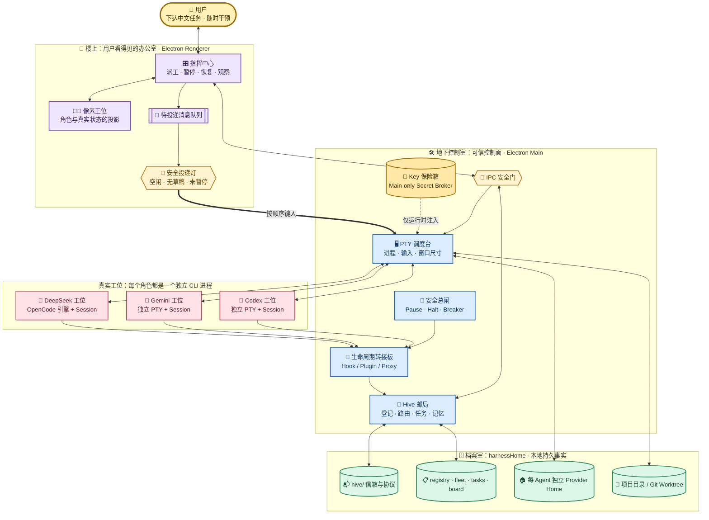
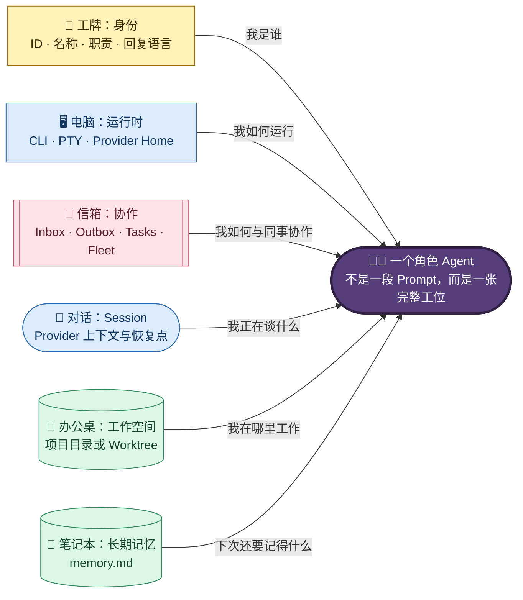
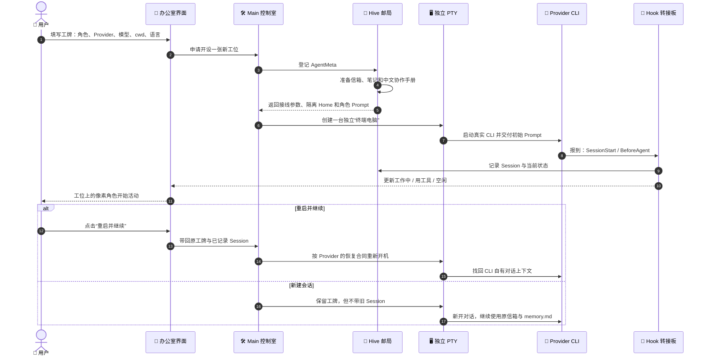
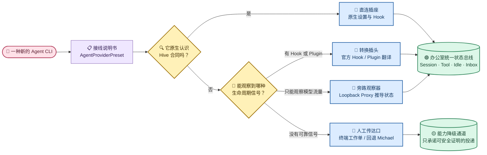
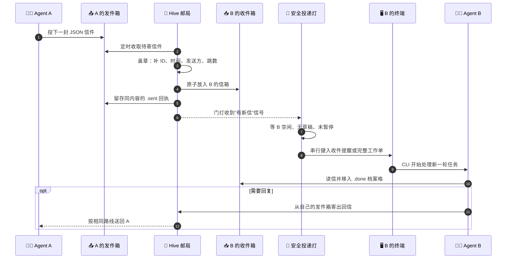
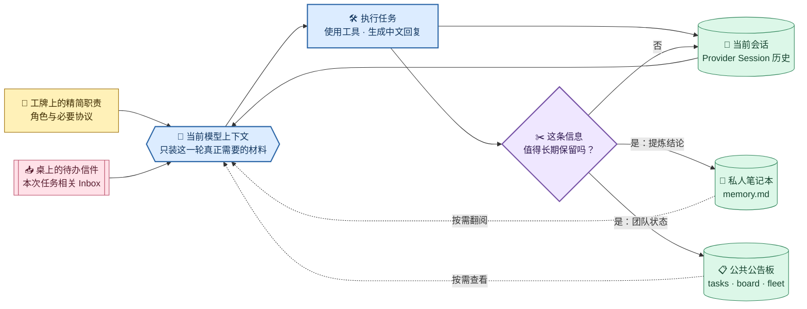
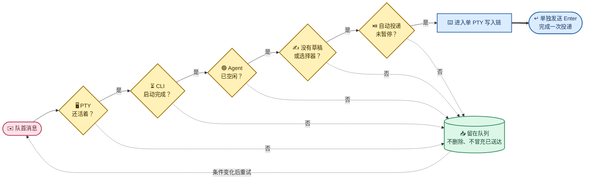

# Munder Difflin 多 Agent 角色办公室架构与运行机制

> 本文是 Munder Difflin DIY 版本的架构总览，描述系统当前如何通过真实 CLI、PTY、Hive 协作目录和 Provider Bridge 组成一个本地优先、可观察、可干预、可恢复的多 Agent 角色办公室。

## 1. 文档定位

| 项目 | 说明 |
| --- | --- |
| 权威范围 | 多 Agent 运行模型、角色化、消息通信、Provider 适配、Session/记忆、控制与恢复机制 |
| 不负责 | 实施阶段、一次性验证结果、临时运行目录、真实 Session ID、密钥和排查流水 |
| 产品决策来源 | [DIY 可行性与功能价值分析](../01-Munder-Difflin-DIY可行性与功能价值分析结论.md) |
| 交付状态来源 | [DIY 实施规划与 Gate 总览](../02-Munder-Difflin-DIY实施规划与Gate总览.md) |
| 核心实现 | [`src/main/hive.ts`](../../../src/main/hive.ts)、[`src/shared/agentProvider.ts`](../../../src/shared/agentProvider.ts)、[`src/renderer/src/hooks/useHive.ts`](../../../src/renderer/src/hooks/useHive.ts) |

本文只维护稳定设计合同。动态证据属于 `.work/`，不得把 API Key、临时进程号、运行 Session ID 或某次 pass/fail 复制进本文。

## 2. 一句话架构

Munder Difflin 不在 Electron 内重新实现 Agent Loop，而是把多个真实 Agent CLI 分别运行在独立 PTY 中；Electron Main 负责进程、Hive、Hook、凭据和控制，Renderer 负责可视化与安全投递，每个 Agent 则通过自己的角色目录、消息信箱和 Provider Session 获得身份、长期记忆与协作能力。

## 3. 设计原则

| 原则 | 设计含义 |
| --- | --- |
| CLI 原生 | 推理、工具调用和会话历史由 Codex、Gemini、OpenCode 等真实 CLI 拥有，不在应用内复制一套 Agent Runtime |
| 本地优先 | 协作事实主要保存在用户选择的 `harnessHome`；不依赖中心调度服务才能运行 |
| 单写者信箱 | Agent 只写自己的 `outbox/`，只处理自己的 `inbox/`；路由器是跨目录投递的唯一写者 |
| 持久事实与实时信号分离 | 任务、消息、记忆和注册表落盘；PTY 输出、Hook、队列和控制状态承担低延迟运行信号 |
| 能力驱动适配 | Provider 通过能力和 Bridge 接入，不假设不同 CLI 拥有相同参数、Hook 或恢复语义 |
| 空闲后投递 | 自动消息只在目标 CLI 可安全接收输入时进入 PTY，避免覆盖用户草稿或打断工具执行 |
| 人可随时介入 | 暂停工具、暂停投递、引导、停止、恢复和断路器共享同一控制面 |
| 展示与机器合同分离 | 中文化作用于 UI、角色和自然语言说明；Provider ID、消息字段、枚举、命令与 Hook 名保持稳定 |

## 4. 总体架构



这张图可以按真实办公室来读：Renderer 是员工可见的楼层，Electron Main 是不直接暴露给员工的控制室，Hive 是邮局和档案系统，PTY 是每张工位上的终端，而 Codex、Gemini、DeepSeek 是真正坐在工位上工作的 CLI。实线表示控制或数据流，双粗线表示最终进入终端的受控输入，虚线表示只在运行时出现的敏感注入。

视觉图例：`🧑` 人类操作员 · `🧑‍💻/🤖` Agent · `🖥️` PTY/进程 · `📮/📬` Hive 通信 · `🗄️/📋` 持久事实 · `🔌` 生命周期 Bridge · `🔐` 凭据边界 · `🚦/🛑` 安全控制。

### 4.1 分层职责

| 层 | 拥有的事实 | 不应拥有的事实 |
| --- | --- | --- |
| Renderer | 当前页面状态、角色投影、用户草稿、待投递队列、空闲门控 | API Key、Provider 全局认证文件、消息路由权威 |
| Electron Main | PTY/进程、Hive 路由、Provider 注入、Hook、控制状态、凭据注入 | 模型内部推理历史、Renderer 临时布局 |
| Provider CLI | 对话 Session、模型推理、工具执行、CLI 自身交互状态 | 其他 Agent 的目录写权限、Hive 全局路由 |
| `harnessHome` | 角色、任务、消息、记忆、注册表和 Provider 隔离 Home | 临时 UI 组件状态、明文凭据文档 |
| 项目/Worktree | Agent 实际修改与验证的工作成果 | Hive 身份、通信收据和 Provider 认证状态 |

## 5. Agent 的组成

一个角色 Agent 不是一段提示词，而是五类状态的组合：



其中：

- Agent ID 是目录、注册表和路由的稳定主键；显示名称与中文角色名可以修改。
- `identity.md` 定义角色职责，`replyLanguage` 定义自然语言输出偏好。
- PTY 让 CLI 以为自己连接真实交互终端，从而保留 TUI、快捷键、彩色输出、审批和窗口尺寸语义。
- Provider Session 保存会话历史；`memory.md` 保存跨 Session 的提炼事实。
- `cwd` 指向实际工作目录，可以是项目根目录，也可以是隔离 Worktree。

## 6. Harness 与持久目录

### 6.1 生成规则

用户选择 `harnessHome` 后，Main Process 会确保该目录存在，并在其中幂等生成 Hive 根目录、公共协议、角色目录和 Provider 隔离配置。切换 `harnessHome` 相当于切换一套办公室持久状态，而不是只切换一个 UI 主题。

```text
<harnessHome>/
├── hive/
│   ├── PROTOCOL.md              # 人可读的消息与协作协议
│   ├── COMMANDS.md              # 人可读的 CLI/Hive 操作说明
│   ├── registry.json            # Agent 身份、Provider、Session 与归档状态
│   ├── fleet.json               # 实时状态、用量、工具、断路器和积压快照
│   ├── tasks.json               # 结构化任务账本
│   ├── board.md                 # Michael 维护的自由形式协作看板
│   ├── log.jsonl                # 追加式事件日志
│   └── agents/
│       └── <agent-id>/
│           ├── identity.md      # 角色身份与职责
│           ├── memory.md        # 跨 Session 长期记忆
│           ├── inbox/
│           │   └── .done/       # 已处理消息
│           ├── outbox/
│           │   └── .sent/       # 已路由发送收据
│           ├── .codex/          # Codex 隔离 Home，按 Provider 存在
│           ├── .gemini-cli/     # Gemini 隔离 Home，按 Provider 存在
│           └── .opencode/       # OpenCode/DeepSeek 隔离 Home，按 Provider 存在
├── worktrees/                   # 按任务创建的隔离 Git 工作区
└── roster.json                  # UI 团队恢复镜像
```

### 6.2 持久与易失状态

| 状态 | 主要载体 | 生命周期 |
| --- | --- | --- |
| 角色身份、Provider、最近 Session | `registry.json` | 应用重启后保留 |
| 任务、看板、消息、长期记忆 | `tasks.json`、`board.md`、信箱、`memory.md` | 应用与 Session 重启后保留 |
| CLI Session 内容 | 每 Agent Provider Home | 由对应 CLI 管理，可按 Session ID 恢复 |
| 运行状态与用量摘要 | `fleet.json`、事件日志 | 持久快照，可由新运行更新 |
| PTY 进程、Hook socket | 内存与操作系统 | 应用退出后消失，重启时重建 |
| Renderer 输入草稿与投递队列 | Renderer Store；队列有本地持久镜像 | 页面运行态；适用状态可恢复 |

## 7. Agent 启动、工作与恢复



Session 切换是“停止当前 CLI，再以另一个有效 Session ID 重启并绑定”，不是在同一个运行中 TUI 内热切换。Agent ID 不变时，角色身份、信箱和 `memory.md` 仍然连续；对话上下文则跟随所选 Provider Session。

## 8. Provider 抽象与生命周期 Bridge

### 8.1 为什么需要 Bridge

不同 CLI 的差异不只是模型名：它们的初始 Prompt 参数、自动权限模式、Hook 事件、配置目录、Session ID 来源、恢复参数和空闲信号都不同。`AgentProviderPreset` 把这些差异声明为数据，`HiveManager` 再按能力选择对应 Bridge。

可以把 Provider Bridge 理解成“转接插头”：不要求每台 Agent 设备使用同一种接口，而是把它真实提供的信号转换成办公室能够理解的统一状态。



### 8.2 当前中文混合办公室主链

| 产品 Provider | 实际 CLI | 初始角色合同 | 生命周期来源 | Session 恢复 | 隔离 Home |
| --- | --- | --- | --- | --- | --- |
| `codex` | Codex CLI | 位置参数初始 Prompt | Codex Hook Bridge | `codex resume` | `<agentDir>/.codex` |
| `gemini` | Google Gemini CLI | `--prompt-interactive` | Gemini 官方 Hook 翻译 | `--resume` | `<agentDir>/.gemini-cli` |
| `deepseek` | OpenCode TUI + DeepSeek API | `--prompt` | OpenCode Plugin Bridge | `--session` | `<agentDir>/.opencode` |

`deepseek` 是用户可见的独立 Provider ID，但复用 OpenCode 已有的工具循环、TUI、Plugin 和 Session 能力；Electron 不直接实现 DeepSeek Agent Loop。其他 Provider 继续通过相同能力模型接入，但不得因为出现在选择器中就假定其生命周期成熟度与上述主链相同。

### 8.3 凭据边界

- Renderer 只处理 Provider/模型选择和“是否已配置”等脱敏状态，不读取真实 Key。
- Main Process 的 Secret Broker 在 spawn 时把所需凭据放入子进程环境。
- 每 Agent Provider Home 只保存 CLI 必要配置；生成的系统设置不得包含 Key 文本。
- 凭据不得进入 Prompt、Hive 文档、消息、截图、日志、`.work` 收据或 Git。

## 9. Hive 消息通信

### 9.1 消息不是共享文档协作

Agent 之间确实使用文件形成持久信箱，但完整通信链还包括：

1. Agent 在自己的 `outbox/` 写一条 JSON 消息。
2. Main Process Router 读取并规范化消息，补齐 ID、时间、发送方和跳数。
3. Router 原子写入接收方 `inbox/`，并将发送方原件归档到 `.sent/`。
4. Hook 或 PTY 静默检测确认目标 Agent 已到安全空闲点。
5. Renderer 将收件提醒或完整终端工作单串行写入目标 PTY。
6. Agent 读取并处理消息，移入 `.done/`，必要时通过自己的 `outbox/` 回信。

因此它更像一套“有档案、有邮戳、到工位前还要看红绿灯”的内部邮政系统，而不是所有 Agent 同时编辑一份公共文档。



### 9.2 消息机器合同

| 字段 | 含义 |
| --- | --- |
| `id` | 消息唯一标识；缺失时由 Router 生成 |
| `conversation` | 跨多条消息的协作会话标识 |
| `in_reply_to` | 被回复消息的 ID |
| `from` / `to` | 发送方与接收方；发送方最终以拥有该 `outbox/` 的 Agent 为准 |
| `act` | `request`、`inform`、`propose`、`query`、`agree`、`refuse`、`done` |
| `subject` / `body` | 人可读主题和正文，可使用中文 |
| `requires_reply` | 是否要求接收方明确回复 |
| `needs_human` | 是否需要人类关注；由 Michael 代理进入人机控制面 |
| `hops` | 路由跳数；超过上限时停止转发，防止 Agent 互相循环 |
| `created_at` | 标准时间戳 |

机器字段、枚举值和目录名不能翻译。中文化只作用于 `subject`、`body`、角色说明和生成文档中的自然语言。

### 9.3 单写者与交付保证

- Agent 绝不直接写入另一个 Agent 的目录。
- Router 使用临时文件与原子重命名完成落盘，避免接收半个 JSON。
- 已规范化消息同时成为接收方消息和发送方 `.sent` 收据，二者机器字段一致。
- 无效 JSON 被隔离为 `bad-*`，不会让路由循环持续报错。
- 归档 Agent、无安全空闲信号的 Provider 和无 PTY 目标不会被静默当作成功；系统改走终端工作单或回退给 Michael。
- 广播只面向当前活跃、可安全接收 Inbox 的 Agent。

## 10. 角色化与中文协作

角色化由稳定身份、可编辑职责和运行时语言合同共同组成，而不是把角色名硬编码到模型中。

| 组成 | 存储/来源 | 作用 |
| --- | --- | --- |
| Agent ID | Registry 与角色目录 | 稳定路由主键，不依赖中文名称 |
| 名称与职责 | `AgentMeta`、`identity.md` | 定义产品经理、架构师、开发、测试、审查等角色 |
| 回复语言 | `replyLanguage` | 要求自然语言使用 `zh-CN` 或 `en-US` |
| 角色 Prompt | `HiveManager` 生成 | 注入职责、消息协议、记忆和安全边界 |
| 角色模板 | Add Agent UI / Hire Manifest | 只预填配置，必须由用户确认，不自动 Spawn |

中文角色名称若无法形成安全英文 slug，系统生成稳定的安全 Agent ID；显示名仍可完整保留中文。协议生成器只迁移已知的系统模板，自定义 `PROTOCOL.md`、自定义身份说明和既有长期记忆正文不被覆盖。

Munder Difflin 当前没有自动加载到所有 Agent 的统一 `AGENTS.md`“蜂巢意识”。其共同意识由精简 Prompt、`PROTOCOL.md`、`registry.json`、`fleet.json`、`tasks.json` 和 `board.md` 按需组合，避免每轮都把整个办公室状态塞入上下文。

## 11. Session、长期记忆与上下文预算

### 11.1 三种记忆层次

| 层次 | 载体 | 适合保存 | 不适合保存 |
| --- | --- | --- | --- |
| 当前对话 | Provider Session | 最近对话、工具调用、模型内部上下文 | 跨 Session 必须长期保留的结论 |
| 角色长期记忆 | `memory.md` | 稳定事实、决策、经验、未完上下文 | 完整对话抄本、原始大日志、凭据 |
| 蜂巢公共事实 | `tasks.json`、`board.md`、Registry/Fleet | 所有者、任务状态、全局角色与运行摘要 | 单 Agent 的私有推理历史 |

可以把模型上下文理解成 Agent 当前摊开的桌面：工牌和当前信件随手可见，私人笔记与公共公告板按需翻阅；工作结束后只把真正耐久的结论抄回笔记本，而不是把桌上所有草稿永久保存。



### 11.2 节省 Token 的规则

- 角色 Prompt 只包含稳定职责、必要协议和文件路径，不粘贴任务背景全文。
- 派工引用文件、消息 ID 和任务卡，而不是跨 Agent 复制大段内容。
- `memory.md` 保存提炼结论，不复制 Session transcript。
- Agent 只读取自己的 Inbox 和任务相关公共事实，不扫描所有角色目录。
- Michael 使用紧凑 roster/fleet 摘要掌握全局，需要深入时再读取单个 Agent 的记忆或发出查询。
- 长对话可创建新 Session，通过 `memory.md` 保持角色连续性，避免无限膨胀旧上下文。

因此 `memory.md` 与 CLI Session 不冲突：前者是显式、可编辑、跨 Session 的耐久摘要；后者是 Provider 拥有的对话上下文。冲突只会在两者重复保存未经提炼的历史时出现。

## 12. 空闲门控、控制与状态

系统没有用单一枚举表达所有状态，而是把“运行状态”“投递状态”和“操作员控制”作为可叠加事实：

| 维度 | 典型状态 | 事实来源 |
| --- | --- | --- |
| CLI 生命周期 | `starting`、`working`、`compacting`、`idle`、`gone` | Provider Hook、PTY 输出与静默回退 |
| 协作状态 | Inbox 积压、任务处理中、等待回复 | Hive 文件和任务账本 |
| 工具控制 | 正常、暂停、指定工具 Gate | Main Control Registry，在 Hook 边界拒绝工具 |
| 投递控制 | 自动投递开启/暂停、手动立即发送 | Renderer 持久队列与 Main 控制快照 |
| 停止控制 | 运行、请求停止、已停止 | 下一个 Hook 安全边界 |
| 断路器 | healthy、steer、constrain、stop | 用量、重复工具与错误风暴监测 |

自动输入 PTY 前必须同时满足：目标 PTY 存活、CLI 已启动、目标处于空闲、安全宽限期结束、没有用户草稿、没有命令选择器、没有相同消息在途，并且自动投递未暂停。所有写入同一 PTY 的操作通过单一 Promise 链串行化，避免两个调用方把文本和 Enter 拼在一起。



Provider Hook 是权威运行信号；如果某个 Bridge 缺少可靠的 turn-end 事件，Renderer 使用 PTY 静默时间作为保守回退，把长时间无输出的 `working/compacting` 投影恢复为 `idle`。新 Hook 事件会再次校正状态。

## 13. 故障、恢复与不可丢失语义

| 故障 | 系统行为 |
| --- | --- |
| CLI 崩溃或终端损坏 | 保留 Agent ID、角色目录和最近 Session；可 Restart & Continue |
| Provider 恢复失败 | 返回可理解错误，允许明确创建新 Session；不伪装为已恢复 |
| PTY 写失败 | 保留队列消息，达到失败阈值后暂停自动投递，避免删掉未送达任务 |
| Hook 漏报 idle | 使用全楼层 PTY 静默回退，不让 Inbox 永久卡住 |
| 消息 JSON 损坏 | 移入 `.sent/bad-*` 隔离，Router 继续处理其他消息 |
| 消息互相转发 | `hops` 上限阻止无限 ping-pong |
| 目标不可投递 | 尝试受控终端工作单；仍不可用时回退 Michael，不静默堆积 |
| 应用启动时 Roster 只恢复一部分 | 首次写入收缩保护拒绝用局部快照覆盖完整历史 Roster |
| Agent 关闭 | Registry 标记 archived，保留记忆和恢复信息；广播不再向其投递 |
| 自动权限未开启 | 沿用 Provider 默认审批/沙箱；不会偷偷附加 bypass 参数 |

## 14. IO、通信延迟与容量边界

### 14.1 五到六个 Agent 的常态

日常 5～6 个 Agent 时，Hive IO 主要是小型 JSON/Markdown、目录扫描、原子重命名和追加日志；模型推理、网络请求与工具执行通常远比本地文件操作耗时。该规模下本地 SSD 的 IO 压力通常不是瓶颈。

| 延迟阶段 | 当前机制 | 影响 |
| --- | --- | --- |
| Agent 写 Outbox | 本地小文件写入 | 通常接近本地文件系统延迟 |
| Router 发现消息 | 默认约 1.5 秒轮询 | 提供稳定、跨平台、易恢复的投递上界分量 |
| 安全投递等待 | 等目标 idle、无草稿且未暂停 | 可能高于 Router 延迟，是有意的正确性门控 |
| PTY 输入 | 100ms 级就绪轮询与串行提交 | 防止 CLI 尚未准备好或输入交错 |
| 模型回答 | Provider 网络、排队、模型与上下文 | 通常是端到端耗时的主要部分 |

### 14.2 需要关注的 IO 风险

- Agent 高频发送大量细碎消息，会增加目录扫描、归档文件数和模型唤醒次数。
- 把完整日志或大制品放入 Inbox/Memory，会同时放大 IO 和 Token 消耗。
- 将 `harnessHome` 放在高延迟网络盘、强同步目录或频繁全盘扫描环境，会放大轮询抖动。
- `log.jsonl`、`.done/`、`.sent/` 和 Provider Session 长期不治理时，会逐渐增加磁盘占用。

推荐保持消息“一事一条但不过度碎片化”，大制品只传路径；`memory.md` 只保留提炼事实；长期运行时按明确保留策略归档日志和历史消息，不能用无界自动删除代替治理。

## 15. 核心不变量

1. Agent 只能写自己的 `outbox/`、`memory.md` 和工作目录，不能直接写其他 Agent 的信箱。
2. Provider/model ID、Hive JSON 字段、消息枚举、Hook 名和 CLI 参数是机器合同，不能因中文化改变。
3. 任何自动 PTY 输入都必须经过统一空闲门控与单 PTY 串行链。
4. Session 历史由 Provider CLI 拥有；角色长期事实由 `memory.md` 拥有；任务全局事实由 Hive 账本拥有。
5. Renderer 不持有明文 Provider Key；凭据不得进入 Prompt、Hive、截图、日志、收据或 Git。
6. Provider 能否接收 Inbox 由其真实生命周期能力决定，不能由 UI 是否展示推断。
7. 角色模板和 Hire Manifest 只预填配置，不能绕过用户确认自动启动进程。
8. 关闭 Agent 是归档而不是抹除；重启与恢复必须尽量保持 Agent ID、记忆和 Session 连续性。
9. 暂停工具、暂停投递和停止是三种独立控制，不能互相冒充。
10. 运行失败必须保留任务或消息，并产生可行动状态；不能把“写入尝试”当作“已送达”。

## 16. 实现地图

| 设计责任 | 主要实现位置 |
| --- | --- |
| Provider 类型、能力、启动与恢复合同 | [`src/shared/agentProvider.ts`](../../../src/shared/agentProvider.ts) |
| Hive 目录、角色 Prompt、消息路由、Provider Bridge | [`src/main/hive.ts`](../../../src/main/hive.ts) |
| PTY 创建、写入、结束与进程树 | [`src/main/pty.ts`](../../../src/main/pty.ts) |
| Main IPC、Secret Broker、Hook/控制编排 | [`src/main/index.ts`](../../../src/main/index.ts) |
| 暂停、工具 Gate、停止和恢复状态 | [`src/main/control.ts`](../../../src/main/control.ts) |
| 启动 Roster 持久化与收缩保护 | [`src/main/roster.ts`](../../../src/main/roster.ts) |
| Renderer 空闲门控、Hook 投影与消息队列投递 | [`src/renderer/src/hooks/useHive.ts`](../../../src/renderer/src/hooks/useHive.ts) |
| Renderer Agent、队列和恢复状态 | [`src/renderer/src/store/store.ts`](../../../src/renderer/src/store/store.ts) |
| 中文角色创建与模板 | [`src/renderer/src/components/AddAgentModal.tsx`](../../../src/renderer/src/components/AddAgentModal.tsx) |
| Hive IPC 类型与 Renderer 安全边界 | [`src/preload/index.ts`](../../../src/preload/index.ts) |

## 17. 本文维护规则

- 只有当上述稳定合同发生变化时才修改本文；测试命令、截图和一次性运行证据继续写入 `.work/`。
- 修改 Provider 参数、消息 schema、目录布局、Session 恢复、空闲门控或凭据边界时，必须同步校准本文对应章节。
- 新专题文档可以在本目录按编号增加，但应引用本文的总览合同，不重复复制整套架构说明。
- 如果实现与本文冲突，以可验证实现为诊断起点；确认新合同后一次性更新代码、适用测试和正式设计，不能长期保留两套权威描述。
