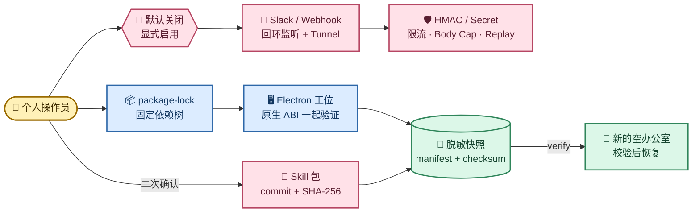
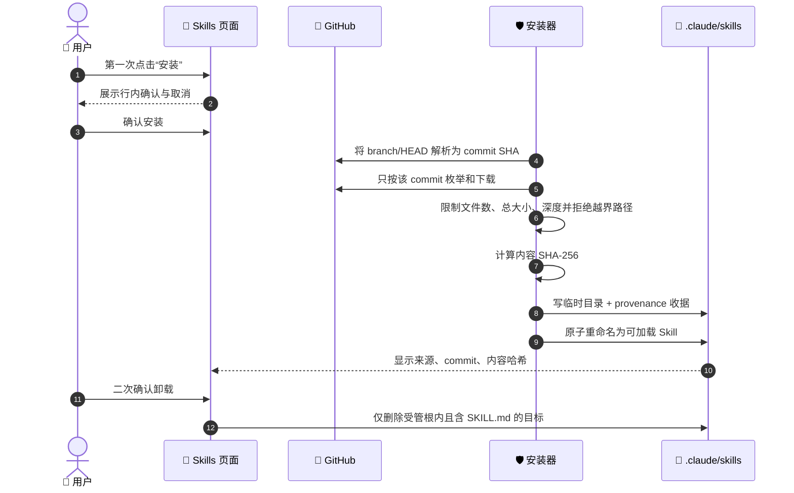
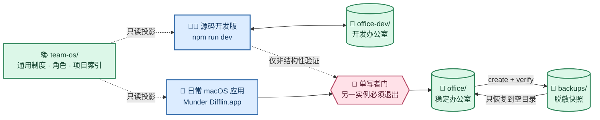

# Munder Difflin 个人长期运行安全与备份恢复设计

> 本文定义 Wave 5 后个人本机长期运行的依赖、外部入口、Skills 与本地数据恢复合同。它不覆盖商业发行、签名、公证、应用商店或自动更新服务。

产品总体架构见 [多 Agent 角色办公室架构与运行机制](01-Munder-Difflin多Agent角色办公室架构与运行机制.md)；Codex 原生运行桥的权限、恢复、兼容和分阶段 Gate 见 [Codex App Server 原生运行桥升级实施规划](../实施规划/05-Munder-Difflin-Codex-App-Server原生运行桥升级实施规划.md)。

## 1. 稳定边界

| 领域 | 长期合同 | 明确不做 |
| --- | --- | --- |
| 运行时 | 仓库声明 Node 22；Electron 与原生模块按 Electron ABI 构建并一起验证 | 用普通 Node 直接加载 Electron ABI 原生模块 |
| 依赖 | lockfile v3 是唯一安装输入；漏洞扫描只产生风险清单，升级必须经过兼容验证 | `npm audit fix --force`、无验证跨大版本升级 |
| 外部入口 | Slack、Webhook、Tunnel 默认关闭；启用的本地转发目标只监听 `127.0.0.1` | 把 Token 放进 URL、日志、文档或收据 |
| Skills | 安装前确认；来源解析到固定 Git commit；记录内容 SHA-256；可卸载 | 隐式运行远程安装脚本、失败后静默换源 |
| 数据 | 脱敏目录快照、逐文件哈希、恢复前校验、只恢复到空目标 | 备份明文 Key、覆盖现有办公室、自动删除 Worktree/Session |

动态扫描结果和每次演练收据属于 `.work/gates/`，本文只维护不随一次运行变化的合同。

## 2. 长期运行防线



### 2.1 Node、Electron 与原生模块

开发命令使用 Node 22，版本范围由 `package.json#engines` 和 `.nvmrc` 共同约束。`postinstall` 会针对 Electron 重建 `better-sqlite3` 与 `node-pty`；因此正确验收入口是 Electron ABI，而不是在普通 Node 进程中 `require` 这些 `.node` 文件。

维护检查至少覆盖：Node 主版本、lockfile 版本、`npm ls` 依赖闭合、Electron 版本/ABI、SQLite 内存查询、PTY 导出、类型检查、生产构建和只读 `npm audit`。发现漏洞后按直接运行依赖、开发/打包依赖、未启用可选入口分类，升级时使用独立分支并重跑同一反馈环。

### 2.2 外部入口

Slack 与 Webhook 必须由用户显式开启；未开启时不创建监听或 Tunnel。开启时：

- Tunnel 只转发到 `127.0.0.1`，避免同时暴露给局域网；
- Slack 使用原始请求体 HMAC、五分钟 replay 窗口、入口限流和 1 MiB body cap；
- Webhook 使用每端点独立 Secret、全局及端点限流、1 MiB body cap；
- Webhook 状态能力 Token 只允许 `x-md-webhook-token` Header，不支持 URL 查询参数；
- 配置轮换会撤销旧端点；应用停止时关闭本地服务器。Tunnel 库不提供关闭句柄时，不承诺进程内精确回收，退出应用是最终清理边界。

## 3. Skills 供应链



Munder 安装的 Skill 随目录保存 `.munder-skill-lock.json`，包含目录原始 URL、解析后的 GitHub 仓库、请求 ref、固定 commit、内容哈希、文件数和安装时间。项目级 Skill 仍覆盖用户级 Skill；手工安装但没有 provenance 的 Skill 继续可用，界面不得为它伪造来源。显式刷新目录会使缓存失效；网络失败只可回退到已标记 stale 的原缓存，不能更换来源。

## 4. 备份内容与排除项

### 4.1 快照内容

| 快照路径 | 来源 | 用途 |
| --- | --- | --- |
| `user-data/config.json` | Electron userData | 脱敏后的语言、Provider 选择、路径与非敏感设置 |
| `user-data/harness.db*` | Electron userData | 任务历史数据库及适用 WAL/SHM |
| `user-data/knowledge/` | Electron userData | 知识库 |
| `harness/hive/` | `harnessHome` | 协议、角色 Home、Session、消息、任务、记忆与蜂巢 Git |
| `harness/roster*.json`、`roster-backups/` | `harnessHome` | UI 团队镜像和可回溯副本 |
| `harness/worktrees/` | `harnessHome` | 未集成文件的恢复副本 |

备份排除 `integration-secrets.json`、Provider `auth.json`/credential/account 文件、API Key 文件、socket、PID/lock、符号链接、缓存、临时目录和 `node_modules`。Worktree 的 `.git` 指针也排除，因为它记录旧机器绝对路径；恢复内容只是救援副本，必须在目标仓库重新创建 Worktree/分支后人工合并。

### 4.2 一致性前提

创建快照前退出 Munder Difflin，并确认没有 Agent CLI 或维护中的 Worktree 写入。这样 SQLite 主文件、WAL/SHM、Hive 日志和 Session 才属于同一静止时点。工具不会为了备份强杀进程，也不会自行删除会话或工作树。

### 4.3 推荐本机布局与双运行形态

个人长期使用采用“一套独立版本化的 Team OS、一套稳定办公室、一套开发办公室、一个版本化备份区”的固定布局。四个目录都应位于源码仓库、Electron `userData` 和 `.app` 包之外，避免更新应用、清理构建产物或切换 Git 分支时连带影响个人制度与办公室数据。

```text
~/Munder-Difflin/
├── team-os/              # 个人团队制度、通用角色/流程和项目只读适配器；独立私有 Git 仓库
├── office/               # 日常稳定 harnessHome：由已安装的 macOS 应用使用
├── office-dev/           # 开发 harnessHome：Provider/Hive/Session 等结构性开发使用
└── backups/              # 经 verify 的脱敏快照；按版本或时间建立新目录
    ├── before-upgrade/
    └── before-hive-change/
```



`team-os/` 不是 `harnessHome`，也不是 Hive 的上级状态目录。它保存跨项目稳定的个人团队制度、通用角色与流程、模板、评测准则和项目适配器；`office/` 与 `office-dev/` 保存角色 Session、信箱、任务、日志和 Provider Home 等运行事实。Munder 后续只能把 Team OS 的适用片段只读投影到 Agent 启动上下文，不得把运行日志、Transcript、Key 或动态任务反写为 Team OS 权威。

Team OS 使用自己的私有 Git 历史和独立备份策略。当前 Harness 快照工具只负责 `harnessHome` 与 Electron `userData`，不自动把 `team-os/` 纳入办公室快照；因此备份办公室不能替代提交或备份 Team OS，反之亦然。完整分层合同见 [个人团队操作系统与多项目工作流分层设计](04-Munder-Difflin个人团队操作系统与多项目工作流分层设计.md)。

运行与切换合同如下：

| 场景 | 使用的 `harnessHome` | 约束 |
| --- | --- | --- |
| 日常工作 | `office/` | 使用已安装的 `.app`；保持为唯一写入者 |
| UI、样式、纯文案验证 | 可临时使用 `office/` | 必须先完全退出已安装版；验证后退出开发版再恢复日常应用 |
| Provider、Hive、角色模板、Session、任务或迁移开发 | `office-dev/` | 不直接在稳定办公室试错；先用代表性测试数据闭合 |
| 新版本切换 | 先备份 `office/`，再由新 `.app` 使用原 `office/` | 快照必须先 `verify`；发现不兼容时恢复到新的空目录，不覆盖原目录 |
| 旧版本回退 | 从对应快照恢复到另一组空目录 | 不让旧版本直接写入已被新版本迁移的稳定办公室 |

已安装版与源码开发版技术上可以指向同一个 `harnessHome`，但这里只允许顺序复用，不允许并发。`harnessHome` 内的角色、Provider Session、Inbox/Outbox、任务、记忆、Roster 和 Worktree 会共同可见；两个 Main Process 同时运行会竞争这些单写者事实、重复路由消息或恢复同一 Session。

共用 `harnessHome` 也不代表共用全部应用状态。Electron `userData` 中的 `config.json`、加密集成凭据、`harness.db`、Knowledge 数据、Slack 运行状态和目录缓存可能因开发版与已安装版的应用身份不同而分开保存。切换运行形态时应分别确认 `harnessHome` 选择和必要凭据，不得通过把明文 Key 放进 `office/` 来实现共享。

### 4.4 容量报告与治理边界

Command Center 提供 Session、Inbox/Outbox 待处理与归档、活动日志、成本账本、`memory.md` 和 Worktree 的文件数与字节数报告。扫描仅使用目录项和文件元数据，跳过符号链接，并受目录数、文件数、深度和累计字节预算约束；达到任一上限时显式标记结果不完整。报告由用户进入活动页或点击刷新触发，不作为后台守护进程运行。

容量报告不读取正文、不复制 Transcript、不输出凭据路径，也不提供自动删除、定时清理或保留规则 DSL。默认策略是保留；确需治理时，先退出应用、按第 4～5 节创建并验证脱敏快照，再由用户明确选择归档或移除目标。Worktree 仍必须先通过 Git 集成与干净性检查，不能因为容量较大而跳过交付门禁。

## 5. 操作手册

以下命令必须在仓库根目录执行，并使用 Node 22。路径使用真实绝对地址替换占位符；输出目录必须尚不存在。

```bash
node tools/w5-backup.cjs create \
  --harness-home /absolute/path/to/harness \
  --user-data /absolute/path/to/electron-user-data \
  --output /absolute/path/to/new-backup

node tools/w5-backup.cjs verify \
  --snapshot /absolute/path/to/new-backup
```

恢复必须指向不存在或为空的两个目标：

```bash
node tools/w5-backup.cjs restore \
  --snapshot /absolute/path/to/new-backup \
  --harness-home /absolute/path/to/empty-harness \
  --user-data /absolute/path/to/empty-user-data
```

恢复工具先验证 manifest 和全部文件哈希，再复制；恢复后的 `config.json` 会把 `harnessHome` 与 `recentHives` 改为新目标。所有敏感字段仍是脱敏占位符，首次启动前或通过设置页重新输入 Key、Slack Secret 和 Webhook Secret。不要把这些值回填进快照。

## 6. 迁移与版本回退

迁移机器时先在源机器停应用、创建并验证快照，再把整个快照目录复制到目标机器，目标机器再次 `verify` 后恢复。安装与快照记录一致或更新且兼容的应用版本，重新输入凭据，重新登记项目路径，并把 Worktree 恢复副本人工合并到重新创建的 Git Worktree。

版本回退不覆盖当前环境：

1. 保留当前应用、`harnessHome` 和 userData；
2. 从回退前快照创建一组新的空恢复目录；
3. 在独立 Git Worktree 或独立安装位置运行目标旧版本；
4. 先只读检查 config schema、数据库和 Hive，再启动一个受控 Agent；
5. 验证角色、Session、消息、任务和知识库后，才把新恢复目录选为日常办公室；
6. 失败时退出旧版本并回到原目录，不删除任何一侧。

快照格式由 `manifest.format` 标识。未来格式升级必须保持旧格式只读验证能力，或提供显式迁移器；不得遇到未知版本后猜测恢复。

## 7. 最小验收矩阵

| Gate | 必须成立 |
| --- | --- |
| 依赖 | lockfile 闭合；Electron ABI 下 SQLite 与 PTY 可用；漏洞有分层风险清单和明确升级边界 |
| 外部入口 | 默认关闭；已启用入口满足回环监听、鉴权、限流、body cap、replay/轮换和停止合同 |
| Skills | 安装需确认；commit 与内容哈希可见；项目覆盖成立；卸载受目录保护；刷新不静默换源 |
| 备份 | 配置已脱敏、认证文件排除、manifest 校验能发现篡改、恢复拒绝覆盖、恢复后路径指向新办公室 |
| G5 | 中文 Codex/Gemini/DeepSeek 主链仍通过，并完成一次 CLI 级创建、验证、空目录恢复和恢复后复验 |
