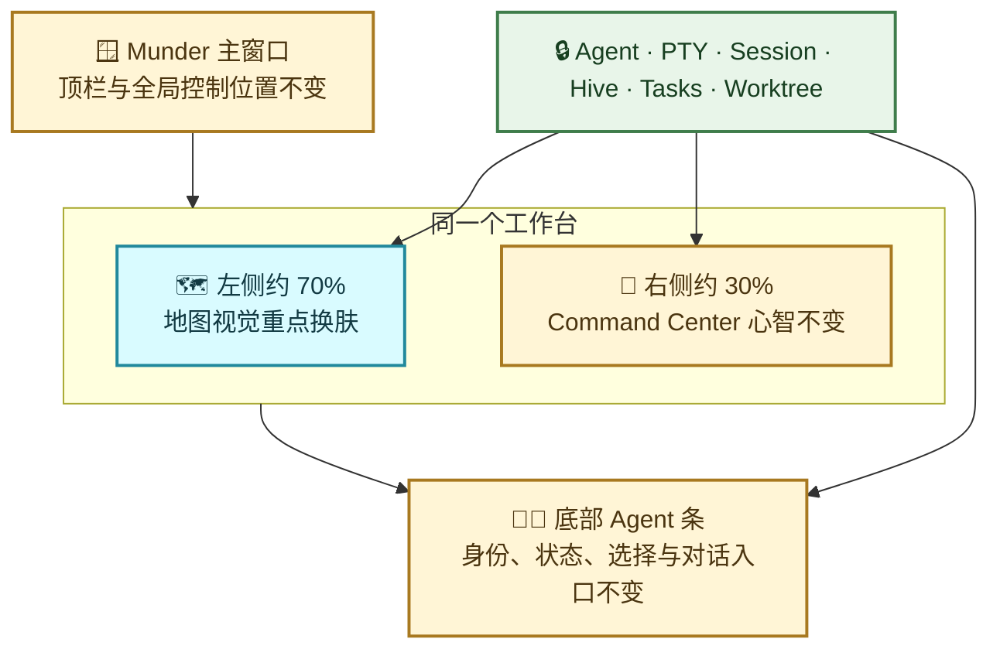
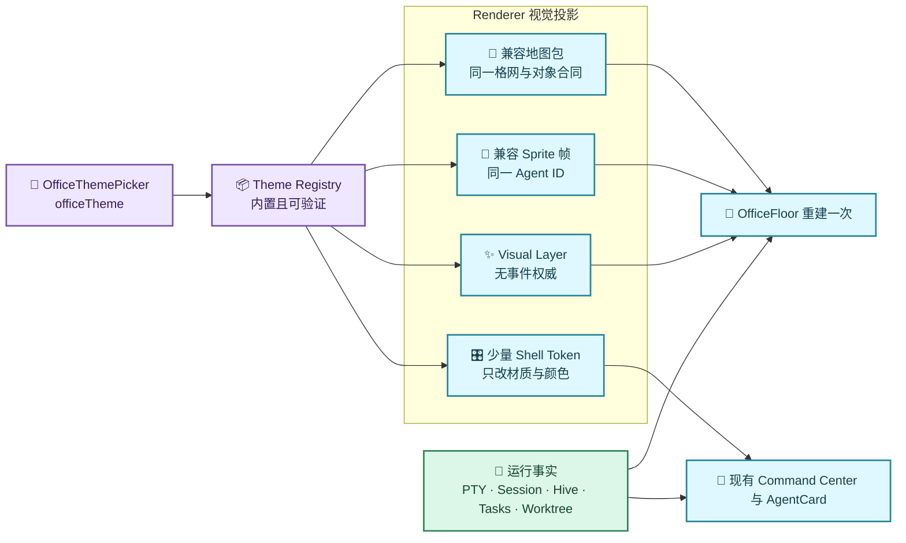
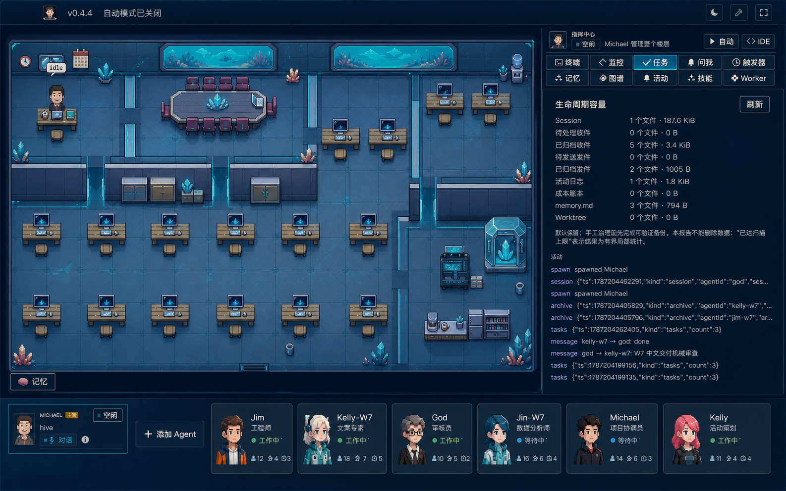
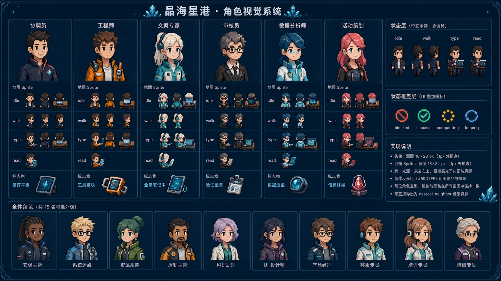
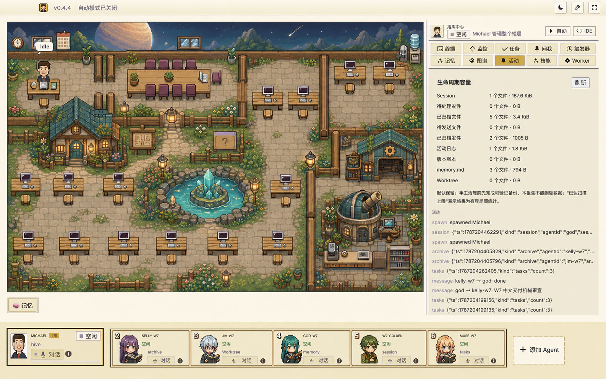
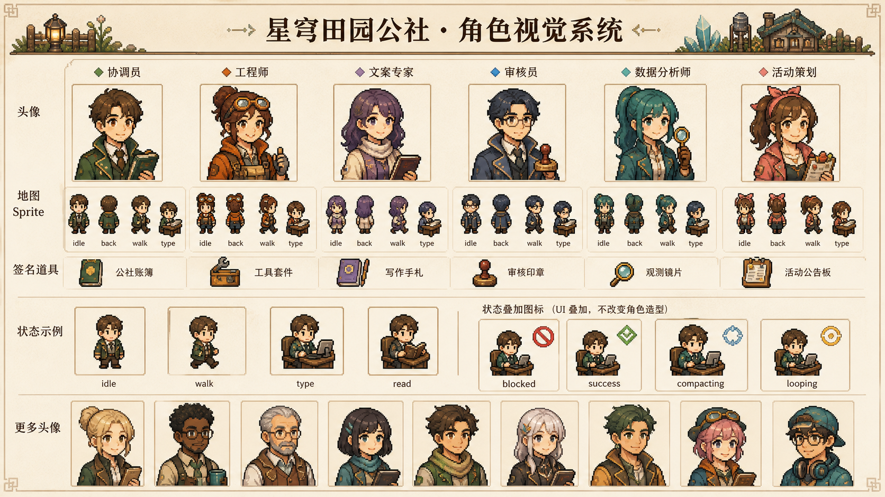
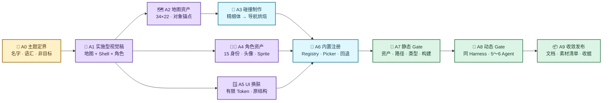

# Munder Difflin 内置主题视觉与低风险换肤设计

> 本文定义 Munder Difflin 内置主题的稳定视觉合同和实施边界。主题只改变同一办公室运行事实的呈现，不改变 Agent、PTY、Session、Hive、任务、Worktree 或用户操作流程。

## 1. 文档定位

| 项目 | 结论 |
| --- | --- |
| 产品与运行机制 | 见 [多 Agent 角色办公室架构与运行机制](01-Munder-Difflin多Agent角色办公室架构与运行机制.md) |
| 长期运行与恢复 | 见 [个人长期运行安全与备份恢复设计](02-Munder-Difflin个人长期运行安全与备份恢复设计.md) |
| 实施顺序与 Gate | 见 [Wave 6 及后续设计结论与实施规划](../实施规划/03-Munder-Difflin-Wave-6及后续设计结论与实施规划.md) |
| 本文权威范围 | 页面结构保护、主题资源合同、视觉映射、工作包和主题验收标准 |

本文采用两套已确认的实施型视觉基线：

- [晶海星港——现有布局约束视觉稿](../ui/02-晶海星港-现有布局约束视觉稿.png)
- [星穹田园公社——现有布局约束视觉稿](../ui/03-星穹田园公社-现有布局约束视觉稿.png)
- [晶海星港——角色视觉系统](../ui/04-晶海星港-角色视觉系统.png)
- [星穹田园公社——角色视觉系统](../ui/05-星穹田园公社-角色视觉系统.png)

视觉稿用于表达材质、色彩、地图对象、角色身份锚点和整体气质，不授权改变真实页面的信息架构。角色视觉稿是美术方向母版，不是可直接导入的 Sprite Atlas；角色数量、尺寸、帧位和回退规则以本文为准。视觉稿与本文冲突时，以本文的布局、交互和运行边界为准。

## 2. 核心设计结论

1. **地图是主题主视觉，右侧仍是原来的 Munder。** 主要投入用于左侧 Pixi 地图、Tileset、角色 Sprite、场景道具和轻量环境效果。
2. **页面骨架不随主题变化。** 顶栏、左侧地图占比、右侧 Command Center、两行功能标签、内容滚动区、消息输入区和底部 Agent 卡片条保持现有结构。
3. **主题不拥有业务状态。** 它只消费 `officeTheme`、Agent 状态、Tool/任务/消息事件和现有锚点，不新增 Provider、IPC、数据库、任务状态或 Agent 状态。
4. **复用同一运行语义，不强求相同几何。** 两套皮肤继续使用同一 34×22、16 px Tile 引擎和稳定对象名合同；为避免角色穿过新画面的桌椅、房间、池塘和道路，每套高保真地图可以拥有与画面一一对齐的静态导航投影。该投影只描述可走格和锚点位置，不拥有 Agent、PTY、Session、任务或角色状态。
5. **右侧只允许低成本视觉映射。** 可调整表面色、边框、选中态和图标色，但不能改标签顺序、字段、按钮数量、操作路径或内容密度。
6. **一键切换仍是既有设置卡片。** 不增加皮肤中心、下载页、向导、确认流程、主题脚本或在线资源市场。

## 3. 受保护的页面心智模型



| 页面区域 | 必须保持 | 允许变化 | 禁止变化 |
| --- | --- | --- | --- |
| 顶栏 | 高度、版本、自动模式、明暗、设置、全屏入口 | 背景和边框 Token | 新增主题导航、移动全局控制 |
| 左侧地图 | 尺寸比例、34×22 格网、稳定对象名、点击语义、镜头行为 | Tileset、Sprite、道具、舷窗/天空、纯视觉特效、与主题画面匹配的静态可走格 | 改对象语义、角色状态、Agent 生命周期或另建寻路引擎 |
| 右侧指挥中心 | Header、自动/IDE、标签集合及顺序、内容与滚动区、输入路径 | 表面色、边框、激活态、非语义图标外观 | 新建任务板、重排功能、改变字段或动作 |
| 底部 Agent 条 | 卡片尺寸、排序、选择、状态、任务便签、对话入口 | 表面色、边框、主题化头像/Sprite | 为主题增加新角色类型或新状态 |
| 设置主题入口 | 现有设置页内一步选择、先校验后持久化 | 卡片缩略图、主题说明 | 新页面、下载、脚本、破坏性确认 |
| 弹窗与详情 | 原入口、字段和完成/关闭路径 | Token 和小图标 | 按主题维护不同交互流程 |

## 4. 主题投影架构



现有 `officeTheme` 继续是唯一持久主题值。若 UI 外壳需要少量随办公室主题变化的 Token，Renderer 只把该值投影为根节点属性，例如 `data-office-skin="starship"`；它不是第二份配置，也不改变已有 `data-cth-theme="light|dark"` 的明暗模式合同。

主题 Token 的优先级固定为：基础设计 Token → 明暗模式 → 办公室皮肤的有限覆盖。办公室皮肤不得覆盖字体、间距、状态语义或终端配色合同。

## 5. 现有实现映射

| 设计责任 | 现有实现 | 实施方式 |
| --- | --- | --- |
| 主题 ID、地图、Tileset、座位、锚点、配色与 Cast | `src/renderer/src/scene/office/themeRegistry.ts` | 扩充内置 `ThemeConfig`；不增加 Skin Engine |
| 主题资源加载与校验 | `src/renderer/src/scene/office/themeLoader.ts` | 继续先加载成功再持久化 |
| 地图、角色和视觉层重建 | `src/renderer/src/scene/office/OfficeFloor.tsx` | 保持一次重建；不双开 Pixi 世界 |
| 纯视觉覆盖层 | `src/renderer/src/scene/office/themeVisuals.ts` | 只绘制无交互、确定性的轻量效果 |
| 主题选择 | `src/renderer/src/components/OfficeThemePicker.tsx` | 在原卡片网格增加已完成主题和缩略图 |
| 顶栏与整体布局 | `src/renderer/src/App.tsx` | 保持 DOM 结构；必要时只投影主题属性 |
| 右侧功能入口 | `src/renderer/src/components/CommandCenterPanel.tsx` | 不改标签、内容或行为；只消费有限 Token |
| 底部角色卡 | `src/renderer/src/components/AgentCard.tsx` | 不改尺寸和语义；可替换兼容头像并消费 Token |
| 明暗与基础设计 Token | `src/renderer/src/design/tokens.css`、`tokens.ts` | 继续作为基础权威；皮肤覆盖不得复制整套 Token |

`starship` 保持机器稳定 ID，产品显示名可以从“星舰‘蜂巢号’舰桥”演进为“晶海星港”。“星穹田园公社”新增稳定机器 ID 时使用不带中文的值，例如 `starfield-farm`；一旦发布不得因文案调整修改该 ID。

## 6. 地图和素材合同

### 6.1 稳定格网与主题导航投影

两套皮肤继续复用同一运行引擎和对象语义：

- 地图均为 34×22，使用 16 px 原始 Tile 与 32 px 视觉素材格；
- 仍由同一个 `TiledMapRenderer` 与 BFS 处理；高保真主题只增加由该 Renderer 一次性读取的静态 `collision-geometry` 矩形对象层；
- `primarySeatNames`、`cafeSeatNames`、`cafeStands` 的对象名、数量和职责保持稳定；
- `coffee`、`anchors`、`errandSpots`、`monitor` 继续使用同一功能合同；
- Agent 稳定座位分配、相机、点击入口和状态表演保持不变。

高保真主题可以内置自己的 `.tmj` 导航投影，但它不是独立游戏场景：只允许按画面制作静态碰撞体、稳定座位和既有功能锚点，使角色真正识别桌椅、墙、门、池塘和道路。所有操作点必须从入口可达；座位和入口必须显式可走；不得新增寻路器、物理引擎、运行时状态或主题专属交互。

视觉地图、精细碰撞体、烘焙碰撞格和操作点必须作为一个资产包共同验收。超出单格的装饰可以跨格绘制；桌椅和设备按地面占位制作，当前单层背景中的房屋、墙体和池塘按不可重合的完整投影制作，透明边、阴影和发光不扩大碰撞体。未来只有在上半部拆成可正确遮挡人物的前景层后，才可缩小该部分碰撞。美术图是对齐基准，原则上不为迁就粗网格重绘背景。

### 6.2 GID 兼容 Tileset

首选路线是为每个主题提供与现有三个 Atlas 尺寸、Tile 尺寸和 GID 语义兼容的替换资源：

| 现有 Atlas | 主题化责任 | 兼容要求 |
| --- | --- | --- |
| `office-tileset.png` | 桌椅、显示器、日历、状态对象和主要工位 | 保持嵌入 Tileset 的 GID 对应关系 |
| `a5-office-floors-walls.png` | 地板、墙体、门、房间分隔 | 保持 `firstgid=513` 和 Atlas 尺寸 |
| `interiors.png` | 柜体、植物、机器、茶水区和环境道具 | 保持 `firstgid=1025` 和 Atlas 尺寸 |

若某一 Atlas 全量重绘成本过高，可以使用随应用内置的整图像素背景；背景必须严格对应 34×22 格网，并与同主题 `.tmj` 导航投影成对交付。原 Tile Layer 仍由同一 Renderer 加载，动态日历、任务板、状态覆盖和点击锚点继续使用既有 GID/对象合同；整图背景不得携带脚本、交互或运行时状态。

### 6.3 角色 Sprite

- 每套发布为“完整主题”的皮肤必须覆盖现有 **15 个可选外观槽位**，同时提供头像与地图 Sprite；只完成地图或只覆盖少量角色只能标记为内部预览。
- 六个核心原型——协调员、工程师、文案专家、审核员、数据分析师、活动策划——用于统一轮廓、服装和随身物的美术语言，不是新的运行时角色分类。系统不得解析自然语言职责、增加分类服务或据此改变 Agent 行为。
- Agent 继续保存既有角色外观 ID。主题只把同一外观 ID 投影为该主题的视觉配方；切换主题前后，Agent ID、名称、职责、Session 和选中外观均不变。
- 同一角色跨主题至少保留两项身份锚点：发型/头部轮廓、主色 Accent、脸部特征或标志性随身物。头像和地图 Sprite 必须来自同一视觉配方，不能出现卡片头像与地图角色不一致。
- 头像原始画布保持 `18×28 px`，地图角色原始画布保持 `18×32 px`；渲染继续使用整数倍近邻采样，不引入平滑缩放或第二套骨骼动画。
- 地图 Sprite 保持三行七帧合同：向下、向上、向右三行，每行依次为 `walk1`、`walk2`、`walk3`、`type1`、`type2`、`read1`、`read2`；向左由向右帧镜像，`idle` 使用 `walk1`。
- 角色业务状态仍只有现有 `idle`、`walk`、`type`、`read` 映射。`blocked`、`success`、`compacting`、`looping` 等继续使用独立 Badge/气泡覆盖层，不为主题新增动作状态或更换服装。
- 主题角色资源加载失败时，必须以同一外观 ID 回退到默认主题视觉，不得随机换人、改变身份或阻塞 Agent。回退是故障恢复能力，不计作完整主题的角色交付。

### 6.4 角色资产交付合同

| 交付物 | 每套主题最低数量 | 合同 |
| --- | ---: | --- |
| 卡片/详情头像 | 15 | 每个既有外观 ID 一张 `18×28 px` 像素配方或确定性产物 |
| 地图动作帧组 | 15 | 每组 `18×32 px`、三方向七帧；左向镜像 |
| 核心原型标志物 | 6 组 | 协调、工程、文案、审核、数据、活动六类美术锚点；只作视觉，不承载业务状态 |
| Cast 映射 | 1 | 既有 15 个外观 ID 到主题视觉配方的一一映射，不改变 ID |
| 素材归属 | 1 | 来源、生成/绘制方式、许可和可分发范围进入既有素材清单 |
| 回退验证 | 1 | 任一主题资源缺失时回到同一外观 ID 的默认视觉 |

角色视觉稿中的人物数量与排布只用于展示风格、身份连续性和动作方向，不作为 Atlas 切图依据。进入代码前必须把母版收敛为上述确定性资产清单，并逐一核对 15 个外观槽位，不能从图中自动推断或补齐角色。

角色三视图母版允许使用不等宽单元格，但切片边界必须作为版本化资产合同显式维护。编译器应按透明连通区域提取每个完整身体，不能把单元格机械三等分；每个基础方向帧必须同时满足头脚完整、脚底落在底边、身体不触碰左右切片边界。该保护用于直接阻止“只显示半边身体”重新出现。

### 6.5 地图与人物碰撞体

该工作在游戏制作中属于**碰撞体制作（Collider Authoring）**和**导航格烘焙（Navigation Grid Baking）**。碰撞采用常见俯视像素场景的三层最小模型，不引入物理引擎或 NavMesh：

| 层 | 形状 | 权威来源 | 目的 |
| --- | --- | --- | --- |
| 静态精细碰撞 | 逻辑像素坐标的命名矩形；圆形物体可用少量矩形组成复合碰撞体 | 主题 `.tmj` 的 `collision-geometry` Object Layer | 贴合桌面、墙体、单层背景建筑、池塘石沿、机器和柜台的不可重合轮廓 |
| 全局导航投影 | 16 px Tile 格 | 构建脚本由精细碰撞体自动生成主题 `.tmj` 的 `collision` Layer | 保留现有 BFS；每格以脚底锚点判定，不再手工维护第二套红格真值 |
| 动态角色 | 以脚底为中心、半径 3.5 px 的圆形占地 | 现有 `Character` 像素坐标 | 防止脚底互穿，同时允许头发、身体和道具按 Y 深度自然遮挡，不把整张 18×32 Sprite 当刚体 |

构建时按 3.5 px 半径对障碍执行**障碍膨胀（Obstacle Inflation / Clearance）**后烘焙格网；运行时每一步再做脚底圆与精细矩形检测，阻止相邻合法格之间擦过桌角或薄墙。所有操作点必须通过入口 BFS 可达、精细碰撞净空，并用可视覆盖图核对；覆盖图中深红是原始碰撞体、浅红圆角边是 3.5 px 膨胀、紫色细格是派生导航投影、绿色圆是操作点脚底。

座椅是交互落点，不把椅背整张像素图当作障碍；桌体和椅子之外的固定结构仍不可穿越。多个角色从同一入口恢复时按稳定 ID 顺序依次离开重叠点；平常相遇仍双向阻挡，短暂等待后只在现有 BFS 上重新选路，不增加群体 AI、连续物理或主题专属逻辑。

### 6.6 特效与性能

特效只使用已有 Pixi Ticker 和确定性绘制：

- 同屏环境粒子应保持少量、可复用，不建立粒子业务状态；
- 窗景、星点、水面微光和灯笼闪烁不得遮挡状态气泡、阻塞告警或点击锚点；
- `document.hidden`、全屏终端或全屏文件时继续沿用现有暂停机制；
- 5～6 个 Agent 的终端输入和右侧滚动优先于环境动画。

## 7. 两套主题视觉语汇

### 7.1 晶海星港（机器 ID：`starship`）





角色基线是“深海晶能航站的专业小队”：保留易辨识的人脸、发型和主 Accent，用舰桥制服、晶体终端、航图板、数据晶簇等轻量道具形成主题感。不得用全身重甲、头盔或强烈发光覆盖身份特征。

| 办公室对象 | 晶海星港呈现 | 复用事实 |
| --- | --- | --- |
| 地板与走廊 | 深海蓝舰桥格板、青色能量导轨 | 原 Tile 和碰撞层 |
| 外墙与窗 | 晶海舷窗、远景行星、海底晶簇 | 原墙体与窗口位置 |
| Agent 工位 | 木/金属混合控制席、蓝色控制屏 | 原座位和 `working` |
| 会议桌 | 晶体航图桌 | 原会议区 |
| 茶水/休息区 | 能量饮料台、观景角 | 原咖啡与 idle loop |
| 服务器/档案区 | 晶体核心、数据柜 | 原右下房间和道具锚点 |
| 消息 | 短数据脉冲或小型航标 | 原信封路径 |
| 完成/阻塞 | 青绿短闪 / 珊瑚红警标 | 原状态与告警优先级 |

右侧在浅色模式下可以继续使用现有奶油纸张；深色模式可呈现接近视觉稿的深海表面。办公室皮肤本身不强制切换用户的明暗偏好。

### 7.2 星穹田园公社（建议机器 ID：`starfield-farm`）





角色基线是“星穹边境的协作工坊”：保留同一身份锚点，用围裙、工装、纸张、观测镜、工具包和星穹徽记表达温暖手作感。不得复刻任何现有农场游戏角色，也不得把职业外观扩展为种植、体力或好感度系统。

| 办公室对象 | 星穹田园公社呈现 | 复用事实 |
| --- | --- | --- |
| 地板与走廊 | 石板小径、木质边界、草地花丛 | 原 Tile 和碰撞层 |
| 外墙与窗 | 开放式公社围栏、远景行星天空 | 原墙体边界与窗口位置 |
| Agent 工位 | 木桌终端、工坊操作台 | 原座位和 `working` |
| 会议桌 | 公社长桌与布告角 | 原会议区 |
| 茶水/休息区 | 小屋、茶台、灯笼休息点 | 原咖啡与 idle loop |
| 服务器/档案区 | 天文台、档案架与观测终端 | 原右下房间和道具锚点 |
| 消息 | 信笺微光沿既有路径移动 | 原信封路径 |
| 完成/阻塞 | 金色短闪 / 红色告示牌 | 原状态与告警优先级 |

该主题只借鉴温暖、手工像素农场冒险的气质，不复制任何现有游戏的角色、地图、Sprite、UI 边框、图标或品牌元素，也不引入种植、时间、体力、好感度等游戏机制。

## 8. UI Token 的有限覆盖

右侧和底部的目标是“同一操作界面穿上同一材质”，不是重新设计页面。允许覆盖的 Token 集合应保持很小：

| 语义 Token | 晶海星港 | 星穹田园公社 | 不得影响 |
| --- | --- | --- | --- |
| `skin-ground` | 深海蓝或冷灰蓝 | 暖米色 | 页面布局 |
| `skin-surface` | 蓝黑/珍珠白 | 羊皮纸/奶油白 | 字段和内容结构 |
| `skin-border` | 青蓝细线 | 胡桃棕细线 | 边框宽度和控件尺寸 |
| `skin-active` | 晶青 | 苔绿 | 标签语义和排序 |
| `skin-attention` | 珊瑚橙 | 琥珀金 | blocked/looping 等状态色 |

以下 Token 不随办公室皮肤改变：字体栈、字号、间距、控件高度、状态含义、成功/阻塞/等待的可访问性对比、终端主题和 Markdown 内容样式。

## 9. 实施工作包

工作包按依赖顺序执行，不并行铺开两套半成品素材。

| ID | 目标 | 写集合 | 非目标 | 单人聚焦预算 | 状态 |
| --- | --- | --- | --- | --- | --- |
| `T0` | 冻结地图与角色视觉基线、15 槽位和精确帧合同 | 本文、规划、四张视觉稿 | 不改代码 | 0.5 天 | 已完成 |
| `T1` | 让主题拥有缩略图和有限 Shell Token 投影 | Theme Registry/Picker、App 根属性、主题 CSS、i18n、目标测试 | 不改页面 DOM、明暗模式或业务状态 | 0.5～1.5 天 | 已完成 |
| `T2` | 完成晶海星港地图视觉包 | 兼容整图背景、同格网导航投影、ThemeConfig、必要视觉层、素材归属、地图与碰撞测试 | 不改对象语义、Agent 状态或寻路引擎 | 2～4 天 | 已完成 |
| `T3` | 完成晶海星港 15 角色视觉包并闭合主题 Gate | 15 头像、15 组兼容 Sprite、Cast 映射、完整身体保护、截图与运行收据 | 不新增角色分类、状态或动画引擎 | 2～4 天 | 已完成 |
| `T4` | 复用 T1～T3 合同完成星穹田园公社完整地图与 15 角色包 | 第二套兼容背景/导航投影/Sprite、ThemeConfig、Picker、测试 | 不引入农场玩法、物理引擎或第二运行世界 | 4～8 天 | 已完成 |

### 9.1 角色视觉前置 Gate（V0）

`T1/T2` 开始前必须同时满足：

- 两套地图视觉稿与两套角色视觉稿已确认并纳入本文；
- 15 个外观槽位、头像/Sprite 尺寸、方向、帧位、状态覆盖层和回退合同无开放问题；
- 已明确六个核心原型只属于美术语言，不引入运行时角色分类；
- 已明确视觉母版不是可直接切图的 Atlas，实施资产需按 6.4 逐项生产和验收。

以上合同已闭合。晶海星港的地图、导航和 15 角色包通过后，星穹田园公社才按同一合同交付；两套主题均未增加角色状态、动画引擎或独立运行世界。

### 9.2 未来新增一套完整主题的标准流程

后续新增主题必须按下图单向推进。概念方向未冻结时只产出视觉稿；地图、UI 和角色合同同时冻结后才进入实现。任一 Gate 失败都回到其直接上游修正，不用运行时代码补偿错误美术，也不同时铺开另一套主题。



#### A0：主题定界

先建立一页主题简报，只冻结以下稳定输入：

| 输入 | 要求 |
| --- | --- |
| 机器 ID | 小写英文和连字符，例如 `crystal-library`；进入配置后不再改名 |
| 中文显示名 | 用于 Picker 和文档，可以随文案校准 |
| 一句话主题 | 说明这是怎样的办公室，而不是新增怎样的玩法 |
| 视觉语汇 | 主色、材质、建筑、桌椅、窗景、角色服装和 3～5 个标志物 |
| 身份连续性 | 15 个既有外观各自至少保留两项跨主题身份锚点 |
| 非目标 | 明确不改 Agent、PTY、Session、Hive、任务、Worktree、右侧流程和角色状态 |
| 素材来源 | 自绘、生成或许可来源及应用内分发范围；来源不清楚不得进入实现 |

若主题必须增加玩法、页面、Provider、状态机或在线资源下载，它不是本文意义的皮肤，应另立产品设计，不能借主题实现绕过评审。

#### A1：实施型视觉稿

视觉稿必须以当前真实页面截图和现有布局为底，至少同时交付：

1. **地图与整页效果稿**：保持顶栏、左/右比例、Command Center、输入区和 Agent 条不变，重点设计左侧地图；清楚画出外墙、主要房间、全部工位、会议区、入口、道路和大型不可穿越物。
2. **角色视觉系统稿**：覆盖 15 个稳定外观，展示头像、正/背/侧方向、服装材质、身份锚点和六类核心美术原型；不得把多人合照当作可切图 Atlas。
3. **Shell 材质板**：只定义 `skin-ground`、`skin-surface`、`skin-border`、`skin-active`、`skin-attention` 及必要图标色，附浅色/深色可读性样例，不重画页面结构。

地图稿必须先检查角色脚底能否通过门、走廊和工位间隙。若画面无法在 3.5 px 脚底半径和 16 px 导航格下形成连通路线，应在视觉阶段调整物体位置；不能等实现后把角色缩小、关闭碰撞或另写寻路器。

#### A2：地图资产与稳定对象

地图资源使用以下固定坐标合同：

- 运行逻辑空间为 `544×352 px`，即 `34×22` 个 `16 px` Tile；高保真整图可按 2 倍制作成 `1088×704 px`，运行时保持整数倍近邻采样。
- 地图母版和运行 PNG 放入 `src/renderer/src/assets/themes/<theme-id>/`；配对的 Tiled 数据写入 `src/renderer/src/assets/maps/<theme-id>.tmj`。
- 主题可以改变对象坐标，但必须保留 `primarySeatNames`、`cafeSeatNames`、`cafeStands`、`entrance`、zones、coffee、anchors 和 errands 的名称、数量与职责。
- 每个操作点先放在对应美术对象的真实落脚位置；座椅是可达交互点，桌体、墙、建筑、池塘和固定设备是障碍。
- 原 Renderer 需要的 GID、动态显示器、日历、任务板和点击锚点仍使用既有语义。仅有整图背景而没有对象数据的图片不能称为地图资产。

新主题先在现有 `tools/build-theme-maps.cjs` 增加一个确定性主题规格。只有第三个主题实际暴露重复维护问题时，才抽取共用数据结构；不得预先建设主题 DSL、编辑器或插件系统。

#### A3：精细碰撞和导航烘焙

碰撞以地图美术为基准，按以下顺序制作：

1. 在 `.tmj` 的 `collision-geometry` Object Layer 中，用有意义的英文名称制作逻辑像素矩形；池塘等曲线轮廓用少量矩形组成复合碰撞体。
2. 以人物脚底圆心和 `3.5 px` 半径执行障碍膨胀，由构建脚本自动生成 34×22 `collision` Layer；禁止手工维护第二份红格。
3. 检查全部操作点既不与精细碰撞相交，也能从 `entrance` 通过 BFS 到达。
4. 对每条相邻可走格连线做连续采样，保证端点虽合法时，中途也不会擦过桌角或薄墙。
5. 用 `tools/render-theme-collision-overlay.py` 生成覆盖图，与无覆盖地图同屏检查：深红碰撞体必须对应不可重合元素，浅红净空不得封死道路，绿色脚底必须落在合法位置。

若精细碰撞与画面无法同时成立，先移动或简化美术对象；只有确认美术本身错误时才重绘局部背景，不以扩大红格掩盖错位。

#### A4：15 个角色资产

角色制作按稳定外观 ID，而不是按自然语言职位分组：

1. 为 15 个 ID 建立主题外观表，逐一记录发型/头部轮廓、主 Accent、服装和标志物；同一人物跨主题保留至少两项身份锚点。
2. 先完成一名代表角色的头像和三方向七帧原型，确认 `18×28` 头像、`18×32` Sprite、脚底锚点和当前 Renderer 动作节奏均成立，再扩展到 15 人。
3. 三视图母版可以不等宽，但必须显式维护切片边界，并通过透明连通区域提取完整身体；不得把单元格机械三等分。
4. 使用 `tools/build-theme-character-assets.py` 生成 `portrait-atlas.png`、`cast-atlas.png` 及 Manifest；输出放入 `src/renderer/src/assets/themes/<theme-id>/characters/`。
5. 每个基础方向帧必须头脚完整、脚底落在底边、身体不触碰左右边界；`type` 和 `read` 帧必须与站立帧存在真实差异。
6. 头像、地图 Sprite 与 Cast 映射必须来自同一角色配方；资源缺失时按同一外观 ID 回退，不得随机换人。

只有 15 个头像、15 组地图帧和稳定 Cast 映射全部齐全，Picker 才能把主题标为“完整”。只完成地图或代表角色时只能作为内部预览，不进入日常设置入口。

#### A5：Shell UI 的有限换肤

UI 工作只把现有界面映射为相同主题材质：

- 在现有 `data-office-skin` 分支下覆盖第 8 节允许的有限 Token；不复制基础 Token，不改字体、间距、控件高度和状态色语义。
- 顶栏、右侧标签、Command Center 内容、输入区和底部卡片的 DOM、顺序、字段和事件处理保持不变。
- 主题化头像进入既有 `SpritePortrait`/卡片入口；状态 Badge、告警和选中态继续高于装饰层。
- 同时核对浅色和深色模式；办公室主题不得替用户切换明暗偏好，也不得改变终端配色。

若设计稿要求新增导航、卡片类型或操作步骤，应退回 A1 删除该要求，而不是在 CSS 换肤任务中扩张页面。

#### A6：内置注册与故障回退

完成资产后才接入运行入口：

1. 在 `themeRegistry.ts` 注册 `ThemeConfig`，绑定地图、背景、Cast、配色、视觉层、座位、锚点和既有对象语义。
2. 在共享配置类型中加入稳定机器 ID；在 `OfficeThemePicker.tsx` 和 i18n 中加入中文卡片、说明和缩略图。
3. Picker 继续先执行 `loadTheme` 校验，再持久化 `officeTheme`；加载失败保留原主题并显示明确错误。
4. 切换只允许重建一次 `OfficeFloor` 视觉世界；不得执行 Kill PTY、archive、dispose Agent、迁移 Session 或修改 Harness。
5. 主题资源必须随应用离线内置，不从网络下载，不读取用户凭据，也不执行主题脚本。

正常新增主题不应修改 Main/Preload IPC、Provider 或 Harness 代码。若接入需要这些修改，立即触发第 11 节止损。

#### A7～A9：验证、发布与长期维护

完整主题按以下 Gate 顺序验收：

| Gate | 必须证明的事实 | 失败时返回 |
| --- | --- | --- |
| `V0` 视觉冻结 | 地图、角色、Shell 三套实施稿齐全；布局和非目标明确 | A0/A1 |
| `M0` 地图与碰撞 | PNG/TMJ 尺寸正确；精细碰撞对齐；派生格一致；全部操作点净空且可达；相邻可走边无中途碰撞 | A2/A3 |
| `C0` 角色资产 | 15 个头像和 15×3×7 场景帧非空；身体完整；身份锚点连续；头像/Sprite 配对 | A4 |
| `U0` Shell 与注册 | 有限 Token、原 DOM/事件、先校验后持久化、失败回退和离线资源成立 | A5/A6 |
| `S0` 静态集成 | 主题目标测试、类型检查和构建通过；无第二 Renderer、寻路器或业务状态 | A2～A6 的直接责任点 |
| `R0` 真实运行 | 同一 Harness、同一组 5～6 Agent 完成旧主题→新主题→旧主题往返；Agent/PTY/Session/任务/记忆/Worktree 不变；移动、座位、碰撞、状态和右侧操作正常 | 最小失败责任点 |

`R0` 必须在真实 Electron 中覆盖代表性桌区、窄路、房间入口和大型障碍边缘，并把运行截图与视觉稿放在同一尺寸下比较；截图本身不是结论，必须逐项判断布局、人物完整性、碰撞、遮挡、可读性和操作入口。5～6 个 Agent 同屏时还要确认终端输入、右侧滚动和点击没有可感知阻塞。

发布收敛只做以下动作：

- 更新本文的主题视觉语汇、Theme Registry 映射和稳定合同；素材来源进入 `src/renderer/src/assets/themes/README.md` 及角色素材清单。
- 静态测试、构建命令、动态截图、状态哈希和碰撞覆盖写入 `.work/` Gate 收据，不把一次性 pass/fail 或运行 ID 写进正文。
- 全部 Gate 通过后才将 Picker 卡片从内部预览改为已完成；任何资源缺失都保持显式失败或同 ID 回退。
- 提交时只纳入该主题资源、注册、有限 Token、目标测试和文档；不得顺带修改 Provider、Hive、Session 或其它主题。

### 9.3 新主题目录与交付清单

```text
docs/diy/ui/
  <序号>-<中文主题名>-现有布局约束视觉稿.png
  <序号>-<中文主题名>-角色视觉系统.png

src/renderer/src/assets/maps/
  <theme-id>.tmj

src/renderer/src/assets/themes/<theme-id>/
  <theme-id>-map.png                 # 可选高分辨率母版
  <theme-id>-map-34x22.png           # 1088×704 运行整图
  characters/
    character-master-v1.png
    character-turnarounds-v1.png
    portrait-atlas.png
    cast-atlas.png
    cast-atlas.json
```

主题实现还必须包含：`ThemeConfig` 注册、Picker/i18n 卡片、有限 Shell Token、地图/碰撞/导航测试、角色 Atlas 与完整身体测试、主题集成测试、素材归属说明和 `.work` 动态收据。目录齐全不等于完成，最终状态只由 `V0 → M0 → C0 → U0 → S0 → R0` Gate 决定。

## 10. 验收合同

### 10.1 结构和交互

- 主题前后顶栏、左右比例、右侧标签、输入区和 Agent 条位置没有结构性变化。
- 右侧每个原有标签、按钮、滚动区和快捷入口仍走原处理函数。
- 设置中一步切换；失败保留原主题；没有 Kill、archive、spawn、Session 或 Worktree 操作。
- 两套主题复用同一格网、稳定对象名、座位/咖啡/差事语义和 Renderer；各自导航投影只校准静态几何，不改变业务合同。

### 10.2 视觉

- 左侧地图不再是单纯暗色遮罩；地板、墙体、工位、主要道具和环境至少五类对象具有主题辨识度。
- 每套完整主题的 15 个可选外观均有一致配对的头像与地图 Sprite，不用默认角色回退冒充完成。
- Agent 名称、头像、Sprite、工位和状态在 5～6 人日常布局下可辨识；相邻 Agent 不依赖读取小字即可区分。
- 主题切换前后保持同一外观 ID，至少两项身份锚点连续，不能因换肤造成“角色换人”的感受。
- `idle`、`walk`、`type`、`read` 帧位正确，向左镜像正确；近邻缩放下无模糊边缘、越界或锚点漂移。
- blocked、looping、compacting、waiting 等状态不被主题装饰遮挡或误色。
- 浅色和深色模式均保持正文、边框、选中态和状态标记可读。

### 10.3 动态事实

- 使用同一 Harness 和同一组运行中 Agent 双向切换，Agent ID、PTY、Session、任务、消息、记忆和 Worktree 保持不变。
- 主题切换后现有地图锚点继续打开相同 Command Center 标签。
- 5～6 个 Agent 工作、消息飞行和地图动画并存时，终端输入与右侧操作没有可感知阻塞。
- 窗口隐藏、全屏终端和全屏文件状态下场景继续暂停绘制。

动态截图、性能观察、命令和运行 ID 写入 `.work/`，不写入本文。

### 10.4 当前实现结论

`T0～T4` 已完成。两套主题均已交付高保真整图背景、贴图对齐的命名精细碰撞体、由 3.5 px 净空自动烘焙的 34×22 导航投影、15 个稳定外观的头像和三方向七帧 Sprite。角色母版使用显式不等宽单元格和透明连通区域编译，基础方向帧已冻结完整身体边界；静态地图和动态角色均使用脚底占地，不把全身 Sprite 扩大为刚体。

真实 Electron 使用同一 Harness 和同一组 6 Agent 完成 `office → starship → starfield-farm` 往返；精细碰撞版本在两套主题各持续观察 12 秒，人物移动保持在桌、墙、房屋、池塘和设备轮廓外。同屏 QA 以两张 `1586×992` 目标稿为基线，Retina 截图按逻辑尺寸归一后无 P0～P2 未闭合项。动态命令、截图、碰撞覆盖和状态哈希只保存在 `.work/runtime/t0-t4/`，Gate 收据保存在 `.work/gates/T0-T4.jsonl`。

## 11. 复杂度止损

出现以下任一情况，立即退回更小的视觉方案：

- 需要修改 Main/Preload IPC、Provider、Hive、Session、任务或 Worktree 合同；
- 主题导航投影需要新的寻路算法、连续物理、运行时状态或专属交互；
- 需要为某个主题新建页面、状态机、数据库、守护进程或脚本执行能力；
- 需要改变右侧标签、按钮、字段或用户完成任务的步骤；
- 需要运行时下载素材、联网鉴权或主题包迁移；
- 为实现背景动画影响 5～6 个 Agent 的终端和操作响应；
- 主题素材遮挡高优先级状态或降低中文可读性；
- 角色主题化需要自然语言职责分类、新角色业务状态或第二套动画引擎；
- 为贴近视觉稿而引入与现有 Tile/Sprite 体系不兼容的大型渲染框架。

## 12. 维护规则

- 本文只维护稳定视觉和实现合同；素材生成过程、截图比较和一次性测试结果写入 `.work/`。
- 新主题必须先复用本文合同并完成一套主题，再决定是否扩展；不得同时维护多个半成品方向。
- 角色视觉母版可演进，但 15 个稳定外观 ID、身份连续性、尺寸和帧合同一旦进入实现不得随画风调整漂移。
- 视觉显示名可以中文化，机器 ID、GID、地图对象名、状态枚举和资源加载合同保持稳定。
- 若实现证明某个视觉目标无法在现有格网和对象语义内低风险完成，优先降低装饰密度并更新视觉稿，不扩大运行机制。
