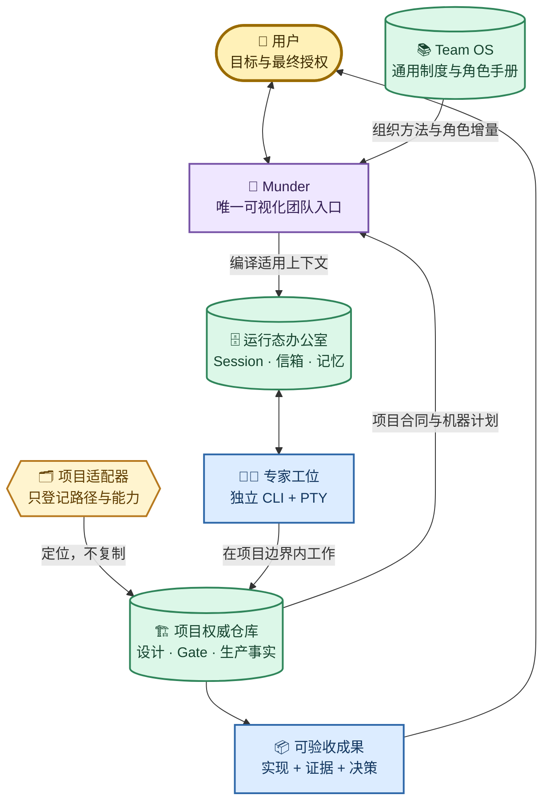

# Munder Difflin 个人团队操作系统与多项目工作流分层设计

> 本文定义 Munder 作为本机唯一智能体专业团队入口时，个人通用工作制度、Munder 产品实现、运行态办公室和各项目权威之间的稳定边界。核心结论是：通用制度上移，项目合同留守，运行状态投影，证据只做引用。

## 1. 结论与非目标

个人 Team OS 应独立维护在 `~/Munder-Difflin/team-os/`，而不是整体迁入某个项目仓库，也不能放进 `office/hive`。它负责跨项目复用的组织制度、角色合同、通用工作流、结果模板、项目索引和评测准则；项目自己的业务事实、机器计划、Gate、生产环境与正式设计继续由项目仓库拥有。

当前个人实例路径是 `/Users/kailonyang/Munder-Difflin/team-os`。Munder 已将它实现为可配置的 `teamOsHome`，并保留环境变量与用户目录默认约定，产品逻辑不硬编码个人绝对路径。

本设计不建立第二套任务调度器，不复制 Provider Agent Loop，不把所有项目统一成相同流程，也不要求每次任务启动全部专家。Munder 仍负责可视化、角色、PTY、消息与运行控制；Team OS 只提供可版本化的稳定组织合同。

## 2. 四层权威

| 层级 | 当前实例 | 拥有的事实 | 不拥有的事实 |
| --- | --- | --- | --- |
| Munder 产品源码 | `/Users/kailonyang/go/src/munder-difflin` | 应用能力、UI、IPC、Hive、Provider Bridge、投影与加载规则 | 某个项目的业务合同、个人运行 Session |
| 个人 Team OS | `/Users/kailonyang/Munder-Difflin/team-os` | 通用制度、角色、流程、模板、项目注册、评测准则 | 项目专属 Gate、生产事实、运行日志与 Transcript |
| 运行态办公室 | `/Users/kailonyang/Munder-Difflin/office`、`office-dev` | Agent 身份实例、Session、Inbox/Outbox、任务、记忆、Provider Home | 通用制度权威、项目正式设计权威 |
| 项目权威 | 例如 `/Users/kailonyang/go/src/jusuan-installer` | 项目 `AGENTS.md`、机器计划、Gate、业务/实现链、正式设计、生产事实、项目 Skills | 其他项目合同和 Munder 产品实现 |



## 3. 决策优先级与冲突处理

1. 用户当前明确目标、授权边界和系统安全限制始终最高。
2. 项目仓库拥有项目领域事实和机器执行合同；Team OS 不得用通用假设覆盖项目事实。
3. Team OS 拥有跨项目组织方法；项目可以在不降低安全边界的前提下作项目化收窄。
4. `harnessHome` 中的 Prompt、记忆和任务只是已编译的运行投影，不得反向覆盖 Team OS 或项目权威。
5. 出现安全或授权冲突时采用更严格边界并显式报告；出现事实冲突时以更具体、更新且可验证的项目权威为准。

这套优先级允许聚算平台保留完整的 `juspctl`、Gate、生产分波和设计体系，同时让未来的写作、研究、个人行政或其他软件项目复用同一套角色与协作原则。

## 4. Team OS 目录合同

```text
team-os/
├── AGENTS.md                    # Team OS 自身与通用团队的短内核
├── organization/
│   ├── constitution.md          # 组织原则、决策权与协作红线
│   └── operating-model.md       # 科学协作操作模型
├── roles/
│   └── capabilities.yaml        # 通用能力、权限与已知盲点目录
├── workflows/                   # 生命周期、交接与自适应协作拓扑
├── templates/                   # 结果卡、交接包等数据模板
├── models/                      # 模型能力、运行成熟度与准入策略
├── projects/
│   ├── registry.json            # 已登记项目及适配器索引
│   └── adapters/                # 只读路径、能力和项目权威入口
└── evals/                       # 通用协作评测准则与冻结样例
```

Team OS 只保存稳定、可审查、可跨项目复用的内容。一次任务的 PID、Session ID、命令输出、pass/fail、费用、临时计划和截图进入运行态 `.work` 或项目规定的证据目录；Key、Token、登录态和 Provider 认证文件不进入 Team OS。

## 5. 项目适配器合同

项目适配器是“地址卡”，不是项目文档镜像。最小字段包括：稳定项目 ID、显示名称、项目根目录、访问模式、项目 `AGENTS.md`、工作流规范、机器计划入口、Gate 配置、正式设计入口、动态证据目录和明确禁止能力。

适配器默认 `read-only`，意味着 Munder 可以读取并汇总项目权威，但不能因登记项目而自动修改仓库、运行生产命令或获得提交授权。项目目录移动时只更新适配器；项目规则更新时只修改项目原文，避免双份制度漂移。

## 6. 按需上下文编译

启动一个项目任务时，Munder 按以下顺序编译最小上下文，而不是把所有文档塞给每个 Agent：

1. 有界加载 Team OS 角色/能力目录和结果卡模板；
2. 通过适配器定位项目 `AGENTS.md` 与适用项目路由，只把路径引用而非项目正文编入工作单；
3. 用户显式选择一个结果负责人角色和必要能力增量，填写业务结果、非目标、验收、预算和停止条件；
4. Main Process 编译一张无持久化、可预览的结果卡式工作单，默认不授予本地写，远端、生产、破坏性和 Git 写始终保持关闭；
5. 只有用户显式打开“项目内本地写”时，工作单才记录本次本地写授权；该字段不绕过 Provider 原生工具审批或项目 Gate；
6. 用户确认预览后只把工作单填入 Michael 现有分派框，仍需再次显式发送；Michael 和执行 Agent 再根据目标与 changed paths 按需读取机器计划、正式设计或领域 Skill；
7. 运行过程中传递结构化交接与证据引用，不复制完整 Transcript；
8. 结束后仅把经确认的稳定经验提炼到角色记忆或权威文档。

同一 Agent 的 CLI Session 可以保留对话连续性，Team OS 角色合同则提供跨 Session 的稳定职责；两者一短一长、一个由 Provider 拥有、一个由用户版本控制，不构成重复存储。

### 6.1 上下文与空闲值守效率合同

Munder 不通过反复粘贴完整制度来维持角色。每个 Agent 的常驻 bootstrap 只保留身份、角色/能力、语言、安全边界、Hive 收发规则和权威文件绝对路径；详细协作协议、项目规范、Skill 与设计正文由 Agent 在任务命中时按路径读取。`identity.md` 保存稳定工牌，`memory.md` 只追加跨 Session 仍有价值的新事实或决策，不写心跳、无变化检查和重复状态。

| 入口 | 注入条件 | 不进入上下文的噪声 |
| --- | --- | --- |
| 稳定 bootstrap | 新建或恢复 CLI Session | 实时 token、费用、任务快照、完整规范正文 |
| `LIVE ROSTER` | Michael 的 `SessionStart`；此后仅成员、角色、状态、真实收件箱或熔断事实发生语义变化 | 时间戳、最近活动秒数、最近工具、token 与费用波动 |
| 每小时值守 | Main Process 先检查任务、成员、真实收件箱和熔断器；只有在办事项、风险或一次性语义变化时才唤醒 Michael | 安静且未变化时不发 Hive 消息、不调用模型、不追加 `memory.md` |

值守语义指纹只保存在本机配置中，不包含 Prompt、Transcript、消息正文、Key 或 Session ID。它不是第二套调度器：原计划任务仍负责时间触发，预检只回答“本轮是否值得调用模型”。存在进行中/阻塞任务、真人或 Agent 的未处理消息、熔断告警时仍照常唤醒，不以节省 Token 为由压掉真实工作。

## 7. 写入、安全与备份边界

| 对象 | 默认写入者 | 保护合同 |
| --- | --- | --- |
| Team OS | 用户或明确获准的维护任务 | 独立私有 Git；不存秘密；运行时默认只读 |
| 项目仓库 | 获得该项目任务授权的 Agent | 遵守项目 `AGENTS.md`、Gate 与提交授权 |
| 稳定办公室 | 已安装 Munder 的单一实例 | 禁止并发写；按长期运行设计备份 |
| 开发办公室 | 源码开发实例 | 与稳定办公室隔离；允许结构性试验 |
| 动态证据 | 执行任务或验证器 | 有界、可清理、不得冒充长期合同 |

Team OS 不纳入 Harness 快照工具的默认输入，因为它不是 `harnessHome`。它依靠自己的 Git 历史与独立备份；办公室快照继续负责 Session、Hive、任务和 userData。两者可以在同一个外层备份介质中保存，但 manifest 和恢复流程必须分开。

## 8. 科学协作与模型组合

TOS0.5 在运行集成前先固定组织行为，避免把“更多 Agent、更多角色、更多模型”误当成团队价值。默认拓扑是单一结果负责人；只有不同事实源、专业互补、高风险独立验证，或写集合互斥且能单独验收的工作能够覆盖协调成本时，才组建临时团队。

可选拓扑只有五种：顺序与工具密集任务使用 `solo`；多事实源探索使用首轮互不可见的 `independent-evidence`；跨专业但实现耦合时使用 `owner-specialists`；高风险变更使用 `single-writer-verifier`；重复且写集合互斥时使用 `batch-parallel`。不建设永久辩论群、固定全员会议或无终点的 Agent 互评。

软件开发默认由一个端到端 Feature Owner 围绕用户可验证的纵向价值切片负责，前端、后端、UI/UX、视觉、数据、安全、测试和 SRE 作为按需能力画像，而不是强制接力岗位：

| 对象 | 稳定语义 | 调度边界 |
| --- | --- | --- |
| 组织角色 | 结果、权限、写入与完成责任 | `delivery-engineer` 是默认端到端 Feature Owner |
| 能力画像 | 专业知识、工具、事实入口和验收方法 | 识别到能力缺口时叠加；不自动获得结果所有权 |
| 人物形象 | Munder 中长期可识别的姓名、外观和默认能力权重 | 可以叫“前端工程师”或“UI 设计师”，但名称不触发强制路由或授权 |
| Agent 实例 | 当前 Provider、Session、PTY、目录和任务状态 | 按结果卡临时创建或复用，不拥有长期制度 |

UI/UX 负责用户流程、信息架构、交互/错误状态和视觉验收；前端工程负责组件、客户端状态、API 集成、可访问性、性能和浏览器事实。小任务允许同一 Agent 顺序承担两种能力；只有专业事实或工具不同，并同时存在独立验收、可分写集合、风险保护或长期高频需求时，才实例化专职 Agent。后端、数据、安全与运行能力采用同一门槛。项目目录名或空闲 Agent 数量不能单独成为拆分理由。

协作关系必须跟随 changed paths、调用/数据依赖、失败责任和项目权威，而不是跟随前端/后端的组织名称。永久专业所有者只适用于具有稳定业务所有权、明确接口、独立测试/部署能力和持续工作量的模块或服务；否则保持一个纵向 owner，由专家给出合同、证据或独立验证。这吸收 DORA 小批次/松耦合、社会技术一致性和 Team Topologies 的端到端责任思想，并在日常真实任务中持续观察、纠偏和精简。

同一 GPT-5.6 家族可以通过不同事实入口、工具、约束和独立首轮减少关注点遗漏，但角色名称本身不会产生认知多样性。Sol 继续担任复杂结果负责人和最终综合；Terra、Luna 只作为经真实任务证明有效的成本/吞吐档位，不能被当成独立模型家族的交叉验证。

其他模型只按“独有证据通道”引入，并分别通过三道 Gate：

| Gate | 必须证明 | 未闭合时的边界 |
| --- | --- | --- |
| 角色能力 | 在冻结的目标任务中贡献最终采用的独有证据，并测量正确性、遗漏、人工纠偏、Token 与延迟 | 不能因厂商 benchmark 或主观印象进入默认角色 |
| 运行集成 | CLI、独立 Home、初始 Prompt、Session 恢复、Hook/空闲、Inbox、停止与失败语义真实闭合 | 只能做隔离、只读、可丢弃的试点 |
| 治理 | Key 只在运行时注入，数据边界、成本、版本漂移和显式降级可解释 | 不能成为 Michael、单写者或生产负责人 |

当前候选顺序是：保留 Gemini 作为多模态/超长材料侦察通道，保留 DeepSeek 作为独立推理审查与低成本批处理通道；新增试点优先评估 Grok 4.6 的时效研究、开放网络挑战与引用能力，其次评估 Kimi K3 的中文知识工作、长文档与多模态办公能力；Qwen3-Coder-Plus 仅在中文代码、阿里生态或本地私有模型需求出现时再评估。Claude 按用户决策排除。候选、已集成和黄金主链是三个不同状态，不得混写。

TOS1 的 loader 只读取和校验上述合同，不自动选人、自动换模型或静默降级。自动路由与自动选模不设定独立 TOS4 前置 Wave；只有长期真实使用中形成明确价值和运行需求时才按独立功能设计。当前模型和角色选择始终由负责人显式决定并可追踪。

运行时按 `config.teamOsHome`、`MUNDER_TEAM_OS_HOME`、`~/Munder-Difflin/team-os` 的优先级解析 Team OS 根目录。Main Process 只读取固定的 `projects/registry.json` 与注册适配器，单文件上限 256 KiB、项目上限 100、每项目引用上限 32；适配器与引用均执行根目录约束和真实路径校验，拒绝绝对引用、`..` 逃逸、文件符号链接和解析后越界。返回值只包含路径、存在性、类型、布尔约束和错误状态，不返回权威正文、Prompt、Transcript、任务或秘密。

TOS2 复用 Michael 的现有 Command Center，新增“项目与权威合同”标签；设置页只增加独立的 Team OS 目录选择，不建立第二个首页、项目管理器或任务数据库。总览展示项目状态、根目录、适配器、权威/机器/证据引用及约束；活动阶段只读取 PlanCoordinator 的持久状态，不从 Hive 文本、终端输出或文件时间猜测。Team OS 缺失、注册表无效或单个适配器失败均显式显示，终端、Agent 与 Hive 不依赖该读取成功。

TOS2.5 在 Team OS `projects/ownership/` 记录 `retain`、`extracted`、`dedupeAfter` 三类归属。TOS3 已完成项目权威引用与工作单编译后，可前向删除项目中已由 Team OS 承接的说明性重复；项目安全底线、机器入口、现行 Skill 执行入口和 Provider/生产约束仍由项目拥有。

TOS3 的空白“准备工作”表单不再是默认入口，其编译接口只作为兼容和高级检查能力保留。正常主链由用户在同一个 Michael Session 中讨论；精确发送或点击“按结论开始推进”后，Main Process 建立有界规划请求，并把项目权威引用、紧凑 workspace 索引和提交协议排入 Michael 当前队列。项目文档正文仍由 Michael 按需读取，不由 Renderer 复制。

TOS4 增加确定性 PlanCoordinator，但不建立第二个模型循环或任务数据库。Michael 在原 Session 中提交 `Plan Manifest`；Coordinator 校验 schema、项目/workspace、角色/能力、DAG、并发宽度、写集合和授权，随后复用现有 Hive task、inbox、Agent spawn、PTY 和 Provider Session 原语执行。串行同计划任务继续使用同一实例/Session；空闲角色实例被无关计划复用时保留工牌、信箱和长期记忆，但重启为新 CLI Session；真正并行的同角色 Lane 获得不同实例、PTY 和 Session。`cwd` 只是上下文锚点，跨目录读写仍由计划 scope 与本机权限共同约束。

Codex 主链默认由 `gpt-5.6-sol` Michael 负责讨论、方案判断、DAG 和综合，自动创建的普通工作者默认使用 `gpt-5.6-luna`。Main Process 必须把 CLI 可执行文件、自动模式参数和模型参数作为独立 argv 传入 PTY，并把 Provider、命令和模型随角色卡持久化；不得把带空格的整段命令误当作可执行文件，也不得在应用恢复时静默退回 CLI 默认模型。

规划状态持久化在当前 `harnessHome/.work/team-os/plans/<requestId>/`，只保存请求、合法计划、任务分配和阶段，不保存 Transcript、Key 或权威正文。项目页默认展示工作区搜索和规划/执行/验证/等待用户/完成阶段；Git、远端、生产、破坏性和数据删除始终为 false，不能由“开始推进”隐式放行。

## 9. 分阶段实施

| 阶段 | 目标 | 完成标志 |
| --- | --- | --- |
| TOS0 | 正式设计、最小目录、通用短内核、首个项目只读适配器 | 结构可解析；无权威文档复制；不含秘密 |
| TOS0.5 | 科学协作模型、软件交付组织、自适应拓扑、能力目录、模型准入与评测合同 | 默认单 Agent；端到端 owner、专业能力缺口、组队理由、单写责任、停止条件和模型 Gate 可审计 |
| TOS1 | 在 Main Process 增加有界只读 loader 与 schema 校验 | 缺失、越界、无效适配器可解释失败；不影响终端基础能力 |
| TOS2 | 在现有 Command Center 增加项目总览 | 只显示项目、适用规则、机器/证据引用、约束与校验状态；不另造任务系统或虚构活动结果 |
| TOS2.5 | 固化首个项目的权威归属与去重 Gate | 项目机器与生产合同留守；通用说明性重复在 TOS3 后前向删除 |
| TOS3 | 显式结果卡工作单、角色增量与按需 Prompt 编译 | 先预览后填入 Michael 现有分派框；无自动发送、自动路由、正文复制或隐式写授权 |
| TOS4 | 对话式开始意图、Workspace Resolver、Plan Manifest 与确定性协调 | 同 Michael Session 形成计划；自动复用/创建真实实例并持久展示 Gate 阶段；高风险权限保持关闭 |

TOS0 与 TOS0.5 是运行集成前的合同切片；TOS1～TOS4 已完成有界读取、可视化投影、权威收敛、Workspace 发现和对话式确定性协调合同。质量、效率、Token 和协作成本继续在长期使用中观察与删减。当前 Munder 不替 Michael 做产品判断或读取完整 Transcript；模型目录存在也不代表候选模型已晋升运行主链。

## 10. 最小验收合同

- 两个不同项目可以登记不同权威入口，不需要复制项目文档；当前自动化夹具已覆盖多项目隔离，真实目录已验证首个聚算项目。
- `office/` 与 `office-dev/` 可以顺序读取同一 Team OS，但不会共享 Session 或并发写办公室。
- Team OS 缺失时，项目仍可按本地 `AGENTS.md` 工作；Munder 应提示降级原因而不是阻断基础终端。
- 项目适配器越界、语法无效或指向不存在的必需入口时显式失败，不进行猜测性回退。
- 角色上下文按目标加载，未命中的角色、Skill、设计和历史不进入 Prompt。
- 工作单预览必须显示字节数与来源数；填入 Michael 分派框不等于发送，用户仍保有最终分派动作。
- 本地写授权默认关闭且只能显式开启；远端、生产、破坏性和 Git 写不能由 TOS3 工作单开启。
- 默认使用单 Agent；组队时结果卡必须能说明互补证据、风险保护或可分解工作的哪一项收益覆盖协调成本。
- 软件功能默认只有一个端到端 Feature Owner；前端、后端、UI/UX 等能力只有在缺口和实例化门槛成立时才创建专职 Agent，人物名称不得代替判断。
- 多 Agent 写任务仍只有一个结果负责人；高风险候选冻结后由独立验证者按验收合同检查，不以“另一个模型同意”代替证据。
- 新模型未通过运行与治理 Gate 时不能成为 Michael、单写者或生产负责人；任何不可用或降级都必须显式呈现，不静默切换。
- 适配器、日志、收据、截图和文档均不包含 API Key、Token、Provider 认证内容或真实 Session ID。

## 11. 当前实现状态与维护

当前已完成四层权威、TOS0 文件合同、TOS0.5 科学协作/模型准入合同、TOS1 有界只读 loader、TOS2 Command Center 项目总览、TOS2.5 聚算项目归属审计、TOS3 显式结果卡兼容编译，以及 TOS4 对话式主链。真实目录可加载 7 个组织角色、9 个能力画像和聚算项目的有界 workspace 索引；用户在同一 Michael Session 中讨论后点击“按结论开始推进”，系统会持久化规划请求、校验 Plan Manifest、写入 Hive 任务并复用或创建真实 Agent/PTY/Session。稳定 bootstrap、语义变化名册注入和每小时零模型预检已按 6.1 落地。基础 Agent、终端和 Hive 不依赖 Team OS 读取成功；远端、生产、破坏性与 Git 写不会被开始意图隐式放行。自动选模仍未实现，候选模型也未晋升为新的黄金主链。后续只在真实长期使用中出现明确价值或问题时调整通用合同；命令输出与一次性收据写入 `.work/`，不得把候选能力当成已交付事实。

通用制度从真实工作中的重复摩擦和有效改进产生，由用户明确决定是否晋升 Team OS；项目特有的机器、领域和生产合同始终留在项目。长期观察用于继续纠偏和删减，不把短期对照实验或项目数量设为前置门槛，也不把一次成功直接扩写成永久规则。
